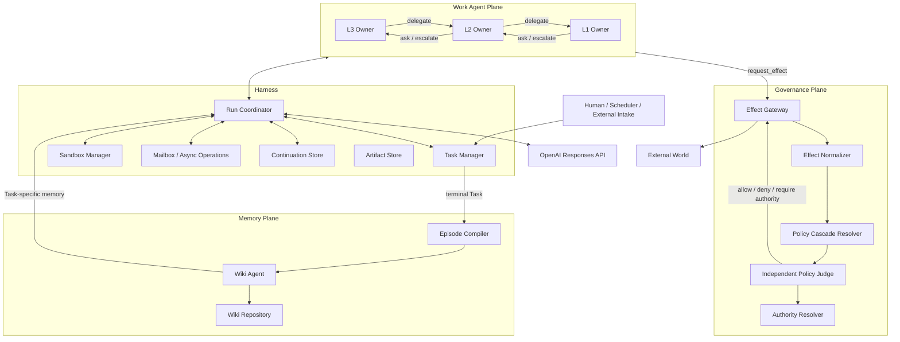

# 階層型エージェントハーネス設計書 V4

## 1. 目的

本設計は、L3・L2・L1の作業エージェントを、Responses APIを使って停止・再開可能なTask実行主体として動かすハーネスを定義する。

設計の中心はモデルの能力差ではない。次の五つを明示的に管理することである。

- 誰がどのTaskの責任を持つか
- どのWorkspaceで自由に作業するか
- どのイベントを待ち、どこから再開するか
- Sandbox外への作用を誰が評価し、誰が実行するか
- 終了したTaskをどう長期記憶へ変換するか

## 2. 基本原則

```text
Work Agent Plane
  目的理解・計画・実装・調査・移譲・完了候補提出

Governance Plane
  External Effectの正規化・Policy評価・Authority解決

Memory Plane
  Task Episode化・Wiki保守・Task向けContext生成

Harness
  状態・排他・Mailbox・Continuation・Workspace・配送・監査
```

### 2.1 Sandbox内では自由

各Taskには隔離Workspaceを与える。ファイル編集、ローカルGit、ビルド、テスト、一時DB、ローカルプロセス、試行錯誤は原則自由にする。Harnessは個々のシェルコマンドの意味を逐次審査しない。

### 2.2 外部世界との接点だけを統治

ネットワーク、Credential、本番環境、外部Repository、メール、Slack、課金資源などへの作用はすべてEffect Gatewayを通す。

### 2.3 作業階層と統治階層を分離

L3/L2/L1の親子関係は、目的・作業・文脈の移譲経路である。External Effectの承認経路ではない。Policy JudgeとAuthorityは別系統に置く。

### 2.4 自然言語判断を偽装しない

Objective、Acceptance、指示、意味的Policyは自然言語でよい。型にするのは、状態、ID、参照、予算、Effect digest、Decision種別など、Harnessが強制する部分に限る。

### 2.5 API状態を正本にしない

Responses APIのResponse IDや`previous_response_id`は推論継続の補助である。Task、Workspace、Mailbox、Logical Continuation、成果物は独自ストアを正本とする。

## 3. 全体アーキテクチャ



## 4. 主要概念

### Agent

継続的な論理主体。能力Profileを持ち、TaskのOwnerになれる。実行プロセスやResponse chainとは区別する。

### Task

単一Ownerが責任を持つ、ObjectiveとAcceptanceを備えた完了判定可能な単位。Ownerは同時に複数Taskを処理しない。

### Workspace

Task専用の論理作業領域。子Taskは親Workspaceから`fork`、`shared_readonly`、または`empty`で作られる。

### Agent Run

あるAgentがあるTaskを処理する実行セッション。再起動・Context再構築・モデル切替により、一Taskに複数Runが存在しうる。

### Subagent

親Task Ownerが`delegate`で生成した子TaskのOwner。別人格というより、独立した責任とContinuationを持つ子コルーチンである。

### Ask

子TaskのOwner Agentが判断責任を保持したまま、親TaskのOwner Agentへ知見を求める、Agent間のコミュニケーションである。回答は助言であり、Task Contractを変更せず、子Taskを拘束しない。

### Escalation

Objective、Acceptance、優先順位、作業範囲など、現在のTask Contractでは決めるべきでない判断責任を上位Authorityへ移すプロトコルである。Child Taskでは親Task、Root Taskでは人間のRoot Authorityが移転先になる。AgentはTaskのOwnerとして送信するが、移転する責任はAgent個人ではなくTask Contractに属する。External Effectの許可とは分離する。

両者は同じMailbox経路を利用しても、意味上の主体が異なる。

| 操作 | 意味上の主体 | 移動するもの | 子Taskへの作用 |
|---|---|---|---|
| Ask | Owner Agent間 | 情報・助言 | Contractは変えず、子Ownerが判断する |
| Escalation | Taskと上位Authority間 | Contract上の判断責任 | 上位決定によりContractを明確化・更新・Cancellationしうる |

### External Effect

Sandbox外へ観測可能な作用を与える要求。Policy Judgeが適合性を評価し、Effect Gatewayだけが実行する。

### Task Episode

Taskが終端状態に入った後に確定する、時系列の長期記憶単位。メッセージ単位ではない。

## 5. L3・L2・L1

すべて同じRuntimeを使う。差はProfileで表す。

| 層 | 典型的な責務 | 文脈範囲 | 委譲先 |
|---|---|---|---|
| L3 | 広い目的、統合、優先順位、親TaskのAcceptance評価 | 広い | L2 / L3 |
| L2 | 独立した実装・分析・運用Task | 中間 | L1 / L2 |
| L1 | 狭く局所的だが完了判定可能なTask | 狭い | 原則なし、必要ならL1 |

L1でもTask Ownerになれる。単なるコマンドや一回の検索はTaskではなくActivityである。

## 6. Task実行の基本ループ

```text
1. HarnessがTaskとOwnerを確定する
2. Workspaceを生成・復元する
3. Wiki AgentへTask Contextを要求する
4. Contract / State / Memoryを分離して推論Contextを構築する
5. Responses APIで次Actionを生成する
6. HarnessがActionを実行または非同期化する
7. Mailboxイベントを受けて再開する
8. OwnerがCompletion Candidateを提出する
9. Acceptance Reviewerが軽量確認する
10. Harnessが終端状態を確定する
11. Episode CompilerとWiki Agentへ非同期投入する
```

## 7. LLMが選択するAction

```typescript
type AgentAction =
  | Terminal
  | Delegate
  | AskParent
  | EscalateParent
  | ReplyToChild
  | RequestExternalEffect
  | CompleteCandidate
  | FailTask
  | CancelChildTask
  | ReportContextGap
  | ReportMemoryError
  | AwaitAsync
  | CancelAsync;
```

すべての長時間Actionは`timeout_ms`を受け取る。期限内に完了しなければ処理を止めず、`async_id`を返す。最終結果はTask Mailboxへ配送する。

詳細は[05-tools-and-async.md](05-tools-and-async.md)を参照。

## 8. 親子関係

### 移譲

親AgentはTaskレコードを直接書かない。`delegate`でTask Proposalを提出し、HarnessがOwner、Task ID、Workspace、予算、親子関係を確定する。

### 子の完了

子OwnerがCompletion Candidateを提出し、Acceptance Reviewerを通過した後、`ChildTaskCompleted`が親Mailboxへ届く。親はその成果を親TaskのAcceptanceへ統合する。

### 子のキャンセル

親Task Ownerは直接の子Taskに`cancel_child_task`を要求できる。Harnessは権限検証後、Taskを直ちに`cancelled`へ確定する。process停止やworktree削除はTask状態から分離したAgent Resource CleanupとしてHarnessが実行する。デフォルトは子孫へのcascade cancellationである。

### 完了責任

- Owner: 作業が完成したと判断し、完了候補を提出する
- Reviewer: 提示成果がAcceptanceを満たすと軽量に確認する
- Harness: 状態遷移を確定する
- Parent Owner: 子成果を親Taskへ統合する

## 9. External Effect統治

```text
Work Agent
  → request_effect
  → Effect Gatewayがpayloadを固定・正規化
  → Hard Check
  → Policy Cascade収集
  → Independent Policy Judge
      ├─ allow
      ├─ deny
      ├─ require_authority
      └─ insufficient_information
  → Gatewayが固定済みpayloadだけを実行
```

親Agentは子のEffectを承認しない。Effectの`origin_task_id`と`delegation_chain`を保持し、Spawnによる権限ロンダリングを防ぐ。

詳細は[06-governance.md](06-governance.md)を参照。

## 10. 長期記憶

Task終了後、Task Episodeを生成する。Work AgentにWikiの直接探索を任せない。Harnessが独立Wiki Agentへ問い合わせ、Task-specific Memory ContextをContractと別区画で強制挿入する。

```text
Task Events + Outcome + Evidence
  → Task Episode
  → Wiki Agent Maintenance
  → Episodic / Semantic Wiki
  → Wiki Agent Query
  → Harness Injection
```

詳細は[07-long-term-memory.md](07-long-term-memory.md)と[08-semantic-wiki-schema.md](08-semantic-wiki-schema.md)を参照。

## 11. 非目的

- 全シェルコマンドの意味的Policy審査
- LLM内部思考の永続化
- 親子関係による権限承認
- Taskごとの完全なコードレビュー
- Work Agentによる自由なWiki探索
- Responses APIだけに依存した永続状態管理

## 12. 正しさを支える不変条件

```text
Task.owner_id は必須
Ownerごとのactive Taskは最大1
TaskごとのWorkspaceは1つ
子TaskのOwnerは親TaskのOwnerと独立
Owner以外はCompletion Candidateを提出できない
ReviewerはTask Ownerと別Run
親Ownerは直接の子だけをcancelできる
External EffectはGateway以外から実行できない
Policy JudgeはCredentialと作業Toolを持たない
Task Episodeは終端後にのみ確定する
Work AgentはSemantic Wikiファイルを直接読まない
```
