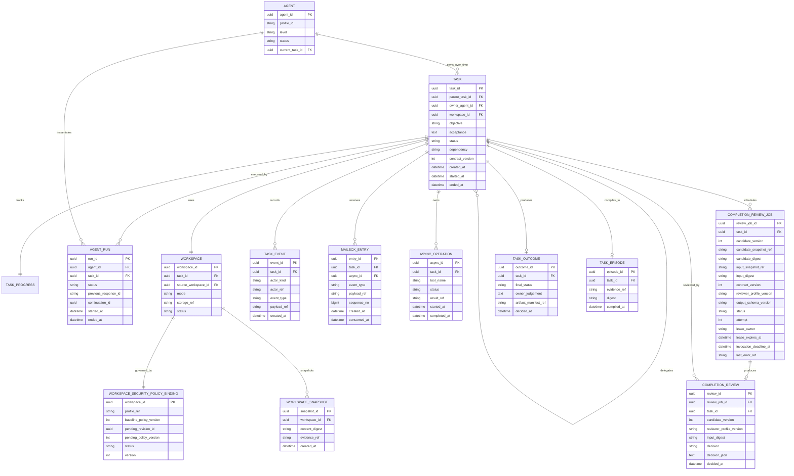

# Agent・Task・Workspace ドメインモデル

## 1. Agent

Agentは、Taskのオーナーになれる持続的な論理主体である。

```typescript
type Agent = {
  agent_id: string;
  profile_id: string;
  level: "L1" | "L2" | "L3";
  status: "idle" | "assigned" | "retired";
  current_task_id?: string;
};
```

AgentはLLMの1回のレスポンスともOSプロセスとも異なる。再起動しても同じAgentが同じTaskのオーナーとして再開できる。

Agentの生成、オーナー割当、実行、中断復帰、解放は[03-agent-lifecycle.md](03-agent-lifecycle.md)を正本とする。

## 2. Task

Taskは、単一オーナーが責任を持つ完了判定可能な作業単位である。

```typescript
type Task = {
  task_id: string;
  parent_task_id?: string;
  owner_agent_id: string;
  workspace_id: string;

  objective: string;
  acceptance: string;
  instructions?: string;
  contract_version: number;

  status: TaskStatus;
  dependency: "required" | "optional";

  created_at: string;
  started_at?: string;
  ended_at?: string;
};
```

### Taskの成立条件

- 目的がある
- 受け入れ条件がある
- オーナーが一人いる
- ライフサイクルがハーネスで管理される
- オーナーが完了候補を提出できる

### Taskではないもの

- 1回のLLMメッセージ
- shell コマンド
- ファイル読み書き
- 一時的な仮説検証
- 同じオーナーが現在Task内で行う細分化

別オーナーへ完了責任を移すとSubTaskになる。

### Task進捗

TaskはオーナーAgentの作業認識をTODO形式の進捗 台帳として持つ。進捗は一定のレスポンス ステップごとにハーネスが強制するメンテナンス レスポンスで更新し、契約や受け入れ条件判定とは分離する。現在値と更新履歴を永続化し、圧縮後の意味的な再開情報とエピソード生成へ利用する。

## 3. Workspace

Taskには1つの論理Workspaceを割り当てる。

```typescript
type Workspace = {
  workspace_id: string;
  task_id: string;
  source_workspace_id?: string;
  mode: "fork" | "shared_readonly" | "empty";
  storage_ref: string;
  status: "active" | "frozen" | "archived" | "destroyed";
  security_policy_binding: {
    profile_ref: string;
    baseline_policy_version: number;
    pending_revision_id: string | null;
    pending_policy_version: number | null;
    status: "active" | "frozen" | "retired";
    version: number;
  };
};
```

### モード

| モード | 用途 |
|---|---|
| `fork` | 親の状態を複製し、子が自由に変更する |
| `shared_readonly` | 親のWorkspaceを読み取り専用ビューとして参照する |
| `empty` | 独立した空Workspaceから開始する |

実体ストレージを共有しても、Taskごとの論理Workspace IDは分ける。Git ワークツリー、コンテナー、ローカル プロセスなどの物理実行リソースはWorkspace 集約に含めず、Agentリソースとしてハーネスがライフサイクルとクリーンアップを管理する。

セキュリティ ポリシーの適用主体はAgentやAgent実行ではなく論理Workspaceである。サンドボックス ネットワーク 識別情報、CASB ルール、認証情報 スコープ、一時許可は`workspace_id`へ束縛する。Task/Agent IDは要求者と目的を示す監査来歴であり、オーナー交代や実行再開でポリシー割り当てを変更しない。

`fork`は親Workspaceのポリシーを暗黙共有せず、プラットフォーム ポリシーが許すプロファイル/バージョンだけを新しいWorkspace 割り当てへコピーする。親の一時許可、使用回数、責任者 承認は子へ継承しない。`shared_readonly`でも子は別Workspace 識別情報を持ち、外向き通信ポリシーは子の割り当てで評価する。

## 4. Agent実行

```typescript
type AgentRun = {
  run_id: string;
  agent_id: string;
  task_id: string;
  status: "running" | "stopped" | "failed" | "completed";
  previous_response_id?: string;
  continuation_id?: string;
  resume_cursor_id?: string;
  stop_reason?: "waiting" | "compacted" | "shutdown";
  normal_step_count: number;
  last_progress_refresh_step: number;
  started_at: string;
  ended_at?: string;
};
```

一Taskに複数実行を許す理由を示す。

- プロセス再起動
- Responses API 連鎖の再構築
- コンテキスト圧縮
- モデル切替
- 長時間停止後の再開

## 5. 完了レビュー

受け入れ条件レビュアーはTaskオーナーでもハーネス管理のAgentでもない。永続化するのは1回の判定結果であり、内部のLLM セッションはAgent実行として保存しない。

```typescript
type CompletionReview = {
  review_id: string;
  review_job_id: string;
  task_id: string;
  candidate_version: number;
  reviewer_profile_version: string;
  input_digest: string;
  decision: AcceptanceReviewDecision;
  decided_at: string;
};
```

`AcceptanceReviewDecision`は全判定で`evidence_refs`を持ち、`reject`では`unmet_acceptance`、`insufficient_evidence`では`required_evidence`も保存する。同じTaskで複数回のレビューを許す。

## 6. ER図



## 7. 主要制約

### オーナー排他

オーナーが割り当てられた非終端Taskは最大1つ。

```sql
CREATE UNIQUE INDEX one_active_task_per_owner
ON tasks(owner_agent_id)
WHERE status NOT IN ('completed', 'cancelled');
```

`waiting`、`suspended`、`reviewing_completion`も非終端である。待機理由はTask状態ではなく`WaitCondition.kind`で区別する。

### 親子制約

- `parent_task_id`は自分自身を参照しない
- 循環を禁止する
- 子Taskのオーナーは親Taskのオーナーと異なる
- 親オーナーがキャンセルできるのは直接の子Taskだけ

### Workspace制約

- Taskはちょうど1つのWorkspaceを持つ
- Workspaceはちょうど1つのセキュリティ ポリシー割り当てを持つ
- ポリシー割り当てはオーナーAgentやAgent実行ではなくWorkspace IDへ束縛する
- 分岐時に一時 許可と責任者 承認を継承しない
- Workspaceの起点 連鎖は循環しない
- `shared_readonly`では書き込み層を持たない

### 結果制約

- Task 結果は終端状態で1つだけ
- `completed` 結果には受理済み完了レビューが必要
- エピソードは結果確定後に1つだけ生成する

## 8. オーナーとロール

Agentは1つのTaskを持つ間、オーナー ロールを担う。ポリシーAgent、外向き通信監査Agent、受け入れ条件レビュアー、Wiki Agentはハーネス管理Agentではなく、作業Taskのオーナーにならない専用LLMコンポーネントとして動かす。

```text
Work Agent   : Taskを所有する
Reviewer     : Taskを所有せず、Completion Candidateを評価する
Policy Agent : Taskを所有せず、ChallengeやFindingからCASB Rule更新を評価する
Audit Agent  : Taskを所有せず、通過済みEgressを事後評価する
Wiki Agent   : 作業Taskを所有せず、記憶を保守・照会する
```
