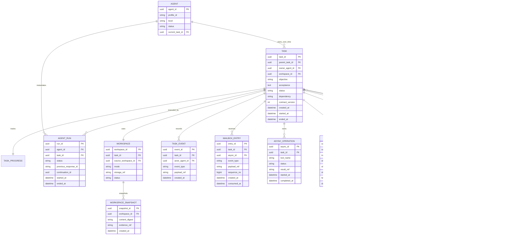

# Agent・Task・Workspace ドメインモデル

## 1. Agent

Agentは、TaskのOwnerになれる持続的な論理主体である。

```typescript
type Agent = {
  agent_id: string;
  profile_id: string;
  level: "L1" | "L2" | "L3";
  status: "idle" | "assigned" | "retired";
  current_task_id?: string;
};
```

AgentはLLMの一回のResponseでもOS processでもない。再起動しても同じAgentが同じTaskのOwnerとして再開できる。

Agentの生成、Owner割当、Run、中断復帰、解放は[03-agent-lifecycle.md](03-agent-lifecycle.md)を正本とする。

## 2. Task

Taskは、単一Ownerが責任を持つ完了判定可能な作業単位である。

```typescript
type Task = {
  task_id: string;
  parent_task_id?: string;
  owner_agent_id: string;
  workspace_id: string;

  objective: string;
  acceptance: string;
  instructions?: string;
  contract_version: number;

  status: TaskStatus;
  dependency: "required" | "optional";

  created_at: string;
  started_at?: string;
  ended_at?: string;
};
```

### Taskの成立条件

- Objectiveがある
- Acceptanceがある
- Ownerが一人いる
- LifecycleがHarnessで管理される
- Ownerが完了候補を提出できる

### Taskではないもの

- 一回のLLMメッセージ
- shell command
- ファイル読み書き
- 一時的な仮説検証
- 同じOwnerが現在Task内で行う細分化

別Ownerへ完了責任を移す場合にSubtaskになる。

### Task Progress

TaskはOwner Agentの作業認識をTodo形式のProgress Ledgerとして持つ。Progressは一定のResponse StepごとにHarnessが強制するMaintenance Responseで更新し、ContractやAcceptance判定とは分離する。現在値と更新履歴を永続化し、Compaction後の意味的な再開情報とEpisode生成へ利用する。

## 3. Workspace

Taskには一つの論理Workspaceを割り当てる。

```typescript
type Workspace = {
  workspace_id: string;
  task_id: string;
  source_workspace_id?: string;
  mode: "fork" | "shared_readonly" | "empty";
  storage_ref: string;
  status: "active" | "frozen" | "archived" | "destroyed";
};
```

### モード

| モード | 用途 |
|---|---|
| `fork` | 親の状態を複製し、子が自由に変更する |
| `shared_readonly` | 親のWorkspaceを読み取り専用Viewとして参照する |
| `empty` | 独立した空Workspaceから開始する |

実体ストレージを共有しても、Taskごとの論理Workspace IDは分ける。Git worktree、container、local processなどの物理実行ResourceはWorkspace Aggregateに含めず、Agent ResourceとしてHarnessがLifecycleとCleanupを管理する。

## 4. Agent Run

```typescript
type AgentRun = {
  run_id: string;
  agent_id: string;
  task_id: string;
  status: "running" | "stopped" | "failed" | "completed";
  previous_response_id?: string;
  continuation_id?: string;
  resume_cursor_id?: string;
  stop_reason?: "waiting" | "compacted" | "shutdown";
  normal_step_count: number;
  last_progress_refresh_step: number;
  started_at: string;
  ended_at?: string;
};
```

一Taskに複数Runを許す理由:

- process再起動
- Responses API chainの再構築
- Context圧縮
- モデル切替
- 長時間停止後の再開

## 5. Completion Review

Acceptance ReviewerはTask OwnerでもHarness管理のAgentでもない。永続化するのは一回の判定結果であり、内部のLLM sessionはAgent Runとして保存しない。

```typescript
type CompletionReview = {
  review_id: string;
  task_id: string;
  candidate_version: number;
  reviewer_profile_version: string;
  input_digest: string;
  decision: "accept" | "reject" | "insufficient_evidence";
  rationale: string;
  decided_at: string;
};
```

同じTaskで複数回のReviewを許す。

## 6. ER図



## 7. 主要制約

### Owner排他

Ownerが割り当てられた非終端Taskは最大一つ。

```sql
CREATE UNIQUE INDEX one_active_task_per_owner
ON tasks(owner_agent_id)
WHERE status NOT IN ('completed', 'cancelled');
```

`waiting`、`suspended`、`reviewing_completion`も非終端である。待機理由はTask statusではなく`WaitCondition.kind`で区別する。

### 親子制約

- `parent_task_id`は自分自身を参照しない
- 循環を禁止する
- 子TaskのOwnerは親TaskのOwnerと異なる
- 親Ownerがcancelできるのは直接の子Taskだけ

### Workspace制約

- Taskはちょうど一つのWorkspaceを持つ
- Workspaceのsource chainは循環しない
- `shared_readonly`では書き込み層を持たない

### Outcome制約

- Task Outcomeは終端状態で一つだけ
- `completed` Outcomeにはaccept済みCompletion Reviewが必要
- EpisodeはOutcome確定後に一つだけ生成する

## 8. OwnerとRole

Agentは一つのTaskを持つ間、Owner Roleを担う。Policy Judge、Acceptance Reviewer、Wiki Agentは作業TaskのOwnerではない専用Roleとして動かす。

```text
Work Agent   : Taskを所有する
Reviewer     : Taskを所有せず、Completion Candidateを評価する
Policy Judge : Taskを所有せず、External Effectを評価する
Wiki Agent   : 作業Taskを所有せず、記憶を保守・照会する
```
