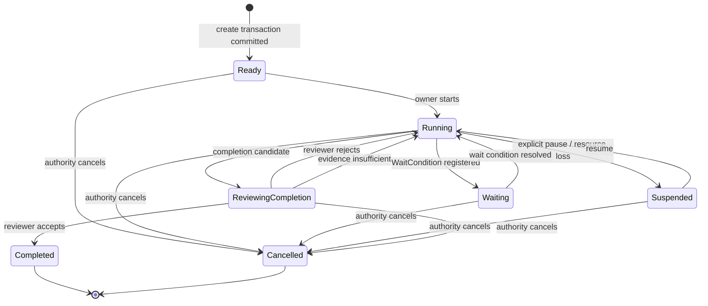
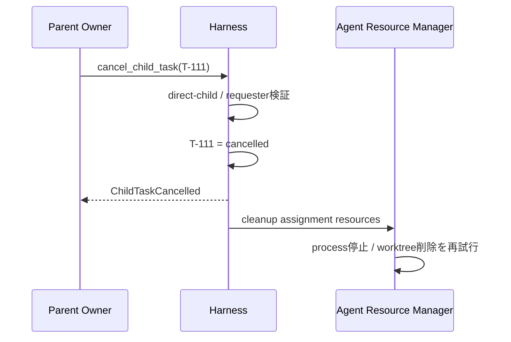

# Taskライフサイクル設計

本書はTaskの生成から終端までの状態遷移を扱う。Agentの生成、Owner割当、Agent Run、解放は[03-agent-lifecycle.md](03-agent-lifecycle.md)へ分離する。

## 1. 状態

```typescript
type TaskStatus =
  | "ready"
  | "running"
  | "waiting"
  | "suspended"
  | "reviewing_completion"
  | "completed"
  | "cancelled";
```



## 2. Root Task生成

Root Taskは人間、Scheduler、Webhook、APIなどの外部IntakeがTask Proposalを提出して作る。

```typescript
type RootTaskProposal = {
  objective: string;
  acceptance: string;
  instructions?: string;
  owner_profile: "L1" | "L2" | "L3";
  workspace_source?: string;
  budget?: Budget;
};
```

Harnessは次を一つの作成Transactionとして行う。

1. Proposalの機械的妥当性を確認
2. idle Agentを割当、またはProfileからSpawn
3. Workspaceを作成
4. 空のTask Progress v0を作成
5. Wiki Agentへ`task_start` Contextを要求
6. Taskを最初から`ready`として永続化
7. Owner Runを開始し`running`へ遷移

Ownerまたは論理Workspaceを準備できなければTaskレコードを`created`状態で残さず、Task作成Operationを失敗として返す。`TaskCreated`と`OwnerAssigned` Eventは同じTransactionで記録できる。

## 3. Child Task生成

Work AgentはTaskレコードを直接作らず、`delegate`でProposalを提出する。

```typescript
type DelegateRequest = {
  objective: string;
  acceptance: string;
  instructions?: string;
  owner_profile: "L1" | "L2" | "L3";
  workspace_mode: "fork" | "shared_readonly" | "empty";
  dependency: "required" | "optional";
  artifact_refs?: string[];
  timeout_ms?: number;
};
```

### 検証

- ObjectiveとAcceptanceが空でない
- 現在Agentが親Task Ownerである
- Task graphに循環がない
- 同一Proposalの重複でない
- 予算・depth・child数上限内
- 子Ownerを確保できる

### 同期待機から非同期への昇格

`timeout_ms`以内に子Taskが完了すれば結果を直接返す。超過した場合、子Taskは継続し、`async_id`を返す。

```json
{
  "status": "accepted",
  "async_id": "async-task-T-111",
  "task_id": "T-111"
}
```

非同期Operationが存在しても、親Taskが自動的に`waiting`になるわけではない。親Ownerが別Activityを続けられるなら`running`のままである。

## 4. Waiting

Taskが待機状態へ入るのは、Ownerがそのイベントなしでは進めないと判断したときである。

```typescript
type WaitCondition =
  | { kind: "child"; async_ids: string[]; mode: "all" | "any" }
  | { kind: "parent"; request_id: string }
  | { kind: "effect"; effect_id: string }
  | { kind: "timer"; wake_at: string };
```

`waiting`は待機理由を表さない。理由と再開条件は必ず`WaitCondition`に保持する。Mailboxイベントなどが到着するとHarnessが条件を照合し、成立時だけ`running`へ戻す。

## 5. Task Progress

TaskはContractとは別に、Owner Agentが認識する進捗をTodo形式のLedgerとして持つ。

```typescript
type TaskProgress = {
  task_id: string;
  version: number;
  current_focus_id?: string;
  last_observed_task_event_sequence: number;
  last_observed_agent_run_event_sequence: number;
  items: ProgressItem[];
  updated_at: string;
};

type ProgressItem = {
  item_id: string;
  description: string;
  status: "pending" | "in_progress" | "completed" | "blocked" | "cancelled";
  evidence_refs: string[];
  blocker?: string;
};
```

ProgressはOwner assertedな作業認識であり、Task ContractやCompletion Reviewを置き換えない。Harnessは一定の通常Response Stepごとに専用Maintenance Responseを開始し、`update_progress`だけをFunction Toolとして許可・強制する。更新はoptimistic `progress_version`とTask Event watermarkを検証して永続化する。

Progress Refreshの周期、失敗時の扱い、Responses API呼び出しは[05-runtime-and-responses-api.md](05-runtime-and-responses-api.md)を正本とする。

## 6. AskとEscalation

AskとEscalationは同じ親子Mailboxを通るが、同じ種類の通信ではない。AskはTaskを担当するOwner Agent間の助言通信であり、Escalationは親子Task間の判断責任移転である。配送主体と意味上の主体を混同しない。

### Ask

子TaskのOwner Agentが親TaskのOwner Agentへ助言を求める。子Ownerは判断責任を保持し、親Ownerの回答を知見として解釈する。AskだけではTask Contractを更新しない。

```text
Child Owner asks → Parent Owner advises → Child Owner interprets and decides
```

### Escalation

子Taskが、現在のContractでは決められない判断を親Taskへ移す。親TaskがTask Contract上の判断責任を引き受け、親OwnerはそのTaskを代表して決定する。必要ならHarnessが子TaskのContractを改訂し、Contract versionを進める。

```text
Child Task escalates → Parent Task decides → Harness revises/clarifies Child Contract → Child Owner follows decision
```

親の決定が既存Contractの解釈確定だけなら、`contract_patch`は不要である。作業継続が不適切なら`terminate: true`を返せる。HarnessはAuthorityとrequest状態を検証し、当該TaskをCancellation理由付きで`cancelled`へ確定して通常の子孫cascadeとOwner解放を適用する。Agent自身がTaskを終端する操作ではない。

親がさらに上位へ上げる場合、子のContinuationを直接渡さない。親Taskが自分のEscalationを作り、回答を受けて子向け決定を生成する。

Root Taskには親Taskがないため、HarnessはEscalationをRoot Authorityである人間へ配送する。人間は`submit_task_escalation_decision` ingressからContractの明確化・変更、追加資源や権限の付与、またはCancellationを決定する。Harnessは`EscalationDecision`保存、Contract更新またはCancellation、Mailbox/async完了を同一Transactionで確定する。Root Owner Agentが達成不能を理由にTaskを終端させることはできない。

## 7. 完了候補とAcceptance Review

Ownerは`complete`ではなく`complete_candidate`を提出する。

```typescript
type CompletionCandidate = {
  owner_judgement: string;
  outcome_ref: string;
  artifact_refs: string[];
  evidence_refs?: string[];
  contract_version: number;
  timeout_ms?: number;
};
```

### Harnessの前検査

- 呼び出したAgentがOwnerか
- Taskが`running`か
- Contract versionが現行か
- 必須Artifact参照が存在するか
- 未終了のrequired child Taskがないか
- Evidence digestを固定できるか

### Acceptance Reviewer

Owner Agent Runから分離した一時API sessionへ次だけを渡す。このsessionはHarness管理のAgent Runではない。

- Objective
- Acceptance
- Owner judgement
- Outcome summary
- 指定Artifact / Evidence
- required child Taskの最終状態

Reviewerはコード品質や新しい要件を評価しない。

```typescript
type AcceptanceReviewDecision = {
  decision: "accept" | "reject" | "insufficient_evidence";
  rationale: string;
  unmet_acceptance: string[];
  required_evidence: string[];
  evidence_refs: string[];
};
```

Structured Outputでは全fieldを必須にし、該当しない配列は空にする。Harnessはdecisionごとの組合せを意味検証する。

`reject`と`insufficient_evidence`はいずれもTaskを`running`へ戻す。前者はAcceptance未達の修正、後者はEvidence追加というOwnerの能動作業を要求する。Evidence取得に別の非同期結果が必要になった場合だけ、Ownerが対応するToolを呼び、その結果を表す`WaitCondition`で`waiting`へ遷移する。

### 責任分担

```text
Owner    : 完成したと判断して候補を出す
Reviewer : Acceptanceとの整合を軽量確認する
Harness  : 状態遷移を確定する
```

ReviewerがTaskのOwnerになることはない。

## 8. Suspensionと復旧

Agent Run、Runtime、Workspace、依存資源などの障害はTaskの失敗を意味しない。Taskの責任を維持したまま`suspended`へ遷移し、Harnessが復旧を管理する。

```typescript
type Suspension = {
  reason: string;
  source:
    | "agent_run_failure"
    | "runtime_failure"
    | "workspace_failure"
    | "resource_unavailable";
  recovery_owner: "harness" | "operator";
  recovery_policy: "automatic" | "manual";
  retry_count: number;
  suspended_at: string;
  next_retry_at?: string;
};
```

Harnessは自動復旧、同じ論理Agentの新しいRun、Workspace復元などを試みる。自動復旧できなければ`recovery_owner`をOperatorへ移して`suspended`を維持する。Operatorは復旧して`running`へ戻すか、AuthorityとしてCancellationを要求する。障害だけを理由にTaskを終端させない。

## 9. 親による子Taskキャンセル

親Task Ownerは直接の子Taskだけをキャンセルできる。CancellationはAuthorityによる責任撤回であるため、中間状態を設けず、Harnessの検証と同時にTaskを`cancelled`へ確定する。

```typescript
type CancelChildTask = {
  child_task_id: string;
  reason: string;
  policy?: "cascade" | "detach_children" | "transfer_children";
  timeout_ms?: number;
};
```

### 標準シーケンス



Cancellation確定前にHarnessは、既存Artifact、Evidence、最新の耐久Workspace snapshotへの参照をOutcomeへ固定する。Agentの応答や新しいsnapshotを待つことはCancellationの成立条件にしない。

### 子孫

デフォルトは`cascade`。Harnessが子孫Taskをそれぞれ`cancelled`へ確定し、各Owner Assignmentの終了イベントからResource Cleanupを起動する。

- HarnessがTask graphに沿ってCancellationを伝播
- process停止やworktree削除はAgent Resource Cleanupとして非同期実行
- Cleanupの再試行や手動介入はTask状態を変更しない
- 実行済みExternal Effectは自動rollbackしない

### TaskとCleanupの分離

```text
Authority decision
  → Task = cancelled
  → Owner Assignment終了
  → HarnessがAgent Resource Cleanupを開始
  → released または needs_operator
```

## 10. Parent Taskの終了条件

Parent Taskは次のいずれかを満たすまでCompletion Candidateを出せない。

- required childrenがすべて終端
- active childrenをcancel済み
- optional childrenをdetachまたはtransfer済み

子Taskの`completed`は親Taskの`completed`を意味しない。

## 11. Task Event

```typescript
type TaskEvent =
  | { type: "TaskCreated" }
  | { type: "OwnerAssigned"; owner_id: string }
  | { type: "TaskStarted"; run_id: string }
  | { type: "ChildDelegated"; child_task_id: string }
  | { type: "WaitStarted"; condition: WaitCondition }
  | { type: "WaitResolved"; event_id: string }
  | { type: "ParentAsked"; request_id: string }
  | { type: "EscalationRaised"; request_id: string }
  | { type: "ContractChanged"; version: number }
  | { type: "TaskSuspended"; suspension: Suspension }
  | { type: "TaskResumed"; run_id: string }
  | { type: "ProgressRefreshed"; progress_version: number; through_task_event_sequence: number; through_agent_run_event_sequence: number }
  | { type: "ProgressRefreshFailed"; reason: string }
  | { type: "ContextCompacted"; cursor_id: string; source_run_id: string; new_run_id: string }
  | { type: "CompletionCandidateSubmitted"; candidate_version: number }
  | { type: "CompletionReviewed"; review_id: string }
  | { type: "TaskCompleted"; outcome_ref: string }
  | { type: "TaskCancelled"; reason: string };
```

現在状態は`tasks`、履歴は`task_events`へ保存する。両者は同一Transactionで更新する。

Context CompactionはTask状態遷移ではない。必要に応じて`ContextCompacted` Eventを監査用に記録するが、Task statusとOwnerは維持する。

## 12. Episode生成

`completed`または`cancelled`へ入った後、Episode Agentを非同期起動する。`suspended`は非終端なのでEpisodeを確定せず、Task Progress、Resume Cursor、障害Evidenceを保存する。
