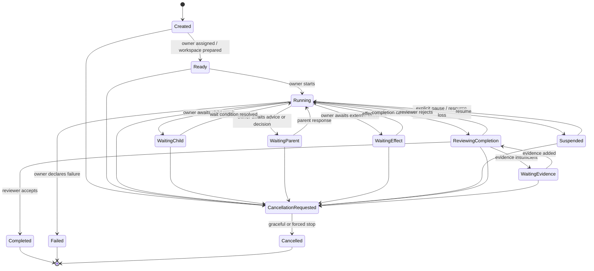
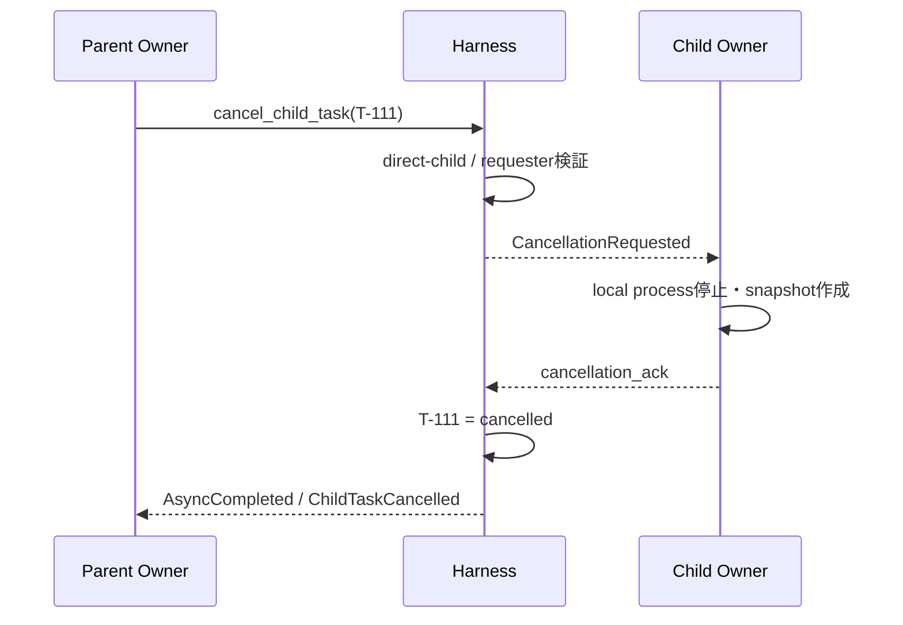

# Taskライフサイクル設計

## 1. 状態

```typescript
type TaskStatus =
  | "created"
  | "ready"
  | "running"
  | "waiting_child"
  | "waiting_parent"
  | "waiting_effect"
  | "suspended"
  | "reviewing_completion"
  | "waiting_evidence"
  | "cancellation_requested"
  | "completed"
  | "failed"
  | "cancelled";
```



## 2. Root Task生成

Root Taskは人間、Scheduler、Webhook、APIなどの外部IntakeがTask Proposalを提出して作る。

```typescript
type RootTaskProposal = {
  objective: string;
  acceptance: string;
  instructions?: string;
  owner_profile: "L1" | "L2" | "L3";
  workspace_source?: string;
  budget?: Budget;
};
```

Harnessは次を行う。

1. Proposalの機械的妥当性を確認
2. idle Agentを割当、またはProfileからSpawn
3. Workspaceを作成
4. Wiki Agentへ`task_start` Contextを要求
5. Taskを`ready`へ確定
6. Owner Runを開始し`running`へ遷移

## 3. Child Task生成

Work AgentはTaskレコードを直接作らず、`delegate`でProposalを提出する。

```typescript
type DelegateRequest = {
  objective: string;
  acceptance: string;
  instructions?: string;
  owner_profile: "L1" | "L2" | "L3";
  workspace_mode: "fork" | "shared_readonly" | "empty";
  dependency: "required" | "optional";
  artifact_refs?: string[];
  timeout_ms?: number;
};
```

### 検証

- ObjectiveとAcceptanceが空でない
- 現在Agentが親Task Ownerである
- Task graphに循環がない
- 同一Proposalの重複でない
- 予算・depth・child数上限内
- 子Ownerを確保できる

### 同期待機から非同期への昇格

`timeout_ms`以内に子Taskが完了すれば結果を直接返す。超過した場合、子Taskは継続し、`async_id`を返す。

```json
{
  "status": "accepted",
  "async_id": "async-task-T-111",
  "task_id": "T-111"
}
```

非同期Operationが存在しても、親Taskが自動的に`waiting_child`になるわけではない。親Ownerが別Activityを続けられるなら`running`のままである。

## 4. Waiting

Taskが待機状態へ入るのは、Ownerがそのイベントなしでは進めないと判断したときである。

```typescript
type WaitCondition =
  | { kind: "child"; async_ids: string[]; mode: "all" | "any" }
  | { kind: "parent"; request_id: string }
  | { kind: "effect"; effect_id: string }
  | { kind: "timer"; wake_at: string };
```

Mailboxイベントが到着するとHarnessが条件を照合し、成立時だけ`running`へ戻す。

## 5. AskとEscalation

AskとEscalationは同じ親子Mailboxを通るが、同じ種類の通信ではない。AskはTaskを担当するOwner Agent間の助言通信であり、Escalationは親子Task間の判断責任移転である。配送主体と意味上の主体を混同しない。

### Ask

子TaskのOwner Agentが親TaskのOwner Agentへ助言を求める。子Ownerは判断責任を保持し、親Ownerの回答を知見として解釈する。AskだけではTask Contractを更新しない。

```text
Child Owner asks → Parent Owner advises → Child Owner interprets and decides
```

### Escalation

子Taskが、現在のContractでは決められない判断を親Taskへ移す。親TaskがTask Contract上の判断責任を引き受け、親OwnerはそのTaskを代表して決定する。必要ならHarnessが子TaskのContractを改訂し、Contract versionを進める。

```text
Child Task escalates → Parent Task decides → Harness revises/clarifies Child Contract → Child Owner follows decision
```

親の決定が既存Contractの解釈確定だけなら、`contract_patch`は不要である。作業継続が不適切なら`terminate`を返せる。

親がさらに上位へ上げる場合、子のContinuationを直接渡さない。親Taskが自分のEscalationを作り、回答を受けて子向け決定を生成する。

## 6. 完了候補とAcceptance Review

Ownerは`complete`ではなく`complete_candidate`を提出する。

```typescript
type CompletionCandidate = {
  owner_judgement: string;
  outcome_ref: string;
  artifact_refs: string[];
  evidence_refs?: string[];
  contract_version: number;
  timeout_ms?: number;
};
```

### Harnessの前検査

- 呼び出したAgentがOwnerか
- Taskが`running`または`waiting_evidence`か
- Contract versionが現行か
- 必須Artifact参照が存在するか
- 未終了のrequired child Taskがないか
- Evidence digestを固定できるか

### Acceptance Reviewer

軽量な独立Runへ次だけを渡す。

- Objective
- Acceptance
- Owner judgement
- Outcome summary
- 指定Artifact / Evidence
- required child Taskの最終状態

Reviewerはコード品質や新しい要件を評価しない。

```typescript
type AcceptanceReviewDecision =
  | { decision: "accept"; rationale: string }
  | { decision: "reject"; rationale: string; unmet: string[] }
  | { decision: "insufficient_evidence"; rationale: string; required: string[] };
```

### 責任分担

```text
Owner    : 完成したと判断して候補を出す
Reviewer : Acceptanceとの整合を軽量確認する
Harness  : 状態遷移を確定する
```

ReviewerがTaskのOwnerになることはない。

## 7. Failure

OwnerがObjective達成不能と判断した場合は`fail_task`を提出する。

```typescript
type FailureDeclaration = {
  reason: string;
  retryable: boolean;
  artifact_refs?: string[];
};
```

`failed` TaskもTask Episodeを生成し、失敗パターンの材料にする。

## 8. 親による子Taskキャンセル

親Task Ownerは直接の子Taskだけをキャンセル要求できる。

```typescript
type CancelChildTask = {
  child_task_id: string;
  reason: string;
  policy?: "cascade" | "detach_children" | "transfer_children";
  timeout_ms?: number;
};
```

### 標準シーケンス



### 子孫

デフォルトは`cascade`。

- 子Ownerが自分の直接子へキャンセルを伝播
- grace period経過後はHarnessがprocessを停止
- Workspace snapshotを保存
- 実行済みExternal Effectは自動rollbackしない

### 強制停止

```text
CancellationRequested
  → grace period
  → process kill / async cancellation / workspace freeze
  → Cancelled
```

## 9. Parent Taskの終了条件

Parent Taskは次のいずれかを満たすまでCompletion Candidateを出せない。

- required childrenがすべて終端
- active childrenをcancel済み
- optional childrenをdetachまたはtransfer済み

子Taskの`completed`は親Taskの`completed`を意味しない。

## 10. Task Event

```typescript
type TaskEvent =
  | { type: "TaskCreated" }
  | { type: "OwnerAssigned"; owner_id: string }
  | { type: "TaskStarted"; run_id: string }
  | { type: "ChildDelegated"; child_task_id: string }
  | { type: "WaitStarted"; condition: WaitCondition }
  | { type: "WaitResolved"; event_id: string }
  | { type: "ParentAsked"; request_id: string }
  | { type: "EscalationRaised"; request_id: string }
  | { type: "ContractChanged"; version: number }
  | { type: "CompletionCandidateSubmitted"; candidate_version: number }
  | { type: "CompletionReviewed"; review_id: string }
  | { type: "CancellationRequested"; reason: string }
  | { type: "TaskCompleted"; outcome_ref: string }
  | { type: "TaskFailed"; reason: string }
  | { type: "TaskCancelled"; reason: string };
```

現在状態は`tasks`、履歴は`task_events`へ保存する。両者は同一Transactionで更新する。

## 11. Episode生成

`completed`、`failed`、`cancelled`へ入った後、Episode Compilerを非同期起動する。Task途中ではEpisodeを確定せず、必要なら再開用Checkpointだけを作る。
