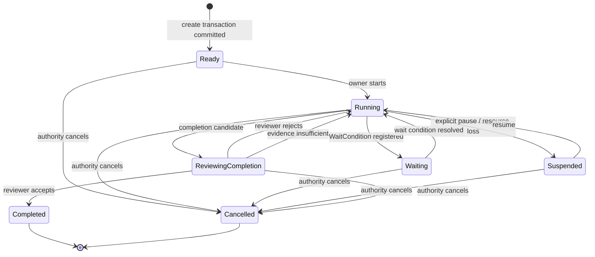
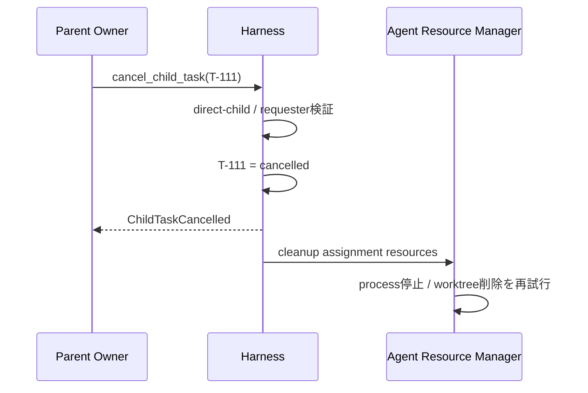

# Taskライフサイクル設計

本書はTaskの生成から終端までの状態遷移を扱う。Agentの生成、オーナー割当、Agent実行、解放は[03-agent-lifecycle.md](03-agent-lifecycle.md)へ分離する。

## 1. 状態

```typescript
type TaskStatus =
  | "ready"
  | "running"
  | "waiting"
  | "suspended"
  | "reviewing_completion"
  | "completed"
  | "cancelled";
```



## 2. ルートTask生成

ルートTaskは人間、Scheduler、Webhook、APIなどの外部受付がTask申請を提出して作る。

```typescript
type RootTaskProposal = {
  objective: string;
  acceptance: string;
  instructions?: string;
  owner_profile: "L1" | "L2" | "L3";
  workspace_source?: string;
  budget?: Budget;
};
```

ハーネスは次を1つの作成トランザクションとして行う。

1. 提案の機械的妥当性を確認
2. idle Agentを割当、またはプロファイルから生成
3. Workspaceを作成
4. 空のTask進捗 v0を作成
5. Wiki Agentへ`task_start` コンテキストを要求
6. Taskを最初から`ready`として永続化
7. オーナー 実行を開始し`running`へ遷移

オーナーまたは論理Workspaceを準備できなければTaskレコードを`created`状態で残さず、Task作成操作を失敗として返す。`TaskCreated`と`OwnerAssigned` イベントは同じトランザクションで記録できる。

## 3. 子Task生成

Work AgentはTaskレコードを直接作らず、`delegate`で提案を提出する。

```typescript
type DelegateRequest = {
  objective: string;
  acceptance: string;
  instructions?: string;
  owner_profile: "L1" | "L2" | "L3";
  workspace_mode: "fork" | "shared_readonly" | "empty";
  dependency: "required" | "optional";
  artifact_refs?: string[];
  timeout_ms?: number;
};
```

### 検証

- 目的と受け入れ条件が空でない
- 現在Agentが親Taskオーナーである
- Taskツリーに循環がない
- 同一提案の重複でない
- 予算・depth・子数上限内
- 子オーナーを確保できる

### 同期待機から非同期への昇格

`timeout_ms`以内に子Taskが完了すれば結果を直接返す。超過した場合、子Taskは継続し、`async_id`を返す。

```json
{
  "status": "accepted",
  "async_id": "async-task-T-111",
  "task_id": "T-111"
}
```

非同期操作が存在しても、親Taskが自動的に`waiting`になるわけではない。親オーナーが別作業を続けられるなら`running`のままである。

## 4. `Waiting`

Taskが待機状態へ入るのは、オーナーがそのイベントなしでは進めないと判断したときである。

```typescript
type WaitCondition =
  | { kind: "child"; async_ids: string[]; mode: "all" | "any" }
  | { kind: "parent"; request_id: string }
  | { kind: "grant"; async_id: string }
  | { kind: "timer"; wake_at: string };
```

`waiting`は待機理由を表さない。理由と再開条件は必ず`WaitCondition`に保持する。メールボックスイベントなどが到着するとハーネスが条件を照合し、成立時だけ`running`へ戻す。

## 5. Task進捗

Taskは契約とは別に、オーナーAgentが認識する進捗をTODO形式の台帳として持つ。

```typescript
type TaskProgress = {
  task_id: string;
  version: number;
  current_focus_id?: string;
  last_observed_task_event_sequence: number;
  last_observed_agent_run_event_sequence: number;
  items: ProgressItem[];
  updated_at: string;
};

type ProgressItem = {
  item_id: string;
  description: string;
  status: "pending" | "in_progress" | "completed" | "blocked" | "cancelled";
  evidence_refs: string[];
  blocker?: string;
};
```

進捗はオーナー申告な作業認識であり、Task契約や完了レビューを置き換えない。ハーネスは一定の通常レスポンス ステップごとに専用メンテナンス レスポンスを開始し、`update_progress`だけを関数 ツールとして許可・強制する。更新はoptimistic `progress_version`とTaskイベント ウォーターマークを検証して永続化する。

進捗 更新の周期、失敗時の扱い、Responses API呼び出しは[05-runtime-and-responses-api.md](05-runtime-and-responses-api.md)を正本とする。

## 6. 質問と上位判断依頼

質問と上位判断依頼は同じ親子メールボックスを通るが、同じ種類の通信ではない。質問はTaskを担当するオーナーAgent間の助言通信であり、上位判断依頼は親子Task間の判断責任移転である。配送主体と意味上の主体を混同しない。

### 質問

子TaskのオーナーAgentが親TaskのオーナーAgentへ助言を求める。子オーナーは判断責任を保持し、親オーナーの回答を知見として解釈する。質問だけではTask契約を更新しない。

```text
Child Owner asks → Parent Owner advises → Child Owner interprets and decides
```

### 上位判断依頼

子Taskが、現在の契約では決められない判断を親Taskへ移す。親TaskがTask契約上の判断責任を引き受け、親オーナーはそのTaskを代表して決定する。必要ならハーネスが子Taskの契約を改訂し、契約バージョンを進める。

```text
Child Task escalates → Parent Task decides → Harness revises/clarifies Child Contract → Child Owner follows decision
```

親の決定が既存契約の解釈確定だけなら、`contract_patch`は不要である。作業継続が不適切なら`terminate: true`を返せる。ハーネスは責任者とリクエスト状態を検証し、当該Taskをキャンセル理由付きで`cancelled`へ確定して通常の子孫カスケードとオーナー解放を適用する。Agent自身がTaskを終端する操作ではない。

親がさらに上位へ上げる場合、子の継続情報を直接渡さない。親Taskが自分の上位判断依頼を作り、回答を受けて子向け決定を生成する。

ルートTaskには親Taskがないため、ハーネスは上位判断依頼をルート責任者である人間へ配送する。人間は`submit_task_escalation_decision` ingressから契約の明確化・変更、追加資源や権限の付与、あるいはキャンセルを決定する。ハーネスは`EscalationDecision`保存、契約更新またはキャンセル、メールボックス/非同期完了を同一トランザクションで確定する。ルート オーナーAgentが達成不能を理由にTaskを終端させることはできない。

## 7. 完了候補と受け入れ条件レビュー

オーナーは`complete`ではなく`complete_candidate`を提出する。

```typescript
type CompletionCandidate = {
  owner_judgement: string;
  outcome_ref: string;
  artifact_refs: string[];
  evidence_refs?: string[];
  contract_version: number;
  timeout_ms?: number;
};
```

### ハーネスの前検査

- 呼び出したAgentがオーナーか
- Taskが`running`か
- 契約バージョンが現行か
- 必須成果物参照が存在するか
- 未終了の必須 子Taskがないか
- 証跡 ダイジェストを固定できるか

### 受け入れ条件レビュアー

オーナーAgent 実行から分離した一時API セッションへ次だけを渡す。このセッションはハーネス管理のAgent実行ではない。

- 目的
- 受け入れ条件
- オーナー judgement
- 結果 要約
- 指定成果物 / 証跡
- 必須 子Taskの最終状態

レビュアーはコード品質や新しい要件を評価しない。

```typescript
type AcceptanceReviewDecision = {
  decision: "accept" | "reject" | "insufficient_evidence";
  rationale: string;
  unmet_acceptance: string[];
  required_evidence: string[];
  evidence_refs: string[];
};
```

構造化 出力では全フィールドを必須にし、該当しない配列は空にする。ハーネスは判断ごとの組合せを意味検証する。

`reject`と`insufficient_evidence`はいずれもTaskを`running`へ戻す。前者は受け入れ条件未達の修正、後者は証跡追加というオーナーの能動作業を要求する。証跡取得に別の非同期結果が必要になった場合だけ、オーナーが対応するツールを呼び、その結果を表す`WaitCondition`で`waiting`へ遷移する。

### 責任分担

```text
Owner    : 完成したと判断して候補を出す
Reviewer : Acceptanceとの整合を軽量確認する
Harness  : 状態遷移を確定する
```

レビュアーがTaskのオーナーになることはない。

## 8. Suspensionと復旧

Agent実行、ランタイム、Workspace、依存資源などの障害はTaskの失敗を意味しない。Taskの責任を維持したまま`suspended`へ遷移し、ハーネスが復旧を管理する。

```typescript
type Suspension = {
  reason: string;
  source:
    | "agent_run_failure"
    | "runtime_failure"
    | "workspace_failure"
    | "resource_unavailable"
    | "security_incident";
  recovery_owner: "harness" | "operator";
  recovery_policy: "automatic" | "manual";
  retry_count: number;
  suspended_at: string;
  next_retry_at?: string;
};
```

ハーネスは自動復旧、同じ論理Agentの新しい実行、Workspace復元などを試みる。自動復旧できなければ`recovery_owner`を運用者へ移して`suspended`を維持する。運用者は復旧して`running`へ戻すか、責任者としてキャンセルを要求する。障害だけを理由にTaskを終端させない。

### インシデントによるTaskツリー suspension

MVPでは、Task `T` でHigh/Critical インシデントが発生した場合、Control Planeは固定したTaskツリー 改訂から `ancestors(T) ∪ {T} ∪ descendants(T)` を封じ込め集合として決定論的に計算する。兄弟Taskとその子孫は集合へ含めず、継続を許可する。各対象についてTask ID、`ancestor | source | descendant`、停止直前の状態を封じ込め スナップショットへ保存する。

Control Planeは集合全体を先に封じ込め対象として予約し、対象Taskからの新規ツール 呼び出し、`delegate`、質問、上位判断依頼、完了案、通常再開を拒否する。これは追加の迂回防止規則ではなく、`suspended` Taskは作業操作を開始できないというTaskライフサイクルの不変条件である。ハーネス内部の実行停止、責任者の判断適用、復旧、キャンセルだけは許可する。

実行中Agent実行は子孫から祖先の順に停止し、停止確認後に各Taskを`suspended`へ確定する。一部の実行停止に時間がかかっても予約済み集合から新規操作は開始できない。親が停止するため、インシデント Taskを破棄して同じ作業を新しい子Taskとして起票する迂回も成立しない。

再開には封じ込め解除と、High/CriticalではControl Planeの責任者ゲートウェイ経由の人間による再開判断を必要とする。祖先から子孫の順に依存関係を再検査し、各Taskを保存済みの直前状態へ戻す。直前状態が`waiting`または`reviewing_completion`だったTaskを無条件に`running`へ変えない。

## 9. 親による子Taskキャンセル

親Taskオーナーは直接の子Taskだけをキャンセルできる。キャンセルは責任者による責任撤回であるため、中間状態を設けず、ハーネスの検証と同時にTaskを`cancelled`へ確定する。

```typescript
type CancelChildTask = {
  child_task_id: string;
  reason: string;
  policy?: "cascade" | "detach_children" | "transfer_children";
  timeout_ms?: number;
};
```

### 標準シーケンス



キャンセル確定前にハーネスは、既存成果物、証跡、最新の耐久Workspace スナップショットへの参照を結果へ固定する。Agentの応答や新しいスナップショットを待つことはキャンセルの成立条件にしない。

### 子孫

デフォルトは`cascade`。ハーネスが子孫Taskをそれぞれ`cancelled`へ確定し、各オーナー 割り当ての終了イベントからリソース クリーンアップを起動する。

- ハーネスがTaskツリーに沿ってキャンセルを伝播
- プロセス停止やワークツリー削除はAgentリソースのクリーンアップとして非同期実行
- クリーンアップの再試行や手動介入はTask状態を変更しない
- 外部へ到達済みの外向きトランザクションは自動ロールバックしない

### Taskとクリーンアップの分離

```text
Authority decision
  → Task = cancelled
  → Owner Assignment終了
  → HarnessがAgent Resource Cleanupを開始
  → released または needs_operator
```

## 10. 親 Taskの終了条件

親 Taskは次のいずれかを満たすまで完了案を出せない。

- 必須 子がすべて終端
- `active` 子をキャンセル済み
- optional 子をdetachまたはtransfer済み

子Taskの`completed`は親Taskの`completed`を意味しない。

## 11. Taskイベント

```typescript
type TaskEvent =
  | { type: "TaskCreated" }
  | { type: "OwnerAssigned"; owner_id: string }
  | { type: "TaskStarted"; run_id: string }
  | { type: "ChildDelegated"; child_task_id: string }
  | { type: "WaitStarted"; condition: WaitCondition }
  | { type: "WaitResolved"; event_id: string }
  | { type: "ParentAsked"; request_id: string }
  | { type: "EscalationRaised"; request_id: string }
  | { type: "ContractChanged"; version: number }
  | { type: "TaskSuspended"; suspension: Suspension }
  | { type: "TaskResumed"; run_id: string }
  | { type: "ProgressRefreshed"; progress_version: number; through_task_event_sequence: number; through_agent_run_event_sequence: number }
  | { type: "ProgressRefreshFailed"; reason: string }
  | { type: "ContextCompacted"; cursor_id: string; source_run_id: string; new_run_id: string }
  | { type: "CompletionCandidateSubmitted"; candidate_version: number }
  | { type: "CompletionReviewed"; review_id: string }
  | { type: "TaskCompleted"; outcome_ref: string }
  | { type: "TaskCancelled"; reason: string };
```

現在状態は`tasks`、履歴は`task_events`へ保存する。両者は同一トランザクションで更新する。

コンテキスト 圧縮はTask状態遷移ではない。必要に応じて`ContextCompacted` イベントを監査用に記録するが、Task状態とオーナーは維持する。

## 12. エピソード生成

`completed`または`cancelled`へ入った後、エピソード Agentを非同期起動する。`suspended`は非終端なのでエピソードを確定せず、Task進捗、再開 カーソル、障害証跡を保存する。
