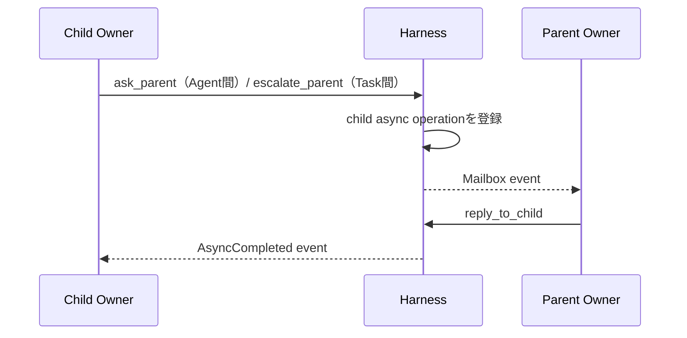

# Agent RuntimeとResponses API設計

## 1. 実行モデル

一つのAgentを、Contextを読み、Actionをyieldし、結果イベントで再開するコルーチンとして扱う。

```text
Agent Coroutine
  read Context View
  decide next Action with LLM
  yield Tool / Delegate / Ask / Escalate / Effect / Completion Candidate
  suspend or continue
  receive result through function output or Mailbox
  resume
```

概念型:

```typescript
type AgentCoroutine = (
  context: AgentContextView,
  event?: AgentEvent
) => Promise<AgentAction | FinalMessage>;
```

## 2. Context View

エージェントへ裸のTask文字列を渡さず、明示的な文脈Viewを構築する。

```typescript
type AgentContextView = {
  contract: {
    objective: string;
    acceptance: string;
    instructions?: string;
    version: number;
  };
  state: {
    status: string;
    workspace_ref: string;
    child_tasks: ChildTaskSummary[];
    pending_async: AsyncSummary[];
  };
  memory: {
    semantic_context: string;
    relevant_episodes?: string;
    memory_version: string;
  };
  mailbox: AgentEvent[];
};
```

Contract、Current State、Organizational Memoryを別セクションで渡し、過去の目的が現在の命令へ混入するのを防ぐ。

## 3. Responses APIの役割

Responses APIは一回の推論ステップを担う。

```text
Responses API = Contextから次Actionを選ぶPolicy Step
Harness       = Task・状態・継続・Workspace・Effect・記憶を管理するRuntime
```

### Function Calling

モデルが返すFunction CallをHarness Effectとして解釈する。Responseの`call_id`に対応する`function_call_output`を次入力へ渡して推論を続けられる。

```json
{
  "type": "function_call_output",
  "call_id": "call_123",
  "output": "{\"status\":\"completed\",\"value\":{...}}"
}
```

### `previous_response_id`

同一Agent Run内の短期継続に利用できる。ただしLogical Continuationの正本にはしない。

- `previous_response_id`はマルチターン継続に使える
- `conversation`とは同時に使えない
- 前Responseの`instructions`は自動継承されないため、Harnessが毎回再構築する
- 長期停止、Response chain喪失、Context再編成時は新しいchainを開始する

### Background mode

一回の長いモデル推論を非同期実行する補助手段として利用できる。Task scheduler、Mailbox、子Agent管理の代替ではない。

```text
Background Response : 単一LLM推論の寿命
Async Operation     : Harness Tool処理の寿命
Task                 : Owner責任の寿命
```

三者を別IDで管理する。

## 4. IDの分離

| ID | 範囲 |
|---|---|
| `response_id` | OpenAIの一Response |
| `call_id` | 一Response chain内のFunction Callと出力の対応 |
| `run_id` | Agentの一実行セッション |
| `async_id` | ResponseをまたぐTool処理 |
| `task_id` | Owner責任単位 |
| `continuation_id` | Taskを論理的に再開する位置と条件 |

```text
call_id ≠ async_id ≠ continuation_id
```

## 5. Logical Continuation

```typescript
type Continuation = {
  continuation_id: string;
  task_id: string;
  run_id: string;
  reason:
    | "waiting_child"
    | "waiting_parent"
    | "waiting_effect"
    | "waiting_review"
    | "suspended";
  awaited_event_ids: string[];
  previous_response_id?: string;
  pending_call_id?: string;
  contract_version: number;
  workspace_snapshot_ref: string;
  context_snapshot_ref: string;
};
```

Response chainを継続できる場合は`previous_response_id`と`call_id`を利用する。できない場合は、Continuation、Task state、Mailbox、Workspaceから新しい入力を構築する。

## 6. Run Coordinator

```text
lock Task
  → consume mailbox entries
  → build context
  → responses.create
  → parse output items
  → validate tool calls
  → dispatch effects
  → persist events and continuation
  → unlock Task
```

同じTaskへ同時に二つのResponse Stepを走らせない。楽観ロック用に`task.version`または`run_step_seq`を使う。

## 7. 親イベント処理

Ask / Escalationは親Responseへの割り込みではなく、親Task Mailboxへのイベントとして配送する。ただし、この共通配送経路は意味上の主体が同じことを意味しない。AskはChild OwnerとParent OwnerのAgent間助言通信、EscalationはChild TaskとParent Taskの間のContract判断責任移転である。



親Taskが別Response Step中ならイベントをキューへ積み、step境界で処理する。重大度に応じた優先度は付けても、同一Task内の推論を強制的に並行実行しない。

## 8. Context再構築

次の場合に新しいResponse chainを開始する。

- 長時間停止後の再開
- Contract version変更
- Context window圧縮
- モデル変更
- `previous_response_id`を取得できない
- 監査上、明示的な境界を作りたい

再構築入力:

```text
Agent Profile
+ Current Task Contract
+ Current Task State
+ Latest Workspace Summary
+ Unconsumed Mailbox Events
+ Wiki Agent Memory Context
+ Previous Run Summary
```

過去の逐語会話を正本として再投入しない。

## 9. Parallel Tool Calls

Responses APIが複数Function Callを返しても、Harnessは依存関係を検査する。

- 独立したlocal readや複数delegateは並列化可能
- Contract変更とcompletion candidateは同一stepで並列処理しない
- `request_effect`はpayloadごとに別Effectとして固定する
- Task状態を変えるcontrol toolは直列化する

安全な初期実装では`parallel_tool_calls: false`でもよい。並列性は子Taskで明示する方が監査しやすい。

## 10. OpenAI仕様に依存する箇所

本設計で依存するのは次の最小部分だけである。

1. Responses APIがcustom function toolsを受け取れる
2. Function Callに`call_id`があり、`function_call_output`で結果を対応付けられる
3. `previous_response_id`で継続できる
4. `background: true`のResponseを後から取得・取消できる

詳細と確認日、公式リンクは[../sources/OPENAI_API_NOTES.md](../sources/OPENAI_API_NOTES.md)に分離している。
