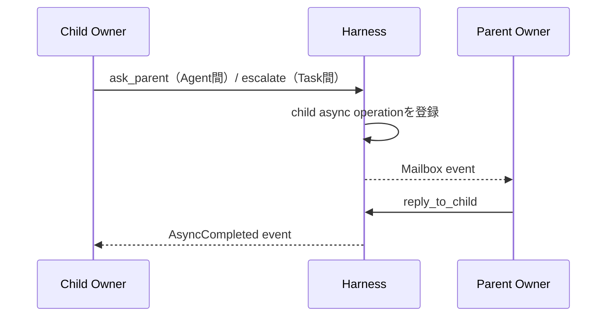

# Agent RuntimeとResponses API設計

## 1. 実行モデル

一つのAgentを、Contextを読み、Actionをyieldし、結果イベントで再開するコルーチンとして扱う。

```text
Agent Coroutine
  read Context View
  decide next Action with LLM
  yield Tool / Delegate / Ask / Escalate / Effect / Completion Candidate
  suspend or continue
  receive result through function output or Mailbox
  resume
```

概念型:

```typescript
type AgentCoroutine = (
  context: AgentContextView,
  event?: AgentEvent
) => Promise<AgentAction | FinalMessage>;
```

## 2. Context View

エージェントへ裸のTask文字列を渡さず、明示的な文脈Viewを構築する。

```typescript
type AgentContextView = {
  contract: {
    objective: string;
    acceptance: string;
    instructions?: string;
    version: number;
  };
  state: {
    status: string;
    workspace_ref: string;
    child_tasks: ChildTaskSummary[];
    pending_async: AsyncSummary[];
  };
  memory: {
    semantic_context: string;
    relevant_episodes?: string;
    memory_version: string;
  };
  mailbox: AgentEvent[];
  recent_run_events: AgentRunEventView[];
};
```

Contract、Current State、Organizational Memory、過去Run Eventsを別セクションで渡し、過去の目的や会話が現在の命令へ混入するのを防ぐ。

## 3. Responses APIの役割

Responses APIは一回の推論ステップを担う。

```text
Responses API = Contextから次Actionを選ぶPolicy Step
Harness       = Task・状態・継続・Workspace・Effect・記憶を管理するRuntime
```

### Function Calling

モデルが返すFunction CallをHarness Effectとして解釈する。Responseの`call_id`に対応する`function_call_output`を次入力へ渡して推論を続けられる。

```json
{
  "type": "function_call_output",
  "call_id": "call_123",
  "output": "{\"status\":\"completed\",\"value\":{...}}"
}
```

### `instructions`と`previous_response_id`

同一Agent Run内の短期継続に利用できる。ただしLogical Continuationの正本にはしない。

- `previous_response_id`はマルチターン継続に使える
- `conversation`とは同時に使えない
- `instructions` parameterは、そのResponseのContextへsystemまたはdeveloper messageとして挿入される
- `previous_response_id`を指定しても、前Responseで指定した`instructions` parameterは次Responseへ引き継がれない
- `input` itemとして明示した`role: "developer"` messageと、top-level `instructions` parameterを混同しない
- 本設計ではHarnessの実行規約をtop-level `instructions`として毎回Current Policyから構築し、API chainを規約の正本にしない
- 長期停止、Response chain喪失、Context再編成時は新しいchainを開始する

### Background mode

一回の長いモデル推論を非同期実行する補助手段として利用できる。Task scheduler、Mailbox、子Agent管理の代替ではない。

```text
Background Response : 単一LLM推論の寿命
Async Operation     : Harness Tool処理の寿命
Task                 : Owner責任の寿命
```

三者を別IDで管理する。

## 4. IDの分離

| ID | 範囲 |
|---|---|
| `response_id` | OpenAIの一Response |
| `call_id` | 一Response chain内のFunction Callと出力の対応 |
| `run_id` | Agentの一実行セッション |
| `async_id` | ResponseをまたぐTool処理 |
| `task_id` | Owner責任単位 |
| `continuation_id` | Taskを論理的に再開する位置と条件 |

```text
call_id ≠ async_id ≠ continuation_id
```

## 5. Logical Continuation

```typescript
type Continuation = {
  continuation_id: string;
  task_id: string;
  run_id: string;
  reason: "waiting" | "reviewing_completion" | "suspended";
  wait_condition?: WaitCondition;
  awaited_event_ids: string[];
  previous_response_id?: string;
  pending_call_id?: string;
  contract_version: number;
  workspace_snapshot_ref: string;
  context_snapshot_ref: string;
};
```

Response chainを継続できる場合は`previous_response_id`と`call_id`を利用する。できない場合は、Continuation、Task state、Mailbox、Workspaceから新しい入力を構築する。

## 6. Run Coordinator

```text
lock Task
  → consume mailbox entries
  → build context
  → responses.create
  → parse output items
  → validate tool calls
  → dispatch effects
  → persist events and continuation
  → unlock Task
```

同じTaskへ同時に二つのResponse Stepを走らせない。楽観ロック用に`task.version`または`run_step_seq`を使う。

## 7. Agent Run Record Policy

本節を、Agent Runから発生する情報の記録範囲・正本性・保持方針の正本とする。Task Event、Effect Ledger、Artifactなど別Aggregateが正本を持つ情報は、Agent Run側に複製せず参照を保存する。

### 記録単位

```text
Agent Run
  └─ Response Step
       ├─ request metadata
       ├─ completed output items
       ├─ tool dispatch / result refs
       ├─ usage / latency
       └─ resulting Task Event refs
```

`agent_runs`は実行セッション、`agent_run_steps`は一回のResponses API呼び出し、`agent_run_items`は完成したoutput itemの正規化記録を表す。Streaming deltaをEvent Sourcingの単位にはしない。

同じOwner Assignment内では`assignment_event_sequence`を単調増加させ、RunをまたいでEventを順序付ける。Task再開時はこのsequenceを基準に過去Run Eventsを選択する。

### 保存区分

| 情報 | 保存内容 | 正本性 | 既定保持 |
|---|---|---|---|
| Run metadata | run、agent、task、model、status、開始終了、stop reason | Runの正本 | 長期 |
| Step metadata | step sequence、response ID、種別、開始終了、status | Run履歴の正本 | 長期 |
| Request context | Contract／State／Progress／Mailbox等のversionと参照、request digest | 各Storeが正本 | 長期 |
| 完全なrequest body | 原則保存しない。必要時だけEvidence DBの暗号化BLOB | 派生コピー | 短期 |
| 完成output item | item type、ID、status、必要field、raw digest | Run Evidence | Policy依存 |
| 通常message text | textまたは暗号化blob参照 | Run Evidence | 短期、Artifact昇格可 |
| Function Call | name、call ID、検証済みarguments、schema version | Tool要求の正本 | 長期 |
| Function Call Result | call ID、status、result／error参照 | Tool結果Storeが正本 | 長期参照 |
| Hosted Tool item | tool種別、item ID、status、result参照 | Provider出力の記録 | Policy依存 |
| Task状態へ作用した結果 | Task Event ID | Task Eventが正本 | 長期参照 |
| Ask／Escalation／Review | request／decision ID | 各Aggregateが正本 | 長期参照 |
| Async Operation | async IDとresult ref | Async Storeが正本 | 長期参照 |
| Artifact／Workspace | immutable Artifact ref、snapshot ref | 各Storeが正本 | 長期参照 |
| Usage | input、cached input、output、reasoning等のtoken数 | 課金・観測記録 | 長期集計、明細はPolicy依存 |
| Error | error code、retryable、provider request ID、redacted detail ref | Run障害記録 | 長期 |

### 保存しない・揮発を許容する情報

- token単位のStreaming delta。完成itemとstream statusだけを保存する
- 非公開Chain of Thought。要求せず、Taskの正本にも使わない
- AgentがAction、Progress、Decision、Artifactへ反映しなかった内部仮説
- 重複したContext本文。version、参照、digestから再構築できるものは複製しない
- Artifact化されていない冗長なstdout/stderr。既定上限を超える部分はtruncateし、必要時だけArtifactへ昇格する

「失うとTask責任、安全性、再開、監査が壊れる情報」は揮発対象にしてはならない。意味情報を残す必要が生じた時点で、Task Progress、Task Event、Decision、Artifactのいずれかへ昇格させる。

### ReasoningとCompaction item

Reasoning本文は保存対象にしない。API継続に必要なreasoning itemや`encrypted_content`は内容を解釈せず、Evidence DBのprovider continuation BLOBとして暗号化保存できる。opaqueなcompaction itemも同様にAPI Context継続用の短期BLOBとして扱い、Task Progress、Episode、監査上の判断根拠には使わない。

standalone `/responses/compact`の出力はAPI仕様に従い全体を変更せず次inputへ渡す必要があるため、次Run／StepがconsumeするまでEvidence DBへ暗号化BLOBとして保持する。その後はRetention Policyに従って削除できる。

### Progress Maintenance Response

Periodic Progress Refreshは`step_kind: "progress_maintenance"`として通常Stepと区別して保存する。

- forced `update_progress` Function Callとargumentsを保存する
- Progress更新Transactionと`ProgressRefreshed` Eventを参照する
- Maintenance Stepを`normal_step_count`へ加算しない
- 失敗時は`ProgressRefreshFailed` Eventとredacted errorを保存する

### RedactionとSecret

永続化前に共通Redaction Pipelineを通す。Credential、Authorization header、Cookie、Secret環境変数、Policy指定PIIは平文保存しない。外部作用のpayload同一性が必要な場合は、実行payloadの暗号化blobをEffect Ledgerに保存し、Agent RunにはdigestとEffect IDだけを残す。

Function argumentsにもSecretが入りうるため、Tool schemaごとのsensitive field指定と汎用Secret scannerを併用する。監査digestはredaction前payloadから安全な境界内で計算し、表示用recordはredactする。

### Transaction境界

一つのStepについて、完成output item、Tool dispatch、Task Event参照、Continuation、Step statusを再実行可能に保存する。外部Tool実行をDB Transaction内に抱えず、開始前にdispatch intentをcommitし、結果を別Transactionで確定する。

```text
Step output received
  → persist completed items + dispatch intents
  → commit
  → execute tools
  → persist tool results + Task Event refs + continuation
  → commit
```

Crash時は`response_id`、`output_item.id`、`call_id`、`idempotency_key`で重複適用を防ぐ。

### Episodeとの境界

Agent Run Recordをそのまま長期記憶にしない。Episode AgentはTask Progress、Task Events、Decision、Artifact、Reviewを主入力にし、Agent Run Recordは根拠確認時の低位Evidenceとして参照する。短期保持対象が削除されてもEpisodeの主要主張が検証できるよう、必要な情報を終端前に長期Aggregateへ昇格させる。

## 8. 親イベント処理

Ask / Escalationは親Responseへの割り込みではなく、親Task Mailboxへのイベントとして配送する。ただし、この共通配送経路は意味上の主体が同じことを意味しない。AskはChild OwnerとParent OwnerのAgent間助言通信、EscalationはChild TaskとParent Taskの間のContract判断責任移転である。



親Taskが別Response Step中ならイベントをキューへ積み、step境界で処理する。重大度に応じた優先度は付けても、同一Task内の推論を強制的に並行実行しない。

## 9. Context Compactionと再構築

本設計では二種類を区別する。

```text
Responses API Compaction
  = API Context Windowを圧縮する機構

Harness Resume Cursor
  = Taskの正本を再読込する位置を固定し、新Agent Runを開始する境界
```

Responses APIには、`responses.create`の`context_management`と`compact_threshold`を使うserver-side compaction、およびstatelessな`POST /responses/compact`がある。APIが返すcompaction itemは暗号化されたopaque itemであり、Task状態の正本やHarnessのResume Cursorには使わない。

CompactionによってTask status、Owner Assignment、Contract version、未完了Operationを変更しない。Taskが`running`なら`running`のままであり、`waiting`や`reviewing_completion`でもその状態と再開条件を維持する。

### Responses API Compaction

Context tokenが閾値へ達した場合はserver-side compactionを利用できる。この処理は同じResponse stream内で発生し、`previous_response_id` chainingも継続できるため、API Compactionだけを理由にAgent Runを閉じない。

- stateless input-array chainingではcompaction itemを含むoutputを次inputへ追加し、必要なら最新compaction itemより前だけを削除する
- `previous_response_id` chainingでは新しいmessageだけを渡し、手動pruneしない
- standalone `/responses/compact`を使う場合は、返されたcompacted window全体を変更せず次のResponses inputへ渡す

API固有の詳細は[../sources/OPENAI_API_NOTES.md](../sources/OPENAI_API_NOTES.md)を正本とする。

### Periodic Progress Refresh

Taskの意味的進捗は後付けCheckpoint要約ではなく、Task Progress Ledgerへ保存する。通常Responseへ共通Envelopeを要求することはResponses APIの仕様上できないため、Harnessが一定の通常Response Stepごとに専用Maintenance Responseを開始する。

```typescript
type ProgressRefreshPolicy = {
  interval_steps: number;      // 推奨初期値: 8
  retry_limit: number;         // 推奨初期値: 1
  refresh_before_run_switch: boolean;
};
```

Maintenance Responseには現在Contract、現在Progress、前回watermark以降のTask Events・Tool結果・Artifact参照を渡す。利用可能Toolを`update_progress`だけに制限し、`tool_choice`で同Functionを強制する。Maintenance Responseは通常Step数へ数えず、TaskのActionを進めない。

前回Progress Refresh以降のAgent Run EventsもMaintenance Responseへ渡し、保存したProgressには`through_agent_run_event_sequence` watermarkを記録する。

```text
N normal Response Steps completed
  → safe step boundary
  → responses.create(
       tools=[update_progress],
       tool_choice={type: "function", name: "update_progress"}
     )
  → Function argumentsを検証
  → progress versionとTask／Agent Run event watermarkを同一Transactionで更新
```

Harnessは既存の非終端itemが応答から消えていないこと、item IDの一意性、Evidence参照、progress version、Event watermarkを検証する。削除相当のitemは省略せず`cancelled`として残す。

`update_progress`を保存した後、Harnessは同じ`call_id`の`function_call_output`を永続化する。次の通常Responseを同じchainで続ける場合は、そのoutputを次inputへ渡す。Progress更新後に追加のMaintenance用message生成を要求しない。

更新失敗時は直前のProgressを保持し、`ProgressRefreshFailed`を記録する。既定回数だけ再試行するが、Taskを`suspended`にはしない。次の周期またはRun切替前に再試行する。未出力の内部思考は回復対象にせず、最後に保存されたProgress以降のTask EventsとTool結果からAgentが再確認する。

### Harness Resume CursorのTrigger

Harnessは次の場合に最小Resume Cursorを作り、新しいAgent Runを開始できる。

- 長時間停止後に再開する
- Contract versionまたはモデルが変わった
- `previous_response_id`を取得できない
- 監査上の明示的なRun境界が必要になった

Context token閾値だけなら、原則としてResponses APIのserver-side compactionを使い、Harness Run境界は作らない。

Run切替前にはProgress Refreshを試行するが、成功を切替の必須条件にはしない。

### 安全な境界

Resume CursorによるRun再構築はResponse Step境界でだけ行う。未処理のFunction Callがある場合は、Tool実行結果と`call_id`対応を先に永続化する。実行中Operationそのものは中断しない。Cursor作成中に到着したMailbox Eventはconsumeせず、新RunのContextへ含める。

```text
lock Task
  → current stepのTool Call / Result / Eventを永続化
  → Contract versionとTask stateを固定して読む
  → Progress Refreshを試行
  → ResumeCursorを生成・検証
  → 旧Runをstopped(reason=compacted)
  → previous_response_idを引き継がず新Runを作成
  → Cursor位置から各正本を再読込してContext Viewを再構築
  → lock解除
```

### Resume Cursor

```typescript
type ResumeCursor = {
  cursor_id: string;
  task_id: string;
  agent_id: string;
  source_run_id: string;
  contract_version: number;
  task_version: number;
  progress_version: number;
  workspace_snapshot_ref: string;
  last_consumed_mailbox_sequence: number;
  last_observed_task_event_sequence: number;
  last_observed_agent_run_event_sequence: number;
  created_at: string;
};
```

Cursorは自然言語要約を持たない。Contract、Task state、Task Progress、Mailbox、Child Task、Async Operation、Artifact、論理Workspace、Agent Run Eventsは各Storeから必ず再読込する。

### 検証と失敗

HarnessはCursor保存前に、Task・Agent・Contract・Progress versionの一致、Workspace参照の存在、EventとMailbox sequenceの単調性を検査する。検査に失敗した場合は旧Runを閉じず、最新状態から再生成する。旧Response chainを利用できずCursorも作れない場合は、Taskを`suspended`としてOperator復旧へ送る。

新Run作成前にContract、Task、Progress versionが変わった場合、Cursorをstaleとして破棄し、最新状態から再生成する。

### 再構築入力

```text
Agent Profile
+ Current Task Contract
+ Current Task State
+ Current Task Progress
+ Latest Workspace Summary
+ Unconsumed Mailbox Events
+ Wiki Agent Memory Context
+ Selected Past Agent Run Events
+ Resume Cursor以降のTask／Run Events
```

### 過去Agent Run Eventsの選択

再開時には、同じOwner Assignmentに属する永続済みRun Eventsから、次を時系列で`recent_run_events`へ入れる。

1. Current Progressの`last_observed_agent_run_event_sequence`より後の全Event
2. 直近の通常Response Step。既定windowは8 Step
3. window外でも未解決のTool Call／Async開始、error、Ask／Escalation、Decision、Artifact生成、Progress Refresh

入力token budgetを超える場合は、未観測Event、未解決Event、Decision／error、直近Eventの順で優先する。省略したEventは件数とsequence範囲だけを示し、必要ならAgentがArtifactやRun RecordをTool経由で確認できるよう参照を付ける。

```typescript
type AgentRunEventView = {
  assignment_event_sequence: number;
  run_id: string;
  step_id: string;
  kind: "message" | "function_call" | "function_result" | "error" | "maintenance";
  summary?: string;
  ref?: string;
  occurred_at: string;
};
```

Reasoning、opaque compaction item、Secret、token単位deltaは注入しない。通常messageも全Transcriptとして戻さず、Retention内にある直近textまたはredacted summaryだけを対象とする。Agent Run Eventsは再開補助であり、Current Contract、State、Progressを上書きしない。

## 10. Parallel Tool Calls

Responses APIが複数Function Callを返しても、Harnessは依存関係を検査する。

- 独立したlocal readや複数delegateは並列化可能
- Contract変更とcompletion candidateは同一stepで並列処理しない
- `request_effect`はpayloadごとに別Effectとして固定する
- Task状態を変えるcontrol toolは直列化する

安全な初期実装では`parallel_tool_calls: false`でもよい。並列性は子Taskで明示する方が監査しやすい。

## 11. OpenAI仕様に依存する箇所

本設計で依存するのは次の最小部分だけである。

1. Responses APIがcustom function toolsを受け取れる
2. Function Callに`call_id`があり、`function_call_output`で結果を対応付けられる
3. `previous_response_id`で継続できる
4. `background: true`のResponseを後から取得・取消できる
5. `context_management`でserver-side compactionを設定できる
6. `POST /responses/compact`でstandalone compactionを実行できる

詳細と確認日、公式リンクは[../sources/OPENAI_API_NOTES.md](../sources/OPENAI_API_NOTES.md)に分離している。
