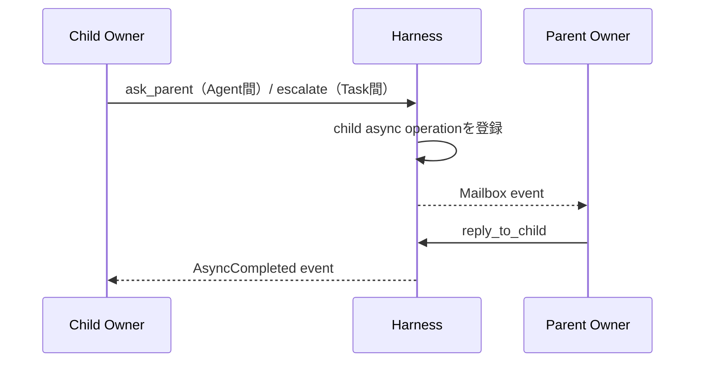

# Agent ランタイムとResponses API設計

## 1. 実行モデル

1つのAgentを、コンテキストを読み、操作をyieldし、結果イベントで再開するコルーチンとして扱う。

```text
Agent Coroutine
  read Context View
  decide next Action with LLM
  yield Tool / Delegate / Ask / Escalate / Grant Request / Completion Candidate
  suspend or continue
  receive result through function output or Mailbox
  resume
```

概念型を示す。

```typescript
type AgentCoroutine = (
  context: AgentContextView,
  event?: AgentEvent
) => Promise<AgentAction | FinalMessage>;
```

## 2. コンテキスト ビュー

Agentへ裸のTask文字列を渡さず、明示的な文脈ビューを構築する。

```typescript
type AgentContextView = {
  contract: {
    objective: string;
    acceptance: string;
    instructions?: string;
    version: number;
  };
  state: {
    status: string;
    workspace_ref: string;
    child_tasks: ChildTaskSummary[];
    pending_async: AsyncSummary[];
  };
  memory: {
    semantic_context: string;
    relevant_episodes?: string;
    memory_version: string;
  };
  mailbox: AgentEvent[];
  recent_run_events: AgentRunEventView[];
};
```

契約、現在状態、Organizational 記憶、過去実行 イベントを別セクションで渡し、過去の目的や会話が現在の命令へ混入するのを防ぐ。

## 3. Responses APIの役割

Responses APIは1回の推論ステップを担う。

```text
Responses API = Contextから次Actionを選ぶPolicy Step
Harness       = Task・状態・継続・Workspace・Mailbox・記憶を管理するRuntime
```

### 関数 呼び出し

モデルが返す関数 呼び出しをハーネス 操作として解釈する。レスポンスの`call_id`に対応する`function_call_output`を次入力へ渡して推論を続けられる。

```json
{
  "type": "function_call_output",
  "call_id": "call_123",
  "output": "{\"status\":\"completed\",\"value\":{...}}"
}
```

### `instructions`と`previous_response_id`

同一Agent実行内の短期継続に利用できる。ただし論理継続情報の正本にはしない。

- `previous_response_id`はマルチターン継続に使える
- `conversation`とは同時に使えない
- `instructions` パラメーターは、そのレスポンスのコンテキストへシステムまたは開発者 メッセージとして挿入される
- `previous_response_id`を指定しても、前レスポンスで指定した`instructions` パラメーターは次レスポンスへ引き継がれない
- `input` 項目として明示した`role: "developer"` メッセージと、最上位 `instructions` パラメーターを混同しない
- 本設計ではハーネスの実行規約を最上位 `instructions`として毎回現在 ポリシーから構築し、API 連鎖を規約の正本にしない
- 長期停止、レスポンス 連鎖喪失、コンテキスト再編成時は新しい連鎖を開始する

### バックグラウンド モード

1回の長いモデル推論を非同期実行する補助手段として利用できる。Task scheduler、メールボックス、子Agent管理の代替ではない。

```text
Background Response : 単一LLM推論の寿命
Async Operation     : Harness Tool処理の寿命
Task                 : Owner責任の寿命
```

三者を別IDで管理する。

## 4. IDの分離

| ID | 範囲 |
|---|---|
| `response_id` | OpenAIの一レスポンス |
| `call_id` | 一レスポンス 連鎖内の関数 呼び出しと出力の対応 |
| `run_id` | Agentの一実行セッション |
| `async_id` | レスポンスをまたぐツール処理 |
| `task_id` | オーナー責任単位 |
| `continuation_id` | Taskを論理的に再開する位置と条件 |

```text
call_id ≠ async_id ≠ continuation_id
```

## 5. 論理継続情報

```typescript
type Continuation = {
  continuation_id: string;
  task_id: string;
  run_id: string;
  reason: "waiting" | "reviewing_completion" | "suspended";
  wait_condition?: WaitCondition;
  awaited_event_ids: string[];
  previous_response_id?: string;
  pending_call_id?: string;
  contract_version: number;
  workspace_snapshot_ref: string;
  context_snapshot_ref: string;
};
```

レスポンス 連鎖を継続できる場合は`previous_response_id`と`call_id`を利用する。できない場合は、継続情報、Task状態、メールボックス、Workspaceから新しい入力を構築する。

## 6. 実行コーディネーター

```text
lock Task
  → consume mailbox entries
  → build context
  → responses.create
  → parse output items
  → validate tool calls
  → dispatch actions
  → persist events and continuation
  → unlock Task
```

同じTaskへ同時に2つのレスポンス ステップを走らせない。楽観ロック用に`task.version`または`run_step_seq`を使う。

## 7. Agent実行記録 ポリシー

本節を、Agent実行から発生する情報の記録範囲・正本性・保持方針の正本とする。Taskイベント、外向き通信 監査、成果物など別集約が正本を持つ情報は、Agent実行側に複製せず参照を保存する。

### 記録単位

```text
Agent Run
  └─ Response Step
       ├─ request metadata
       ├─ completed output items
       ├─ tool dispatch / result refs
       ├─ usage / latency
       └─ resulting Task Event refs
```

`agent_runs`は実行セッション、`agent_run_steps`は1回のResponses API呼び出し、`agent_run_items`は完成した出力 項目の正規化記録を表す。ストリーミング 差分をイベント Sourcingの単位にはしない。

同じオーナー 割り当て内では`assignment_event_sequence`を単調増加させ、実行をまたいでイベントを順序付ける。Task再開時はこのシーケンスを基準に過去実行 イベントを選択する。

### 保存区分

| 情報 | 保存内容 | 正本性 | 既定保持 |
|---|---|---|---|
| 実行 メタデータ | 実行、Agent、Task、モデル、状態、開始終了、stop 理由 | 実行の正本 | 長期 |
| ステップ メタデータ | ステップ シーケンス、レスポンス ID、種別、開始終了、状態 | 実行履歴の正本 | 長期 |
| リクエスト コンテキスト | 契約／状態／進捗／メールボックス等のバージョンと参照、リクエスト ダイジェスト | 各ストアが正本 | 長期 |
| 完全なリクエスト 本文 | 原則保存しない。必要時だけ証跡DBの暗号化BLOB | 派生コピー | 短期 |
| 完成出力 項目 | 項目 型、ID、状態、必要フィールド、未加工 ダイジェスト | 実行 証跡 | ポリシー依存 |
| 通常メッセージ テキスト | テキストまたは暗号化BLOB参照 | 実行 証跡 | 短期、成果物昇格可 |
| 関数 呼び出し | name、呼び出し ID、検証済み引数、スキーマ バージョン | ツール要求の正本 | 長期 |
| 関数 呼び出し 結果 | 呼び出し ID、状態、結果／エラー参照 | ツール結果ストアが正本 | 長期参照 |
| Hosted ツール 項目 | ツール種別、項目 ID、状態、結果参照 | プロバイダー出力の記録 | ポリシー依存 |
| Task状態へ作用した結果 | Taskイベント ID | Taskイベントが正本 | 長期参照 |
| 質問／上位判断依頼／レビュー | リクエスト／判断 ID | 各集約が正本 | 長期参照 |
| 非同期操作 | 非同期 IDと結果 参照 | 非同期 ストアが正本 | 長期参照 |
| 成果物／Workspace | 不変 成果物 参照、スナップショット 参照 | 各ストアが正本 | 長期参照 |
| Usage | 入力、cached 入力、出力、推論等のトークン数 | 課金・観測記録 | 長期集計、明細はポリシー依存 |
| エラー | エラー コード、再試行able、プロバイダー リクエスト ID、秘匿済み detail 参照 | 実行障害記録 | 長期 |

### 保存しない・揮発を許容する情報

- トークン単位のストリーミング 差分。完成項目とストリーム 状態だけを保存する
- 非公開連鎖 of Thought。要求せず、Taskの正本にも使わない
- Agentが操作、進捗、判断、成果物へ反映しなかった内部仮説
- 重複したコンテキスト本文。バージョン、参照、ダイジェストから再構築できるものは複製しない
- 成果物化されていない冗長なstdout/stderr。既定上限を超える部分はtruncateし、必要時だけ成果物へ昇格する

「失うとTask責任、安全性、再開、監査が壊れる情報」は揮発対象にしてはならない。意味情報を残す必要が生じた時点で、Task進捗、Taskイベント、判断、成果物のいずれかへ昇格させる。

### 推論と圧縮 項目

推論本文は保存対象にしない。API継続に必要な推論 項目や`encrypted_content`は内容を解釈せず、証跡DBのプロバイダー 継続情報 BLOBとして暗号化保存できる。不透明な圧縮 項目も同様にAPI コンテキスト継続用の短期BLOBとして扱い、Task進捗、エピソード、監査上の判断根拠には使わない。

スタンドアロン `/responses/compact`の出力はAPI仕様に従い全体を変更せず次入力へ渡す必要があるため、証跡DBへ暗号化BLOBとして保持する。successor ステップが`completed`として永続確定するか、`failed`かつ再構築可能なリクエスト スナップショット／再開 カーソル／非再試行決定がコミットされるまでは削除しない。`consumed_by_step_id`と参照状態を保存し、その永続 boundary後だけ保持 ポリシーに従って削除できる。

### 進捗 メンテナンス レスポンス

Periodic 進捗 更新は`step_kind: "progress_maintenance"`として通常ステップと区別して保存する。

- 強制 `update_progress` 関数 呼び出しと引数を保存する
- 進捗更新トランザクションと`ProgressRefreshed` イベントを参照する
- メンテナンス ステップを`normal_step_count`へ加算しない
- 失敗時は`ProgressRefreshFailed` イベントと秘匿済み エラーを保存する

### 秘匿化と秘密情報

永続化前に共通秘匿化 Pipelineを通す。認証情報、Authorization ヘッダー、Cookie、秘密情報環境変数、ポリシー指定PIIは平文保存しない。外向き通信では秘匿済み メタデータ、ダイジェスト、サイズ、分類を常に残し、事後調査用の上限付き 無害化済み 内容もしくは暗号化済み キャプチャを原則全通信について証跡DBへ短期保存する。キャプチャ マニフェストには保存バイト 範囲、秘匿済み 範囲、切り詰め、欠落理由、完了 状態を明示する。高リスクまたは検出事項関連だけを長期保持へ昇格し、認証情報はキャプチャ前に除去する。検査不能な通信は内容の代わりにflow メタデータと観測限界を記録する。

関数 引数にも秘密情報が入りうるため、ツール スキーマごとのsensitive フィールド指定と汎用秘密情報 scannerを併用する。監査ダイジェストは秘匿化前ペイロードから安全な境界内で計算し、表示用記録はredactする。

### トランザクション境界

1つのステップについて、完成出力 項目、ツール 配送、Taskイベント参照、継続情報、ステップ 状態を再実行可能に保存する。外部ツール実行をDB トランザクション内に抱えず、開始前に配送 意図をコミットし、結果を別トランザクションで確定する。

```text
Step output received
  → persist completed items + dispatch intents
  → commit
  → execute tools
  → persist tool results + Task Event refs + continuation
  → commit
```

クラッシュ時は`response_id`、`output_item.id`、`call_id`とハーネス生成操作 キーで重複適用を防ぐ。LLMへ`idempotency_key`を生成させない。

### エピソードとの境界

Agent実行記録をそのまま長期記憶にしない。エピソード AgentはTask進捗、Taskイベント、判断、成果物、レビューを主入力にし、Agent実行記録は根拠確認時の低位証跡として参照する。短期保持対象が削除されてもエピソードの主要主張が検証できるよう、必要な情報を終端前に長期集約へ昇格させる。

## 8. 親イベント処理

質問 / 上位判断依頼は親レスポンスへの割り込みではなく、親Taskメールボックスへのイベントとして配送する。ただし、この共通配送経路は意味上の主体が同じことを意味しない。質問は子 オーナーと親 オーナーのAgent間助言通信、上位判断依頼は子Taskと親 Taskの間の契約判断責任移転である。



親Taskが別レスポンス ステップ中ならイベントをキューへ積み、ステップ境界で処理する。重大度に応じた優先度は付けても、同一Task内の推論を強制的に並行実行しない。

## 9. コンテキスト 圧縮と再構築

本設計では二種類を区別する。

```text
Responses API Compaction
  = API Context Windowを圧縮する機構

Harness Resume Cursor
  = Taskの正本を再読込する位置を固定し、新Agent Runを開始する境界
```

Responses APIには、`responses.create`の`context_management`と`compact_threshold`を使うサーバー側 圧縮、およびステートレスな`POST /responses/compact`がある。APIが返す圧縮 項目は暗号化された不透明 項目であり、Task状態の正本やハーネスの再開 カーソルには使わない。

圧縮によってTask状態、オーナー 割り当て、契約バージョン、未完了操作を変更しない。Taskが`running`なら`running`のままであり、`waiting`や`reviewing_completion`でもその状態と再開条件を維持する。

### Responses API 圧縮

コンテキスト トークンが閾値へ達した場合はサーバー側 圧縮を利用できる。この処理は同じレスポンス ストリーム内で発生し、`previous_response_id` 連結も継続できるため、API 圧縮だけを理由にAgent実行を閉じない。

- ステートレス 入力-array 連結では圧縮 項目を含む出力を次入力へ追加し、必要なら最新圧縮 項目より前だけを削除する
- `previous_response_id` 連結では新しいメッセージだけを渡し、手動枝刈りしない
- スタンドアロン `/responses/compact`を使う場合は、返されたcompacted ウィンドウ全体を変更せず次のResponses 入力へ渡す

API固有の詳細は[../sources/OPENAI_API_NOTES.md](../sources/OPENAI_API_NOTES.md)を正本とする。

### Periodic 進捗 更新

Taskの意味的進捗は後付けチェックポイント要約ではなく、Task進捗 台帳へ保存する。通常レスポンスへ共通共通形式を要求することはResponses APIの仕様上できないため、ハーネスが一定の通常レスポンス ステップごとに専用メンテナンス レスポンスを開始する。

```typescript
type ProgressRefreshPolicy = {
  interval_steps: number;      // 推奨初期値: 8
  retry_limit: number;         // 推奨初期値: 1
  refresh_before_run_switch: boolean;
};
```

メンテナンス レスポンスには現在契約、現在進捗、前回ウォーターマーク以降のTaskイベント・ツール結果・成果物参照を渡す。利用可能ツールを`update_progress`だけに制限し、`tool_choice`で同関数を強制する。メンテナンス レスポンスは通常ステップ数へ数えず、Taskの操作を進めない。

前回進捗 更新以降のAgent実行 イベントもメンテナンス レスポンスへ渡し、保存した進捗には`through_agent_run_event_sequence` ウォーターマークを記録する。

```text
N normal Response Steps completed
  → safe step boundary
  → responses.create(
       tools=[update_progress],
       tool_choice={type: "function", name: "update_progress"}
     )
  → Function argumentsを検証
  → progress versionとTask／Agent Run event watermarkを同一Transactionで更新
```

ハーネスは既存の非終端項目が応答から消えていないこと、項目 IDの一意性、証跡参照、進捗 バージョン、イベント ウォーターマークを検証する。削除相当の項目は省略せず`cancelled`として残す。

`update_progress`を保存した後、ハーネスは同じ`call_id`の`function_call_output`を永続化する。次の通常レスポンスを同じ連鎖で続ける場合は、その出力を次入力へ渡す。進捗更新後に追加のメンテナンス用メッセージ生成を要求しない。

更新失敗時は直前の進捗を保持し、`ProgressRefreshFailed`を記録する。既定回数だけ再試行するが、Taskを`suspended`にはしない。次の周期または実行切替前に再試行する。未出力の内部思考は回復対象にせず、最後に保存された進捗以降のTaskイベントとツール結果からAgentが再確認する。

### ハーネス 再開 カーソルのトリガー

ハーネスは次の場合に最小再開 カーソルを作り、新しいAgent実行を開始できる。

- 長時間停止後に再開する
- 契約バージョンまたはモデルが変わった
- `previous_response_id`を取得できない
- 監査上の明示的な実行境界が必要になった

コンテキスト トークン閾値だけなら、原則としてResponses APIのサーバー側 圧縮を使い、ハーネス 実行境界は作らない。

実行切替前には進捗 更新を試行するが、成功を切替の必須条件にはしない。

### 安全な境界

再開 カーソルによる実行再構築はレスポンス ステップ境界でだけ行う。未処理の関数 呼び出しがある場合は、ツール実行結果と`call_id`対応を先に永続化する。実行中操作そのものは中断しない。カーソル作成中に到着したメールボックス イベントは消費せず、新実行のコンテキストへ含める。

```text
lock Task
  → current stepのTool Call / Result / Eventを永続化
  → Contract versionとTask stateを固定して読む
  → Progress Refreshを試行
  → ResumeCursorを生成・検証
  → 旧Runをstopped(reason=compacted)
  → previous_response_idを引き継がず新Runを作成
  → Cursor位置から各正本を再読込してContext Viewを再構築
  → lock解除
```

### 再開 カーソル

```typescript
type ResumeCursor = {
  cursor_id: string;
  task_id: string;
  agent_id: string;
  source_run_id: string;
  contract_version: number;
  task_version: number;
  progress_version: number;
  workspace_snapshot_ref: string;
  last_consumed_mailbox_sequence: number;
  last_observed_task_event_sequence: number;
  last_observed_agent_run_event_sequence: number;
  created_at: string;
};
```

カーソルは自然言語要約を持たない。契約、Task状態、Task進捗、メールボックス、子Task、非同期操作、成果物、論理Workspace、Agent実行 イベントは各ストアから必ず再読込する。

### 検証と失敗

ハーネスはカーソル保存前に、Task・Agent・契約・進捗 バージョンの一致、Workspace参照の存在、イベントとメールボックス シーケンスの単調性を検査する。検査に失敗した場合は旧実行を閉じず、最新状態から再生成する。旧レスポンス 連鎖を利用できずカーソルも作れない場合は、Taskを`suspended`として運用者復旧へ送る。

新実行作成前に契約、Task、進捗 バージョンが変わった場合、カーソルを古いとして破棄し、最新状態から再生成する。

### 再構築入力

```text
Agent Profile
+ Current Task Contract
+ Current Task State
+ Current Task Progress
+ Latest Workspace Summary
+ Unconsumed Mailbox Events
+ Wiki Agent Memory Context
+ Selected Past Agent Run Events
+ Resume Cursor以降のTask／Run Events
```

### 過去Agent実行 イベントの選択

再開時には、同じオーナー 割り当てに属する永続済み実行 イベントから、次を時系列で`recent_run_events`へ入れる。

1. 現在 進捗の`last_observed_agent_run_event_sequence`より後の全イベント
2. 直近の通常レスポンス ステップ。既定ウィンドウは8 ステップ
3. ウィンドウ外でも未解決のツール 呼び出し／非同期開始、エラー、質問／上位判断依頼、判断、成果物生成、進捗 更新

入力トークン 予算を超える場合は、未観測イベント、未解決イベント、判断／エラー、直近イベントの順で優先する。省略したイベントは件数とシーケンス範囲だけを示し、必要ならAgentが成果物や実行記録をツール経由で確認できるよう参照を付ける。

```typescript
type AgentRunEventView = {
  assignment_event_sequence: number;
  run_id: string;
  step_id: string;
  kind: "message" | "function_call" | "function_result" | "error" | "maintenance";
  summary?: string;
  ref?: string;
  occurred_at: string;
};
```

推論、不透明 圧縮 項目、秘密情報、トークン単位差分は注入しない。通常メッセージも全Transcriptとして戻さず、保持内にある直近テキストまたは秘匿済み 要約だけを対象とする。Agent実行 イベントは再開補助であり、現在 契約、状態、進捗を上書きしない。

## 10. Parallel ツール Calls

Responses APIが複数関数 呼び出しを返しても、ハーネスは依存関係を検査する。

- 独立したローカル readや複数`delegate`は並列化可能
- 契約変更と完了 候補は同一ステップで並列処理しない
- `request_grant`はTaskと不変 許可確認を照合し、同じ`call_id`の再配送を同一許可申請へ収束させる
- Task状態を変える制御 ツールは直列化する

安全な初期実装では`parallel_tool_calls: false`でもよい。並列性は子Taskで明示する方が監査しやすい。

## 11. OpenAI仕様に依存する箇所

本設計で依存するのは次の最小部分だけである。

1. Responses APIがcustom 関数 ツールを受け取れる
2. 関数 呼び出しに`call_id`があり、`function_call_output`で結果を対応付けられる
3. `previous_response_id`で継続できる
4. `background: true`のレスポンスを後から取得・取消できる
5. `context_management`でサーバー側 圧縮を設定できる
6. `POST /responses/compact`でスタンドアロン 圧縮を実行できる

詳細と確認日、公式リンクは[../sources/OPENAI_API_NOTES.md](../sources/OPENAI_API_NOTES.md)に分離している。
