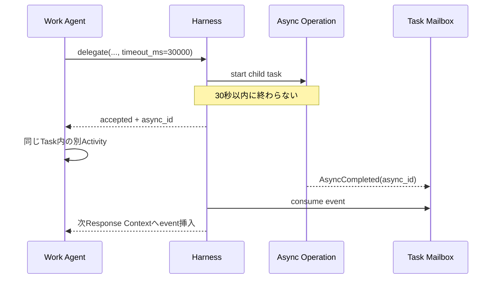

# LLM Toolと非同期実行設計

## 1. 共通規約

すべてのWork Agent Toolは`timeout_ms`を受け取る。呼び出し開始からその時間だけFunction Callに直接応答できる状態で待つ。

```typescript
type ToolCallOptions = {
  timeout_ms?: number;
  idempotency_key?: string;
};

type ToolResult<T> =
  | { status: "completed"; value: T }
  | { status: "accepted"; async_id: string; operation: string }
  | { status: "failed"; error: ToolError };
```

```text
timeout = 同期待機を終了する
cancel  = 実処理を停止する
```

期限超過後も処理は継続する。結果はMailboxへ送る。

## 2. Work Agent Tool一覧

| Tool | 目的 | 通常の非同期理由 |
|---|---|---|
| `terminal` | Sandbox内コマンド | 長時間process |
| `delegate` | 子Task生成と実行 | 子Task完了待ち |
| `ask_parent` | Child OwnerからParent OwnerへのAgent間助言要求 | 親Response待ち |
| `escalate` | Taskから上位Authorityへ作業契約判断を移す | 上位決定待ち |
| `reply_to_child` | 子のAsk/Escalationへ応答 | 子Mailbox配送待ち |
| `request_effect` | External Effect要求 | Judge / Authority / 外部実行待ち |
| `complete_candidate` | 完了候補提出 | Acceptance Review待ち |
| `update_progress` | Harnessが強制する定期Progress更新 | Maintenance Response内で同期完了 |
| `cancel_child_task` | 直接子Taskの責任撤回 | HarnessによるCancellation確定 |
| `report_context_gap` | Wiki Agentへ追加Context要求 | Wiki応答待ち |
| `report_memory_error` | 注入記憶の誤りを報告 | Memory Plane受付待ち |
| `await_async` | 複数Operationの待機条件設定 | 指定Operation待ち |
| `cancel_async` | Operation取消要求 | 取消完了待ち |

実際のResponses API向けJSON Schemaは`../schemas/work-agent-tools.json`にある。

## 3. `terminal`

```typescript
terminal({
  command: string,
  cwd?: string,
  timeout_ms?: number,
  idempotency_key?: string
})
```

Sandbox内だけで実行する。Direct network、Credential mount、host filesystem accessは禁止する。

期限超過時:

```json
{
  "status": "accepted",
  "async_id": "async-terminal-902",
  "operation": "terminal"
}
```

process stdout/stderrはArtifactまたはlog streamへ保存し、最終イベントに参照を付ける。

## 4. `delegate`

親Agentが作るのはTask Proposalである。

```typescript
delegate({
  objective: string,
  acceptance: string,
  instructions?: string,
  owner_profile: "L1" | "L2" | "L3",
  workspace_mode: "fork" | "shared_readonly" | "empty",
  dependency: "required" | "optional",
  artifact_refs?: string[],
  timeout_ms?: number,
  idempotency_key?: string
})
```

Completed value:

```typescript
type ChildTaskResult = {
  task_id: string;
  status: "completed" | "cancelled";
  summary: string;
  artifact_refs: string[];
  workspace_snapshot_ref?: string;
};
```

## 5. `ask_parent`

Owner Agent間のコミュニケーションToolである。Taskは配送先と文脈を定めるが、Task間で判断責任を移転する操作ではない。

```typescript
ask_parent({
  message: string,
  artifact_refs?: string[],
  timeout_ms?: number,
  idempotency_key?: string
})
```

子TaskのOwner Agentが最終判断責任を保持する。親Ownerの回答は助言であり、`contract_patch`を伴わない。親回答の型:

```typescript
type ParentAdvice = {
  message: string;
  artifact_refs?: string[];
};
```

## 6. `escalate`

Taskから上位AuthorityへTask Contract上の判断責任を移転するToolである。Child TaskではParent Taskへ、Root Taskでは人間のRoot AuthorityへHarnessが配送する。呼び出しはOwner Agentが実行するが、Agent間の単なる相談ではない。

```typescript
escalate({
  message: string,
  artifact_refs?: string[],
  timeout_ms?: number,
  idempotency_key?: string
})
```

親Taskは必要に応じて子Task向けのContract patchを決定する。

```typescript
type ParentDecision = {
  message: string;
  contract_patch?: {
    objective?: string;
    acceptance?: string;
    instructions?: string;
  };
  terminate?: boolean;
};
```

External EffectのPolicy承認には使わない。


## 7. `reply_to_child`

親Task Ownerが子のAskまたはEscalationへ応答する。Askへの応答では`response_kind: "advice"`を使い、Contractを変更しない。Escalationへの応答では`response_kind: "contract_decision"`を使い、必要なら子Task向けの`contract_patch`または`terminate`を返す。

```typescript
reply_to_child({
  request_id: string,
  response_kind: "advice" | "contract_decision",
  message: string,
  contract_patch?: {
    objective?: string,
    acceptance?: string,
    instructions?: string
  },
  terminate?: boolean,
  timeout_ms?: number,
  idempotency_key?: string
})
```

`advice`は子を拘束しない。`contract_decision`はHarnessがContract versionを更新してから子へ配送する。

## 8. `request_effect`

```typescript
request_effect({
  effect_type: string,
  target: string,
  payload_ref: string,
  explanation?: string,
  timeout_ms?: number,
  idempotency_key?: string
})
```

Agentの`explanation`は要求者の主張として扱う。target、digest、classification、cost、origin chainはGatewayが計算する。

結果:

```typescript
type EffectResult =
  | { outcome: "succeeded"; result_ref: string }
  | { outcome: "denied"; reason: string; decision_ref: string }
  | { outcome: "failed"; reason: string }
  | { outcome: "cancelled"; reason: string };
```

`waiting_authority`はOperation途中の状態であり、同期期限を超えれば`async_id`で返す。

## 9. `complete_candidate`

```typescript
complete_candidate({
  owner_judgement: string,
  outcome_ref: string,
  artifact_refs: string[],
  evidence_refs?: string[],
  contract_version: number,
  timeout_ms?: number,
  idempotency_key?: string
})
```

Acceptance Reviewが期限内に終われば結果を直接返す。超えれば`async_id`を返し、Reviewer判断をMailboxへ送る。


## 10. `update_progress`

Harnessが定期Maintenance Responseで利用可能な唯一のToolとして提示し、`tool_choice`で強制する。Work Agentの通常Actionとして呼び出すことには依存しない。

```typescript
update_progress({
  based_on_progress_version: number,
  through_task_event_sequence: number,
  through_agent_run_event_sequence: number,
  current_focus_id?: string,
  items: Array<{
    item_id: string,
    description: string,
    status: "pending" | "in_progress" | "completed" | "blocked" | "cancelled",
    evidence_refs: string[],
    blocker?: string
  }>
})
```

Harnessはversion、Task／Agent Run Event watermark、Evidence参照、item IDの一意性、既存非終端itemの欠落を検証し、Task Progressと`ProgressRefreshed` Eventを同一Transactionで保存する。itemを削除する場合は省略せず`cancelled`として残す。このToolはTask Actionを進めず、同じ`call_id`の`function_call_output`を永続化した時点でMaintenance処理を終了する。

## 11. `cancel_child_task`

```typescript
cancel_child_task({
  child_task_id: string,
  reason: string,
  cancellation_policy?: "cascade" | "detach_children" | "transfer_children",
  timeout_ms?: number,
  idempotency_key?: string
})
```

Harnessはrequesterが親Task Ownerで、対象が直接子であることを検証し、Taskを直ちに`cancelled`へ確定する。Agent processやworktreeの停止・削除は別のAgent Resource Cleanupとして非同期に追跡する。

## 12. Memory Gap

```typescript
report_context_gap({
  message: string,
  memory_refs?: string[],
  artifact_refs?: string[],
  timeout_ms?: number,
  idempotency_key?: string
})
```

Work AgentがWikiを自由検索するToolではない。現在の注入Contextに不足・矛盾があることをHarnessへ伝える。


### `report_memory_error`

```typescript
report_memory_error({
  memory_ref: string,
  message: string,
  evidence_refs?: string[],
  timeout_ms?: number,
  idempotency_key?: string
})
```

Work AgentはWikiを直接修正しない。報告はMemory PlaneのError Queueへ入り、Wiki AgentがEpisodeやEvidenceと照合して別Runで修正する。

## 13. Mailboxイベント

```typescript
type MailboxEvent =
  | {
      event_id: string;
      type: "AsyncCompleted";
      async_id: string;
      source_tool: string;
      result_ref: string;
      based_on_contract_version: number;
    }
  | {
      event_id: string;
      type: "AsyncFailed";
      async_id: string;
      source_tool: string;
      error_ref: string;
    }
  | {
      event_id: string;
      type: "AsyncCancelled";
      async_id: string;
      source_tool: string;
    }
  | {
      event_id: string;
      type: "AsyncProgress";
      async_id: string;
      source_tool: string;
      message: string;
      progress?: number;
    };
```

### 配送保証

- at-least-once delivery
- `event_id`で重複排除
- `async_id`でOperationへ関連付け
- `sequence_no`でTask内順序を付与
- consumeはTask state更新と同一Transaction

## 14. `await_async`

```typescript
await_async({
  async_ids: string[],
  mode: "all" | "any",
  timeout_ms?: number
})
```

期限内に条件が成立しなければ、待機条件そのものを表す新しい`async_id`を返す。元Operationを複製するのではなく、複数Operationを束ねるWait Group Operationである。条件成立時に`AsyncCompleted`がMailboxへ届く。OwnerがTaskを停止して待つ場合、HarnessはこのWait GroupをContinuationの`WaitCondition`へ結び、Taskを`waiting`へ遷移する。

## 15. `cancel_async`

```typescript
cancel_async({
  async_id: string,
  reason: string,
  timeout_ms?: number,
  idempotency_key?: string
})
```

Toolごとの取消可能性を検査する。すでに実行済みのExternal Effectは取消不能であり、補償Effectが必要になる。

## 16. Orphan結果

Owner Taskが終端後にOperation結果が届いた場合の既定値:

| Operation | 処理 |
|---|---|
| child Task | 親TaskまたはSchedulerへ通知し、Episodeへ記録 |
| external effect | 必ず監査記録し、元Task EpisodeへLate Eventとして参照 |
| terminal | processを停止し、logをarchive |
| parent advice | staleとして保存し、適用しない |

## 17. 非同期シーケンス


