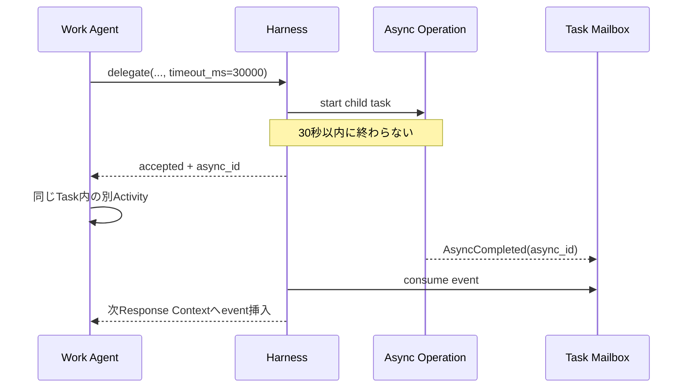

# LLM Toolと非同期処理の設計

## 1. 共通規約

### Cross-plane メッセージ相関

Plane境界を越えるメッセージは共通Envelopeを使い、`message_id`、実際の送受信責任を示す
`from_component` / `to_component`、ワークフロー単位の`correlation_id`、直前原因を示す
`causation_message_id`を必須とする。配列順だけを因果関係として扱わない。再送時は同じ
業務operation keyを維持するが、新しい`message_id`を割り当て、causation chainを保存する。

Toolが起動したプロセスからEgressが発生した場合、`EgressAttempt.tool_call_id`と
`process_ref`を必須記録する。Harness外のsystem プロセス起点だけ`tool_call_id = null`を許す。

すべてのWork Agent Toolは`timeout_ms`を受け取る。呼び出し開始からその時間だけFunction Callに直接応答できる状態で待つ。

```typescript
type ToolCallOptions = {
  timeout_ms?: number;
};

type ToolResult<T> =
  | { status: "completed"; value: T }
  | { status: "accepted"; async_id: string; operation: string }
  | { status: "failed"; error: ToolError };
```

canonical Schemaは[tool-result.schema.json](../schemas/draft-v0/execution-plane/tool-result.schema.json)と[tool-result-values.schema.json](../schemas/draft-v0/execution-plane/tool-result-values.schema.json)を正本とする。

```text
timeout = 同期待機を終了する
cancel  = 実処理を停止する
```

期限超過後も処理は継続する。結果はMailboxへ送る。

冪等キーはLLMに生成させない。Harnessが永続化した`task_id + call_id + tool_name`から内部Operation Keyを決定論的に生成する。同じFunction Callの再配送は同じOperationへ収束し、新しい`call_id`は新しい要求として扱う。

### Tool実行境界

Work Agentへ公開するFunction Toolと、Sandbox境界で強制される通信Policyを区別する。

| 種別 | Work Agentから見えるか | 実行場所 | 例 |
|---|---|---|---|
| Sandbox Tool | 見える | Task Sandbox内 | `terminal` |
| Harness Control Tool | 見える | Harness Control Plane | `delegate`、`ask_parent`、`complete_candidate` |
| Grant Request Tool | `request_grant`だけ見える | Harness Control Plane | CASB ChallengeへのGrant申請 |
| Egress Enforcement | 見えない | HTTPS Proxy / DNS Proxy / Firewall | CLI通信のallow / block |

Work AgentはSandbox内で`gh`、`git`、`curl`等を自由に使う。外向き通信はEgress Control Planeが強制捕捉するため、外部操作ごとの申請Toolは作らない。Baseline Policyでblockされた場合だけ、MailboxのChallengeに対して`request_grant`を呼べる。

Tool Registryは各Toolの実行境界を固定する。

```typescript
type ToolExecutionZone = "sandbox" | "harness_control";

type ToolRegistration = {
  tool_name: string;
  execution_zone: ToolExecutionZone;
  exposed_to_work_agent: boolean;
};
```

HTTPS Proxy、DNS Proxy、Firewall、Credential BrokerはWork Agent ToolではなくSandbox基盤である。

## 2. Work Agent Tool一覧

| Tool | 目的 | 通常の非同期理由 |
|---|---|---|
| `terminal` | Sandbox内コマンド | 長時間プロセス |
| `delegate` | 子Task生成と実行 | 子Task完了待ち |
| `ask_parent` | Child OwnerからParent OwnerへのAgent間助言要求 | 親Response待ち |
| `escalate` | Taskから上位Authorityへ作業契約判断を移す | 上位決定待ち |
| `reply_to_child` | 子のAsk/Escalationへ応答 | 子Mailbox配送待ち |
| `request_grant` | Mailboxで通知されたEgress Challengeへの一時Grant申請 | Policy Agent / Authority / Policy反映待ち |
| `complete_candidate` | 完了候補提出 | Acceptance Review待ち |
| `update_progress` | Harnessが強制する定期Progress更新 | Maintenance Response内で同期完了 |
| `cancel_child_task` | 直接子Taskの責任撤回 | HarnessによるCancellation確定 |
| `report_context_gap` | Wiki Agentへ追加Context要求 | Wiki応答待ち |
| `report_memory_error` | 注入記憶の誤りを報告 | Memory Plane受付待ち |
| `await_async` | 複数Operationの待機条件設定 | 指定Operation待ち |
| `cancel_async` | Operation取消要求 | 取消完了待ち |

現在のResponses API向け合成bundleは`../schemas/draft-v0/api/work-agent-tools.json`にある。canonical Schemaの所有境界とバージョン規約は[schemas/README.md](../schemas/README.md)を正本とする。

## 3. `terminal`

```typescript
terminal({
  command: string,
  cwd?: string,
  timeout_ms?: number,
})
```

Sandbox内だけで実行する。Direct ネットワーク、Credential mount、host filesystem accessは禁止する。

期限超過時の処理を示す。

```json
{
  "status": "accepted",
  "async_id": "async-terminal-902",
  "operation": "terminal"
}
```

プロセス stdout/stderrはArtifactまたはlog streamへ保存し、最終イベントに参照を付ける。

## 4. `delegate`

親Agentが作るのはTask Proposalである。

```typescript
delegate({
  objective: string,
  acceptance: string,
  instructions?: string,
  owner_profile: "L1" | "L2" | "L3",
  workspace_mode: "fork" | "shared_readonly" | "empty",
  dependency: "required" | "optional",
  artifact_refs?: string[],
  timeout_ms?: number,
})
```

Completed value:

```typescript
type ChildTaskResult = {
  task_id: string;
  status: "completed" | "cancelled";
  summary: string;
  artifact_refs: string[];
  workspace_snapshot_ref?: string;
};
```

## 5. `ask_parent`

Owner Agent間のコミュニケーションToolである。Taskは配送先と文脈を定めるが、Task間で判断責任を移転する操作ではない。

```typescript
ask_parent({
  message: string,
  artifact_refs?: string[],
  timeout_ms?: number,
})
```

子TaskのOwner Agentが最終判断責任を保持する。親Ownerの回答は助言であり、`contract_patch`を伴わない。親回答の型を示す。

```typescript
type ParentAdvice = {
  message: string;
  artifact_refs?: string[];
};
```

## 6. `escalate`

Taskから上位AuthorityへTask Contract上の判断責任を移転するToolである。Child TaskではParent Taskへ、Root Taskでは人間のRoot AuthorityへHarnessが配送する。呼び出しはOwner Agentが実行するが、Agent間の単なる相談ではない。

```typescript
escalate({
  message: string,
  artifact_refs?: string[],
  timeout_ms?: number,
})
```

親Taskは必要に応じて子Task向けのContract patchを決定する。

```typescript
type ParentDecision = {
  message: string;
  contract_patch?: {
    objective?: string;
    acceptance?: string;
    instructions?: string;
  };
  terminate?: boolean;
};
```

Egress Grantの承認には使わない。

Root Taskでは親Ownerの`reply_to_child`を使わない。Root Authorityが`submit_task_escalation_decision` ingressへ回答し、Harnessがリクエスト ID、Authority identity、未解決状態を検証する。同じリクエスト IDへの再配送は同じ決定へ収束させ、決定保存とContract バージョン更新またはCancellation、`AsyncCompleted`配送を同一Transactionで確定する。


## 7. `reply_to_child`

親Task Ownerが子のAskもしくはEscalationへ応答する。Askへの応答では`response_kind: "advice"`を使い、Contractを変更しない。Escalationへの応答では`response_kind: "contract_decision"`を使い、必要なら子Task向けの`contract_patch`または`terminate`を返す。

```typescript
reply_to_child({
  request_id: string,
  response_kind: "advice" | "contract_decision",
  message: string,
  contract_patch?: {
    objective?: string,
    acceptance?: string,
    instructions?: string
  },
  terminate?: boolean,
  timeout_ms?: number,
})
```

`advice`は子を拘束しない。`contract_decision`はHarnessがContractバージョンを更新してから子へ配送する。`terminate: true`ではContractを更新せず、Authority決定として対象子Taskを理由付きで`cancelled`へ確定し、通常のcascadeを適用する。

## 8. `request_grant`

```typescript
request_grant({
  challenge_id: string,
  justification: string,
  evidence_refs: string[],
  timeout_ms: number | null
})
```

`challenge_id`はCASBがblock時に作成し、`EgressBlocked` Mailbox Eventで通知する。Harnessは現在TaskがChallengeのWorkspaceを使用していること、Workspace Policy Binding、Challenge期限、grant eligibilityを検証し、Operation Keyを生成してWorkspaceスコープのGrant Requestを保存する。

Agentはdestination、Policy patch、TTL、Credential、idempotency keyを指定しない。Policy Agentの判断とCASB Policy ManagerによるWorkspaceスコープのtemporary Ruleの検証・反映後、結果を直接またはMailboxで返す。

結果を示す。

```typescript
type GrantResult =
  | { decision: "grant"; grant_id: string; policy_version: number; expires_at: string; retry_original_command: true }
  | { decision: "deny"; reason: string }
  | { decision: "cancelled"; reason: string };
```

`request_grant`は常にGrant Requestに紐づくAsync Operationを作る。期限内に終端すれば`ToolResult.completed`でGrantResultを返し、Authority待ちもしくはPolicy反映が同期期限を超えれば`ToolResult.accepted(async_id)`を返す。最終的なgrant/deny/cancelは`AsyncCompleted`または`AsyncCancelled`の`result_ref`を正本とする。最初にblockされた通信は自動再生せず、grant結果と`PolicyGrantReady`受信後にAgentが元のCLI commandを再実行する。

`AsyncCompleted`を配送するTransactionより前に、対応するAsync Operationを`completed`へ
遷移させてterminal result refを固定する。Task再開時は、待機時Continuationと完了Mailbox
Eventを消費した`ResumeContext`を作り、`previous_run_id`とは異なる`new_run_id`を割り当てる。
Taskの`TaskResumed`と新Agent Run開始はこのResumeContextをcausationとして参照する。

## 9. `complete_candidate`

```typescript
complete_candidate({
  owner_judgement: string,
  outcome_ref: string,
  artifact_refs: string[],
  evidence_refs?: string[],
  contract_version: number,
  timeout_ms?: number,
})
```

Acceptance Reviewが期限内に終われば結果を直接返す。超えれば`async_id`を返し、Reviewer判断をMailboxへ送る。


## 10. `update_progress`

Harnessが定期Maintenance Responseで利用可能な唯一のToolとして提示し、`tool_choice`で強制する。Work Agentの通常Actionとして呼び出すことには依存しない。

```typescript
update_progress({
  based_on_progress_version: number,
  through_task_event_sequence: number,
  through_agent_run_event_sequence: number,
  current_focus_id?: string,
  items: Array<{
    item_id: string,
    description: string,
    status: "pending" | "in_progress" | "completed" | "blocked" | "cancelled",
    evidence_refs: string[],
    blocker?: string
  }>
})
```

Harnessはバージョン、Task／Agent Run Event watermark、Evidence参照、item IDの一意性、既存非終端itemの欠落を検証し、Task Progressと`ProgressRefreshed` Eventを同一Transactionで保存する。itemを削除する場合は省略せず`cancelled`として残す。このToolはTask Actionを進めず、同じ`call_id`の`function_call_output`を永続化した時点でMaintenance処理を終了する。

## 11. `cancel_child_task`

```typescript
cancel_child_task({
  child_task_id: string,
  reason: string,
  cancellation_policy?: "cascade" | "detach_children" | "transfer_children",
  timeout_ms?: number,
})
```

Harnessは要求元が親Task Ownerで、対象が直接子であることを検証し、Taskを直ちに`cancelled`へ確定する。Agentプロセスやworktreeの停止・削除は別のAgent Resource Cleanupとして非同期に追跡する。

## 12. Memory Gap

```typescript
report_context_gap({
  message: string,
  memory_refs?: string[],
  artifact_refs?: string[],
  timeout_ms?: number,
})
```

Work AgentがWikiを自由検索するToolではない。現在の注入Contextに不足・矛盾があることをHarnessへ伝える。


### `report_memory_error`

```typescript
report_memory_error({
  memory_ref: string,
  message: string,
  evidence_refs?: string[],
  timeout_ms?: number,
})
```

Work AgentはWikiを直接修正しない。報告はMemory PlaneのError Queueへ入り、Wiki AgentがEpisodeやEvidenceと照合して別のWiki maintenance Job内の一時API sessionで修正する。

## 13. Mailboxイベント

canonical Envelopeは[mailbox-event.schema.json](../schemas/draft-v0/control-plane/mailbox-event.schema.json)を正本とする。Plane固有ペイロードはEnvelopeの`payload_schema`でrevisionまで固定する。

永続`MailboxEntry`の共通Envelopeは`event_id`、`task_id`、`sequence_no`、`created_at`と以下のペイロードを持つ。例中の`event_id`以外の共通フィールドは省略している。

```typescript
type MailboxEvent =
  | {
      event_id: string;
      type: "AsyncCompleted";
      async_id: string;
      source_tool: string;
      result_ref: string;
      based_on_contract_version: number;
    }
  | {
      event_id: string;
      type: "AsyncFailed";
      async_id: string;
      source_tool: string;
      error_ref: string;
    }
  | {
      event_id: string;
      type: "AsyncCancelled";
      async_id: string;
      source_tool: string;
    }
  | {
      event_id: string;
      type: "AsyncProgress";
      async_id: string;
      source_tool: string;
      message: string;
      progress?: number;
    }
  | {
      event_id: string;
      type: "EgressBlocked";
      workspace_id: string;
      task_id: string;
      challenge_id: string;
      protocol: "dns" | "https" | "tls" | "tcp" | "udp";
      destination_ref: string;
      request_summary_ref?: string;
      reason_codes: string[];
      grant_eligible: boolean;
      challenge_expires_at: string;
    }
  | {
      event_id: string;
      type: "PolicyGrantReady";
      workspace_id: string;
      task_id: string;
      request_id: string;
      async_id: string;
      challenge_id: string;
      grant_id: string;
      policy_version: number;
      expires_at: string;
      retry_original_command: true;
    };
```

### 配送保証

- at-least-once delivery
- `event_id`で重複排除
- Async Eventは`async_id`、CASB Eventは`challenge_id`で関連付け
- `sequence_no`でTask内順序を付与
- consumeはTask state更新と同一Transaction

## 14. `await_async`

```typescript
await_async({
  async_ids: string[],
  mode: "all" | "any",
  timeout_ms?: number
})
```

期限内に条件が成立しなければ、待機条件そのものを表す新しい`async_id`を返す。元Operationを複製するのではなく、複数Operationを束ねるWait Group Operationである。同じFunction Callの再配送ではHarness生成のOperation Keyにより同じWait Groupを返す。条件成立時に`AsyncCompleted`がMailboxへ届く。OwnerがTaskを停止して待つ場合、HarnessはこのWait GroupをContinuationの`WaitCondition`へ結び、Taskを`waiting`へ遷移する。

`reply_to_child`ではHarnessが`request_id`から元Aggregateを解決し、Askには`response_kind: advice`だけを許可して`contract_patch = null`かつ`terminate = null | false`を強制する。Escalationには`response_kind: contract_decision`だけを許可する。Schemaだけでなく、この意味検証を適用前に必須とする。

## 15. `cancel_async`

```typescript
cancel_async({
  async_id: string,
  reason: string,
  timeout_ms?: number,
})
```

Toolごとの取消可能性を検査する。Grant ワークフローではPolicy Grantのactivation前だけ取消可能である。Grant Request、Authority Request、Evaluation Job、Async Operationのcancel、`pending_activation` Grantのrevoke、pending Ready Outboxの無効化、`AsyncCancelled`を1つのTransactionで確定する。activation TransactionもRequest非終端とGrant pendingをlock下で再検査する。activation後は`not_cancellable`を返し、このToolからGrantを暗黙revokeしない。すでに外部へ到達したOutbound Transactionは取り消せず、必要なら通常のCLIで補償操作を行う。

## 16. Orphan結果

Owner Taskが終端後にOperation結果を受け取った場合の既定値を示す。

| Operation | 処理 |
|---|---|
| child Task | 親TaskまたはSchedulerへ通知し、Episodeへ記録 |
| late Egress/Grant Event | 必ず監査記録し、元Task EpisodeへLate Eventとして参照 |
| terminal | プロセスを停止し、logをarchive |
| parent advice | staleとして保存し、適用しない |

## 17. 非同期シーケンス


