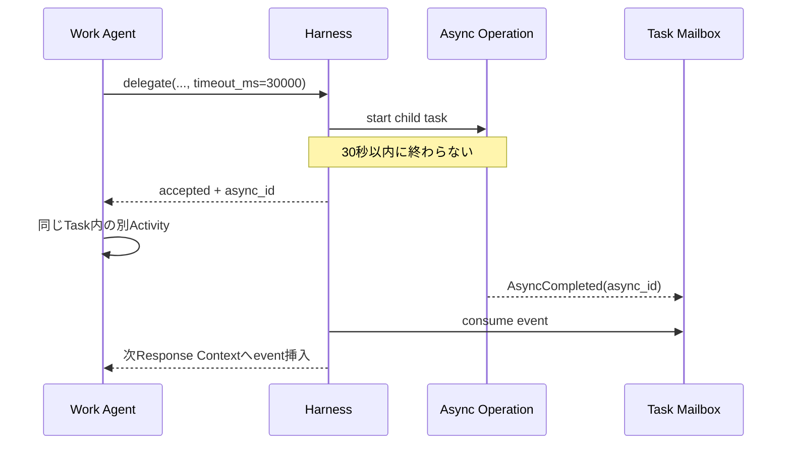

# LLM ツールと非同期処理の設計

## 1. 共通規約

### Cross-plane メッセージ相関

Plane境界を越えるメッセージは共通共通形式を使い、`message_id`、実際の送受信責任を示す
`from_component` / `to_component`、ワークフロー単位の`correlation_id`、直前原因を示す
`causation_message_id`を必須とする。配列順だけを因果関係として扱わない。再送時は同じ
業務操作 キーを維持するが、新しい`message_id`を割り当て、因果関係 連鎖を保存する。

ツールが起動したプロセスから外向き通信が発生した場合、`EgressAttempt.tool_call_id`と
`process_ref`を必須記録する。ハーネス外のシステム プロセス起点だけ`tool_call_id = null`を許す。

すべてのWork Agent ツールは`timeout_ms`を受け取る。呼び出し開始からその時間だけ関数 呼び出しに直接応答できる状態で待つ。

```typescript
type ToolCallOptions = {
  timeout_ms?: number;
};

type ToolResult<T> =
  | { status: "completed"; value: T }
  | { status: "accepted"; async_id: string; operation: string }
  | { status: "failed"; error: ToolError };
```

正規 Schemaは[tool-result.スキーマ.JSON](../schemas/draft-v0/execution-plane/tool-result.schema.json)と[tool-result-values.スキーマ.JSON](../schemas/draft-v0/execution-plane/tool-result-values.schema.json)を正本とする。

```text
timeout = 同期待機を終了する
cancel  = 実処理を停止する
```

期限超過後も処理は継続する。結果はメールボックスへ送る。

冪等キーはLLMに生成させない。ハーネスが永続化した`task_id + call_id + tool_name`から内部操作 キーを決定論的に生成する。同じ関数 呼び出しの再配送は同じ操作へ収束し、新しい`call_id`は新しい要求として扱う。

### ツール実行境界

Work Agentへ公開する関数 ツールと、サンドボックス境界で強制される通信ポリシーを区別する。

| 種別 | Work Agentから見えるか | 実行場所 | 例 |
|---|---|---|---|
| サンドボックス ツール | 見える | Task サンドボックス内 | `terminal` |
| ハーネス 制御 ツール | 見える | ハーネス Control Plane | `delegate`、`ask_parent`、`complete_candidate` |
| 許可申請 ツール | `request_grant`だけ見える | ハーネス Control Plane | CASB 許可確認への許可申請 |
| 外向き通信 強制 | 見えない | HTTPS プロキシ / DNS プロキシ / ファイアウォール | CLI通信の許可 / 拒否 |

Work Agentはサンドボックス内で`gh`、`git`、`curl`等を自由に使う。外向き通信は外向き通信Control Planeが強制捕捉するため、外部操作ごとの申請ツールは作らない。基本ポリシーで拒否された場合だけ、メールボックスの許可確認に対して`request_grant`を呼べる。

ツール レジストリは各ツールの実行境界を固定する。

```typescript
type ToolExecutionZone = "sandbox" | "harness_control";

type ToolRegistration = {
  tool_name: string;
  execution_zone: ToolExecutionZone;
  exposed_to_work_agent: boolean;
};
```

HTTPS プロキシ、DNS プロキシ、ファイアウォール、認証情報 ブローカーはWork Agent ツールではなくサンドボックス基盤である。

## 2. Work Agent ツール一覧

| ツール | 目的 | 通常の非同期理由 |
|---|---|---|
| `terminal` | サンドボックス内コマンド | 長時間プロセス |
| `delegate` | 子Task生成と実行 | 子Task完了待ち |
| `ask_parent` | 子 オーナーから親 オーナーへのAgent間助言要求 | 親レスポンス待ち |
| `escalate` | Taskから上位責任者へ作業契約判断を移す | 上位決定待ち |
| `reply_to_child` | 子の質問/上位判断依頼へ応答 | 子メールボックス配送待ち |
| `request_grant` | メールボックスで通知された外向き通信の許可確認への一時許可申請 | ポリシーAgent / 責任者 / ポリシー反映待ち |
| `complete_candidate` | 完了候補提出 | 受け入れ条件レビュー待ち |
| `update_progress` | ハーネスが強制する定期進捗更新 | メンテナンス レスポンス内で同期完了 |
| `cancel_child_task` | 直接子Taskの責任撤回 | ハーネスによるキャンセル確定 |
| `report_context_gap` | Wiki Agentへ追加コンテキスト要求 | Wiki応答待ち |
| `report_memory_error` | 注入記憶の誤りを報告 | Memory Plane受付待ち |
| `await_async` | 複数操作の待機条件設定 | 指定操作待ち |
| `cancel_async` | 操作取消要求 | 取消完了待ち |

現在のResponses API向け合成バンドルは`../schemas/draft-v0/api/work-agent-tools.json`にある。正規 Schemaの所有境界とバージョン規約は[schemas/README.md](../schemas/README.md)を正本とする。

## 3. `terminal`

```typescript
terminal({
  command: string,
  cwd?: string,
  timeout_ms?: number,
})
```

サンドボックス内だけで実行する。直接 ネットワーク、認証情報 マウント、ホスト ファイルシステム アクセスは禁止する。

期限超過時の処理を示す。

```json
{
  "status": "accepted",
  "async_id": "async-terminal-902",
  "operation": "terminal"
}
```

プロセス stdout/stderrは成果物またはログ ストリームへ保存し、最終イベントに参照を付ける。

## 4. `delegate`

親Agentが作るのはTask申請である。

```typescript
delegate({
  objective: string,
  acceptance: string,
  instructions?: string,
  owner_profile: "L1" | "L2" | "L3",
  workspace_mode: "fork" | "shared_readonly" | "empty",
  dependency: "required" | "optional",
  artifact_refs?: string[],
  timeout_ms?: number,
})
```

`Completed` value:

```typescript
type ChildTaskResult = {
  task_id: string;
  status: "completed" | "cancelled";
  summary: string;
  artifact_refs: string[];
  workspace_snapshot_ref?: string;
};
```

## 5. `ask_parent`

オーナーAgent間のコミュニケーションツールである。Taskは配送先と文脈を定めるが、Task間で判断責任を移転する操作ではない。

```typescript
ask_parent({
  message: string,
  artifact_refs?: string[],
  timeout_ms?: number,
})
```

子TaskのオーナーAgentが最終判断責任を保持する。親オーナーの回答は助言であり、`contract_patch`を伴わない。親回答の型を示す。

```typescript
type ParentAdvice = {
  message: string;
  artifact_refs?: string[];
};
```

## 6. `escalate`

Taskから上位責任者へTask契約上の判断責任を移転するツールである。子Taskでは親 Taskへ、ルートTaskでは人間のルート責任者へハーネスが配送する。呼び出しはオーナーAgentが実行するが、Agent間の単なる相談ではない。

```typescript
escalate({
  message: string,
  artifact_refs?: string[],
  timeout_ms?: number,
})
```

親Taskは必要に応じて子Task向けの契約 パッチを決定する。

```typescript
type ParentDecision = {
  message: string;
  contract_patch?: {
    objective?: string;
    acceptance?: string;
    instructions?: string;
  };
  terminate?: boolean;
};
```

外向き通信 許可の承認には使わない。

ルートTaskでは親オーナーの`reply_to_child`を使わない。ルート責任者が`submit_task_escalation_decision` ingressへ回答し、ハーネスがリクエスト ID、責任者 識別情報、未解決状態を検証する。同じリクエスト IDへの再配送は同じ決定へ収束させ、決定保存と契約バージョン更新またはキャンセル、`AsyncCompleted`配送を同一トランザクションで確定する。


## 7. `reply_to_child`

親Taskオーナーが子の質問もしくは上位判断依頼へ応答する。質問への応答では`response_kind: "advice"`を使い、契約を変更しない。上位判断依頼への応答では`response_kind: "contract_decision"`を使い、必要なら子Task向けの`contract_patch`または`terminate`を返す。

```typescript
reply_to_child({
  request_id: string,
  response_kind: "advice" | "contract_decision",
  message: string,
  contract_patch?: {
    objective?: string,
    acceptance?: string,
    instructions?: string
  },
  terminate?: boolean,
  timeout_ms?: number,
})
```

`advice`は子を拘束しない。`contract_decision`はハーネスが契約バージョンを更新してから子へ配送する。`terminate: true`では契約を更新せず、責任者決定として対象子Taskを理由付きで`cancelled`へ確定し、通常のカスケードを適用する。

## 8. `request_grant`

```typescript
request_grant({
  challenge_id: string,
  justification: string,
  evidence_refs: string[],
  timeout_ms: number | null
})
```

`challenge_id`はCASBが拒否時に作成し、`EgressBlocked` メールボックス イベントで通知する。ハーネスは現在Taskが許可確認のWorkspaceを使用していること、Workspaceポリシー割り当て、許可確認期限、許可 適格性を検証し、操作 キーを生成してWorkspaceスコープの許可申請を保存する。

Agentは宛先、ポリシー パッチ、TTL、認証情報、冪等キーを指定しない。ポリシーAgentの判断とCASB ポリシー マネージャーによるWorkspaceスコープの一時 ルールの検証・反映後、結果を直接またはメールボックスで返す。

結果を示す。

```typescript
type GrantResult =
  | { decision: "grant"; grant_id: string; policy_version: number; expires_at: string; retry_original_command: true }
  | { decision: "deny"; reason: string }
  | { decision: "cancelled"; reason: string };
```

`request_grant`は常に許可申請に紐づく非同期操作を作る。期限内に終端すれば`ToolResult.completed`でGrantResultを返し、責任者待ちもしくはポリシー反映が同期期限を超えれば`ToolResult.accepted(async_id)`を返す。最終的な許可/拒否/キャンセルは`AsyncCompleted`または`AsyncCancelled`の`result_ref`を正本とする。最初に拒否された通信は自動再生せず、許可結果と`PolicyGrantReady`受信後にAgentが元のCLI コマンドを再実行する。

`AsyncCompleted`を配送するトランザクションより前に、対応する非同期操作を`completed`へ
遷移させて終端 結果 参照を固定する。Task再開時は、待機時継続情報と完了メールボックス
イベントを消費した`ResumeContext`を作り、`previous_run_id`とは異なる`new_run_id`を割り当てる。
Taskの`TaskResumed`と新Agent実行開始はこのResumeContextを因果関係として参照する。

## 9. `complete_candidate`

```typescript
complete_candidate({
  owner_judgement: string,
  outcome_ref: string,
  artifact_refs: string[],
  evidence_refs?: string[],
  contract_version: number,
  timeout_ms?: number,
})
```

受け入れ条件レビューが期限内に終われば結果を直接返す。超えれば`async_id`を返し、レビュアー判断をメールボックスへ送る。


## 10. `update_progress`

ハーネスが定期メンテナンス レスポンスで利用可能な唯一のツールとして提示し、`tool_choice`で強制する。Work Agentの通常操作として呼び出すことには依存しない。

```typescript
update_progress({
  based_on_progress_version: number,
  through_task_event_sequence: number,
  through_agent_run_event_sequence: number,
  current_focus_id?: string,
  items: Array<{
    item_id: string,
    description: string,
    status: "pending" | "in_progress" | "completed" | "blocked" | "cancelled",
    evidence_refs: string[],
    blocker?: string
  }>
})
```

ハーネスはバージョン、Task／Agent実行 イベント ウォーターマーク、証跡参照、項目 IDの一意性、既存非終端項目の欠落を検証し、Task進捗と`ProgressRefreshed` イベントを同一トランザクションで保存する。項目を削除する場合は省略せず`cancelled`として残す。このツールはTask 操作を進めず、同じ`call_id`の`function_call_output`を永続化した時点でメンテナンス処理を終了する。

## 11. `cancel_child_task`

```typescript
cancel_child_task({
  child_task_id: string,
  reason: string,
  cancellation_policy?: "cascade" | "detach_children" | "transfer_children",
  timeout_ms?: number,
})
```

ハーネスは要求元が親Taskオーナーで、対象が直接子であることを検証し、Taskを直ちに`cancelled`へ確定する。Agentプロセスやワークツリーの停止・削除は別のAgentリソースのクリーンアップとして非同期に追跡する。

## 12. 記憶 欠落

```typescript
report_context_gap({
  message: string,
  memory_refs?: string[],
  artifact_refs?: string[],
  timeout_ms?: number,
})
```

Work AgentがWikiを自由検索するツールではない。現在の注入コンテキストに不足・矛盾があることをハーネスへ伝える。


### `report_memory_error`

```typescript
report_memory_error({
  memory_ref: string,
  message: string,
  evidence_refs?: string[],
  timeout_ms?: number,
})
```

Work AgentはWikiを直接修正しない。報告はMemory Planeのエラー Queueへ入り、Wiki Agentがエピソードや証跡と照合して別のWiki メンテナンス ジョブ内の一時API セッションで修正する。

## 13. メールボックスイベント

正規 共通形式は[mailbox-event.スキーマ.JSON](../schemas/draft-v0/control-plane/mailbox-event.schema.json)を正本とする。Plane固有ペイロードは共通形式の`payload_schema`で改訂まで固定する。

永続`MailboxEntry`の共通共通形式は`event_id`、`task_id`、`sequence_no`、`created_at`と以下のペイロードを持つ。例中の`event_id`以外の共通フィールドは省略している。

```typescript
type MailboxEvent =
  | {
      event_id: string;
      type: "AsyncCompleted";
      async_id: string;
      source_tool: string;
      result_ref: string;
      based_on_contract_version: number;
    }
  | {
      event_id: string;
      type: "AsyncFailed";
      async_id: string;
      source_tool: string;
      error_ref: string;
    }
  | {
      event_id: string;
      type: "AsyncCancelled";
      async_id: string;
      source_tool: string;
    }
  | {
      event_id: string;
      type: "AsyncProgress";
      async_id: string;
      source_tool: string;
      message: string;
      progress?: number;
    }
  | {
      event_id: string;
      type: "EgressBlocked";
      workspace_id: string;
      task_id: string;
      challenge_id: string;
      protocol: "dns" | "https" | "tls" | "tcp" | "udp";
      destination_ref: string;
      request_summary_ref?: string;
      reason_codes: string[];
      grant_eligible: boolean;
      challenge_expires_at: string;
    }
  | {
      event_id: string;
      type: "PolicyGrantReady";
      workspace_id: string;
      task_id: string;
      request_id: string;
      async_id: string;
      challenge_id: string;
      grant_id: string;
      policy_version: number;
      expires_at: string;
      retry_original_command: true;
    };
```

### 配送保証

- 少なくとも1回 配送
- `event_id`で重複排除
- 非同期 イベントは`async_id`、CASB イベントは`challenge_id`で関連付け
- `sequence_no`でTask内順序を付与
- 消費はTask状態更新と同一トランザクション

## 14. `await_async`

```typescript
await_async({
  async_ids: string[],
  mode: "all" | "any",
  timeout_ms?: number
})
```

期限内に条件が成立しなければ、待機条件そのものを表す新しい`async_id`を返す。元操作を複製するのではなく、複数操作を束ねる待機 グループ 操作である。同じ関数 呼び出しの再配送ではハーネス生成の操作 キーにより同じ待機 グループを返す。条件成立時に`AsyncCompleted`がメールボックスへ届く。オーナーがTaskを停止して待つ場合、ハーネスはこの待機 グループを継続情報の`WaitCondition`へ結び、Taskを`waiting`へ遷移する。

`reply_to_child`ではハーネスが`request_id`から元集約を解決し、質問には`response_kind: advice`だけを許可して`contract_patch = null`かつ`terminate = null | false`を強制する。上位判断依頼には`response_kind: contract_decision`だけを許可する。Schemaだけでなく、この意味検証を適用前に必須とする。

## 15. `cancel_async`

```typescript
cancel_async({
  async_id: string,
  reason: string,
  timeout_ms?: number,
})
```

ツールごとの取消可能性を検査する。許可 ワークフローでは一時許可の有効化前だけ取消可能である。許可申請、責任者への依頼、評価 ジョブ、非同期操作のキャンセル、`pending_activation` 許可の失効、`pending` 準備完了 送信キューの無効化、`AsyncCancelled`を1つのトランザクションで確定する。有効化 トランザクションもリクエスト非終端と許可 `pending`をロック下で再検査する。有効化後は`not_cancellable`を返し、このツールから許可を暗黙失効しない。すでに外部へ到達した外向きトランザクションは取り消せず、必要なら通常のCLIで補償操作を行う。

## 16. Orphan結果

オーナー Taskが終端後に操作結果を受け取った場合の既定値を示す。

| 操作 | 処理 |
|---|---|
| 子Task | 親TaskまたはSchedulerへ通知し、エピソードへ記録 |
| 遅延 外向き通信/許可 イベント | 必ず監査記録し、元Taskエピソードへ遅延 イベントとして参照 |
| 終端 | プロセスを停止し、ログをarchive |
| 親 advice | 古いとして保存し、適用しない |

## 17. 非同期シーケンス


