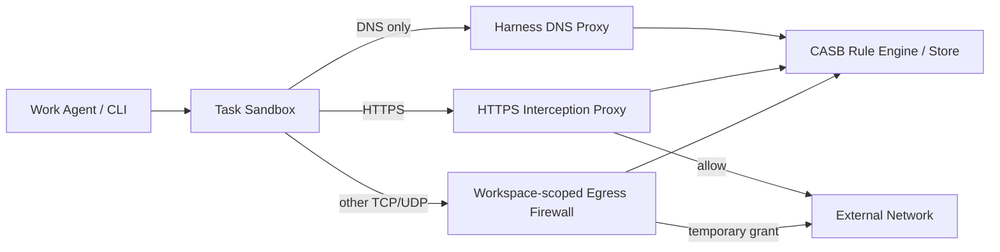
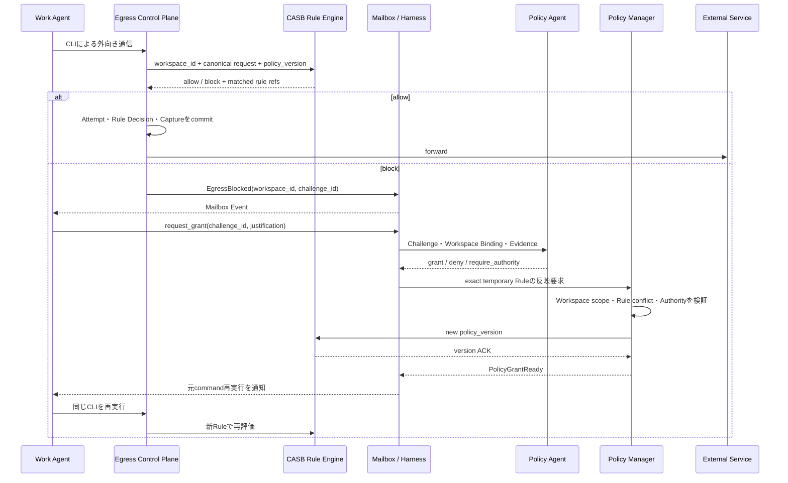

# CASB 外向き通信 統治設計

## 1. 信頼境界

```text
Sandbox内
  原則自由: file / git local / build / test / local process

Sandbox外
  Policy対象: network / credential / publish / production / money / communication
```

サンドボックスには外部認証情報を置かず、直接外向き通信を遮断する。外向き通信は外向き通信Control Planeへ強制ルーティングする。

セキュリティ ポリシーの適用単位は論理Workspaceである。Agent、Agent実行、Taskオーナーはポリシー 主体ではない。TaskとAgentは要求者・目的・委譲を監査するために記録するが、ルールエンジンはWorkspace ネットワーク 識別情報から`WorkspaceSecurityPolicyBinding`を解決する。

### 1.1 実装・永続化境界

Governance PlaneはRustの独立プロセスとして実装し、`governance.db`を単独で書き込み所有する。ポリシー、Workspaceポリシー割り当て、試行、許可確認、許可、外向きトランザクション、検出事項、改訂、統治 送信キュー/受信キューはこのSQLiteを正本とする。Go コアはDB ファイルを直接開かず、バージョン付きJSONメッセージをUnixドメインソケットで交換する。

Control PlaneのTask、非同期操作、Taskメールボックス、責任者への依頼/判断は`control.db`に残す。両DBをまたぐトランザクションは作らず、メッセージ ID、冪等キー、`ACK`、リース、照合で収束させる。許可 有効化、失効、ポリシーバージョン `ACK`など安全性に関わるワークフローは、統治側の確定`ACK`まで外向き操作を許可しない。

## 2. サンドボックス要件の優先度

サンドボックス要件の優先度は、段階的な実装スコープを表す。すべてのOSで最初から同じ機能を実装することは要求しない。

| 優先度 | 実装上の意味 | リリース判断 |
|---|---|---|
| P0 | 最小限の隔離、外向き通信捕捉、監査可能性を備えるMVP要件 | 対応を表明するOS/プロファイルでは全P0が必須。不足するプロファイルは提供しない |
| P1 | MVP後に追加する標準的な隔離・リソース統制 | 未実装でもP0 プロファイルは提供できる |
| P2 | 高度な防御、性能、可観測性の改善 | 対応可能なOS/プロファイルから段階的に追加する |

Linuxを仕様と初期実装の正本にする。macOS / Windowsは機能ごとに実現可能性を評価し、同じ安全上の結果を別技術で実現できる場合だけ対応プロファイルとして追加する。Linux固有機能との完全な同型性は要求しない。

P0は「Linux、macOS、WindowsをすべてMVPでサポートする」という意味ではない。初期MVPをLinux P0 プロファイルだけで提供してよい。macOS / Windows ネイティブでP0の一部を安全に強制できない場合、そのネイティブ プロファイルを未提供とし、後続でVM方式またはOS固有方式を実装する。

| 要件 | 優先度 | Linux正本 | macOS ネイティブ アダプター | Windows ネイティブ アダプター |
|---|---:|---|---|---|
| Task Workspaceと明示allowlist以外への読み書き拒否 | P0 | マウント 名前空間 + 読み取り専用 ランタイム マウント + Landlock/LSM | App サンドボックス コンテナー + ファイルシステム許可 | AppContainer + ACL |
| Task プロセスの終了・回収 | P0 | cgroup/PID追跡 | プロセス グループまたはVM | Job Object |
| ホスト 認証情報非公開 | P0 | 秘密情報非マウント、別識別情報 | Keychain 権限設定なし、環境非注入 | 認証情報非継承、AppContainer 識別情報 |
| プロキシ到達可かつ直接外向き通信拒否 | P0 | ネットワーク 名前空間 + ファイアウォール | ネットワーク Extension/VM等で強制できるプロファイルのみ | WFP/VM等で強制できるプロファイルのみ |
| 外向き通信Control Planeを迂回できない | P0 | ネットワーク 名前空間 + ファイアウォール | サンドボックス/VM 経路固定 | AppContainer/VM 経路固定 |
| 権限昇格拒否 | P0 | rootless、ケイパビリティ drop、`no_new_privs` | 権限設定最小化、ルート helperなし | AppContainer / Restricted トークン |
| ホスト IPC・管理ソケット非公開 | P0 | IPC 名前空間、ソケット非マウント | Mach/XPC許可最小化 | AppContainer + named object ACL |
| `shared_readonly` モード | P1 | 読み取り専用 bind マウント | 読み取り専用 マウント/ACL + サンドボックス スコープ | 読み取り専用 ACL + AppContainer スコープ |
| CPU / メモリ / PID上限 | P1 | cgroups v2 | `setrlimit` + monitor、厳密性が必要ならVM | Job Object limits |
| disk上限 | P1 | クォータ付きボリューム | APFS ボリューム クォータまたはVM disk | VHDX / ファイルシステム クォータ |
| Workspace 分岐 / スナップショット | P1 | OverlayFS/reflink + Git ワークツリー | APFS clone + Git ワークツリー | VHDX differencing/ブロッククローン + Git ワークツリー |
| syscall攻撃面の縮小 | P1 | seccomp + LSM | App サンドボックス/Hardened ランタイム、同等性が必要ならVM | AppContainer + プロセス mitigation ポリシー |
| デバイスアクセス拒否 | P1 | デバイス非公開 + ケイパビリティ/LSM | デバイス 権限設定なし | デバイス ケイパビリティなし |
| リソース使用量計測 | P2 | cgroup accounting | プロセス monitor | Job Object accounting |
| copy-on-write高速化 | P2 | OverlayFS/reflink | APFS clone | ブロッククローン/differencing VHDX |
| サンドボックス violation監査 | P2 | 監査/LSM ログ | サンドボックス violation ログ | AppContainer/ETW ログ |

対応プロファイルとして提供するのは、そのOSでP0をすべて実装し、隔離テストを通過したものに限る。P1/P2は対応可能な機能から段階的に実装する。ただしP0適合は「攻撃やポリシー 迂回が機械的に不可能」という保証ではない。インライン判定はルールベースだが、ルール作成・更新と事後監査には確率的LLM判断を使うため、見逃しや不適切なルール更新を残余リスクとして運用する。

macOS / Windows ネイティブで「外向き通信 プロキシには到達できるが、それ以外のネットワークへは到達できない」境界を強制できない場合、そのネイティブ プロファイルは提供せずLinux VM プロファイルを使用する。

## 3. 外向き通信Control Plane

Work Agentはサンドボックス内で`gh`、`git`、`curl`、package マネージャーなどを通常どおり実行する。外部作用を事前分類する`request_effect`やEffect 型 レジストリは設けない。境界を越えようとした実通信を外向き通信Control Planeが捕捉し、基本ポリシーをインライン適用する。



Workspace ネットワーク 識別情報はネットワーク 名前空間、cgroup、AppContainer等のOS アダプターから付与し、通信内容をAgentの自己申告に依存してAgentやTaskへ関連付けない。ルールエンジンは`workspace_id`からセキュリティ ポリシー割り当てを解決し、Task/Agentは監査来歴として記録する。統治 ポリシー ストアまたは強制 点が利用不能な場合はフェイルクローズとする。

## 4. HTTPS 傍受

HTTPSは専用CAをTask サンドボックスへtrustさせ、Interception プロキシでTLSを終端する。プロキシは認証情報を除いたリクエスト メタデータと必要な本文検査結果をポリシーへ渡し、許可時だけ外部プロバイダーとのTLS接続を作る。

- サンドボックスからプロキシを迂回する経路を与えない
- DNS、DoH、DoT、QUICによる迂回を遮断する
- Authorization、Cookie、秘密情報は監査ログへ保存しない
- 認証情報 ブローカーがWorkspaceセキュリティポリシー割り当てに基づき外側リクエストへ認証情報を注入する
- certificate pinningなど傍受非対応通信はP0では拒否する
- P0ではgeneric `CONNECT`、HTTP Upgrade、WebSocket、ambiguous framingを拒否する
- HTTP/1.1・HTTP/2をcanonicalizeし、リクエスト 本文検査完了前に外側へ送信しない
- streaming uploadはP0では全bufferしてから判定するか未対応として拒否する
- リダイレクト先は新しい外向き通信 試行として再評価する

## 5. HTTPS以外の通信

非HTTP TLSはP1でSNI-aware L4 プロキシを利用できる。その他のプロトコルはWorkspaceスコープのファイアウォールで`protocol + resolved IP + exact port + TTL`を短時間だけ許可する。

FQDNはDNS 来歴と監査上の識別子であり、L4の実強制境界は完全一致 IP + ポートである。共有IP上の別サービスをFQDNだけで隔離できないため、強いFQDN拘束が必要な通信はSNI/certificate検証プロファイルへ昇格する。サンドボックスから外部DNSへの直接通信と生IP指定は原則拒否する。

P0ではHTTPS以外をTCPに限定し、UDPはハーネス DNS プロキシ以外を拒否する。ICMP、RAWソケット、未対応IP プロトコル、IPv6 拡張 ヘッダーによる迂回もデフォルト拒否とする。private、loopback、link-local、メタデータ、Control Plane IPを拒否し、CNAME 連鎖とDNS rebindingを検査する。DNS TTLと許可 TTLの短い方を使用し、スナップショット後の新IPを既存許可へ自動追加しない。Git操作はHTTPSへ統一し、SSH Agent ブローカーや汎用UDP 許可はP1とする。

ハーネス DNS プロキシ自体もdefault-denyの強制 点である。P0ではA/AAAA問い合わせだけを許可し、TXT等の未対応型、過長ラベル、高頻度、高entropy ラベルを拒否する。未知FQDNは上流へ問い合わせる前にFQDNだけを割り当てした`dns` 許可確認を作るため、拒否された名前をDNS クエリとして外部へ漏らさない。明示HTTPS プロキシはhostnameを直接受け取り、transparent モードが必要ならハーネス管理のsynthetic IPを使う。許可・拒否したDNS問い合わせはWorkspace 識別情報、Task 来歴、クエリ 型、無害化済み FQDN ダイジェスト、ポリシーバージョンとともに監査する。

## 6. 外向き通信 試行と許可確認

基本ポリシーが通信を許可しない場合、外部へ転送せず`EgressAttempt`と不変な`EgressChallenge`を保存する。

```typescript
type EgressChallenge = {
  challenge_id: string;
  workspace_id: string;
  task_id: string;
  origin_task_id: string;
  delegation_chain_digest: string;
  contract_version: number;
  binding: {
    protocol: "dns" | "https" | "tls" | "tcp" | "udp";
    scheme: string;
    fqdn: string | null;
    resolved_ip: string | null;
    port: number;
    method: string | null;
    normalized_path_query: string | null;
    policy_headers_digest: string | null;
    body_digest: string | null;
    body_size: number | null;
    requested_credential_scope: string | null;
    dns_snapshot_ref: string | null;
    baseline_policy_version: number;
    canonical_request_digest: string;
  };
  destination_ref: string;
  request_summary_ref?: string;
  reason_codes: string[];
  grant_eligible: boolean;
  auto_grant_eligible: boolean;
  required_authority_ref: string | null;
  created_at: string;
  expires_at: string;
};
```

許可確認 コアは不変とする。各実通信は別`EgressAttempt`として保存し、同じTask、正規 リクエスト ダイジェスト、認証情報 スコープ、ポリシーバージョン、DNS スナップショット、拒否理由の短時間再試行を`ChallengeObservation`で同じ許可確認へ関連付ける。再試行 回数や最終観測時刻はObservation集計に置き、許可確認本体を更新しない。

## 7. ルールベース CASB ポリシー

外向き通信Control Planeはすべての通信を正規 外向き通信 試行へ変換し、バージョン付きCASB ルールエンジンだけでインラインの許可/拒否を決める。通信ごとにLLMを呼ばない。

- 宛先 / プロトコル / ポート 許可・拒否
- Workspace ネットワーク 識別情報とセキュリティ ポリシー割り当て
- 認証情報 スコープ
- リクエスト method / パス / サイズ
- 秘密情報、PII、データ 分類
- DNS解決の整合性
- 既存のWorkspace限定一時許可
- プラットフォーム/基本ポリシーが決定する自動許可上限と必須責任者

ルールは宛先、プロトコル、ポート、Workspace/プロファイル、認証情報 スコープ、method/パス、サイズ、データ 分類、内容 パターン、期限、使用回数を条件にできる。複数ルールのpriorityとdeny-overrides規則を固定し、未分類、ルール 競合、統治 ポリシー ストア障害は既定で拒否する。Control Planeへの通知が一時的に失敗しても統治 送信キューへ残し、既存ポリシーによるインライン 強制を継続する。

ルール 文書の正規 Schemaは[casb-policy.スキーマ.JSON](../schemas/draft-v0/governance-plane/casb-policy.schema.json)と[casb-rule.スキーマ.JSON](../schemas/draft-v0/governance-plane/casb-rule.schema.json)を正本とする。

各試行にはポリシーバージョン、一致 ルール 参照、理由 コード、許可/拒否を持つ`EgressRuleDecision`を結び付ける。ルールエンジンの結果は同じ入力とポリシーバージョンから再現可能にする。ただしルール setが未知の攻撃を完全に表現できるとは仮定せず、不適切なルール更新や未検出パターンによる迂回を残余リスクとして扱う。

許可時も外側接続を作る前に、外向き通信 試行、ルール 判断、リクエスト キャプチャ マニフェスト、`intent_committed` 外向きトランザクションをコミットする。DNS 上流 クエリとL4 接続も同じ先行書き込み順序に従う。レスポンスは上限付き キャプチャとマニフェスト完了状態をコミットしてからサンドボックスへ返す。外部到達の可能性がある途中クラッシュはマニフェストを`incomplete`、トランザクションを`outcome_unknown`として照合し、必ず高リスク 監査対象にする。`failed`は外部未到達または失敗が確定した場合だけに使う。監査ストアへ永続化できない場合は転送せず、観測不能な外部作用を作らない。

## 8. 拒否通知

Agentが消費する拒否通知の正本はTaskメールボックスである。統治側の配送正本は統治 送信キューであり、CLIへ返すHTTP 403、レスポンス ヘッダー、ソケット エラーは即時フィードバックだがbest effortとする。

```text
persist EgressAttempt
  → persist EgressChallenge
  → persist Governance Outbox(EgressBlocked)
  → commit
  → CLIへblock response
  → Control Inboxへat-least-once delivery + ACK
  → Control local transactionでTask Mailboxへ追加
```

`EgressBlocked`には許可確認 ID、無害化済み 宛先/リクエスト 要約、理由、許可 適格性だけを含め、未加工 本文、認証情報、外部の未検証テキストを含めない。Taskは自動で`waiting`へ遷移せず、Agentが許可申請、別手段、無視を判断する。

## 9. `request_grant`

Work Agentはメールボックスで受け取った許可確認に対してだけ許可を申請できる。

```typescript
request_grant({
  challenge_id: string,
  justification: string,
  evidence_refs: string[],
  timeout_ms: number | null
})
```

Agentは宛先、ポリシー パッチ、TTL、認証情報、冪等キーを指定しない。ハーネスは現在Taskが許可確認のWorkspaceを使用していること、許可確認期限、許可 適格性を検査し、`task_id + call_id + tool_name`から操作 キーを生成してWorkspace、Task、許可申請、非同期操作を保存する。同じ`workspace_id + challenge_id`の非終端許可申請は1つに限定し、オーナー交代や別ステップからの再申請でも既存リクエスト/非同期操作を返す。

## 10. ポリシーAgent

ポリシーAgentはルールエンジンのhot パスには入らず、拒否された許可確認または事後検出事項を契機にルール更新を判断する組み込みAgentである。許可申請では無害化済み 許可確認、Agent justification、Task契約、現在ポリシー、プラットフォーム上限、認証情報 スコープ、証跡を入力し、構造化 出力で次を返す。

```typescript
type GrantDecision = {
  decision: "grant" | "deny" | "require_authority";
  rationale: string;
  question: string | null;
  evidence_refs: string[];
};
```

組み込みAgentは許可範囲や責任者を生成せず、本番ポリシー ストアへ直接書かない。`grant`/`deny`では`question = null`、`require_authority`では質問を必須とする。プラットフォーム/基本ポリシーが許可確認生成時に`auto_grant_eligible`と`required_authority_ref`を確定し、CASB ポリシー マネージャーがこれを強制する。Agentが`grant`を返しても自動許可不可なら`require_authority`または`deny`へ正規化し、責任者は`required_authority_ref`から決定する。CASB ポリシー マネージャーが不変 許可確認から完全一致 一時 ルールを決定論的に生成する。

検出事項起点ではポリシーAgentが証跡、キャプチャ マニフェスト、Workspaceポリシー割り当て、現行ルール、過去検出事項を調査し、隔離ポリシー Workspaceへ候補 ルール 文書と評価を作る。ハーネスが候補 参照/ダイジェスト、基底 ポリシーバージョン、固定 タイムスタンプを改訂 ジョブへ原子的に保存してから、構造化 出力として`update | no_change | require_authority`、根拠、証跡 参照を確定する。クラッシュ/再試行ではジョブに固定済みの候補だけを再利用し、出力に候補 参照を自己申告させない。

`update`と`require_authority`では固定候補を必須、`no_change`では候補なしを強制する。対象スコープはジョブ作成時にハーネスが`workspace:<workspace_id>`または`global:<profile_ref>`の対象 ポリシー キーとして固定し、ポリシーAgentに拡張させない。ポリシー マネージャーがSchema、スコープ、ルール 競合、回帰結果、責任者要否を検証する。ポリシーAgentの判断は確率的であり、ルール改定後も事後監査を継続する。

評価 ジョブは入力 スナップショット/ダイジェスト、プロファイル/Schema バージョン、試行、リース、期限、エラーだけを保存し、技術障害では同じ固定入力を再試行する。確定出力はID付き判断 記録として保存する。組み込みAgentのAgent ID、Agent実行、レスポンス ID、ツール 呼び出し履歴は永続化しない。

### 10.1 ルール更新シーケンス



外向き通信 監査 検出事項からの恒久ルール改定でも、ポリシーAgentは候補 ルールと評価を作り、ポリシー マネージャーがWorkspace/全体 スコープ、Schema、回帰結果、責任者を検証してからルールエンジンへ新バージョンを配布する。ポリシーAgentを通信のインライン判定には使わない。

### 10.2 恒久ルール改定の確定

`require_authority`の場合は、提案 ID/ダイジェスト、Workspaceまたは全体 スコープ、基底 ポリシーバージョン、責任者、期限を不変な改訂 責任者への依頼へ固定する。回答は認証済み回答者、承認/拒否、根拠、時刻を改訂 責任者の判断へ一件だけ保存する。拒否/期限切れ/遅延 レスポンスは許可 責任者と同じ冪等な終端規則を使う。

適用時は対象Workspaceポリシー割り当てもしくは全体 ポリシー 行をロックし、`current_version == proposal.base_policy_version`かつ`pending_revision_id = null`をCAS検証する。不一致または既存`pending`がある提案は配布前に`stale`として、最新ルールでポリシーAgentの再評価へ戻す。ロック下の単調シーケンスで新規バージョンを発番し、改訂を`pending_activation`で保存すると同時に対象 行へ`pending_revision_id`と`pending_version`を予約する。現行`active`バージョンは維持したまま、その一件だけをルールエンジンへ配布する。

正本となる ルールエンジンの`ACK`後のトランザクションでは、`ACK`対象バージョンに加えて`pending_revision_id == revision_id`を再検査する。改訂を`active`、旧改訂を`superseded`とし、割り当ての現在バージョンを切り替えて`pending`予約をclearする。配布失敗、キャンセル、タイムアウトでも旧バージョンを`active`のまま保ち、同一トランザクションで`pending`予約を解放する。

改訂作成トランザクションは起点 提案、必要なら承認済み改訂 責任者の判断、対象 ポリシー 参照/ダイジェスト、基底/新規 バージョンを一意に結び付ける。ポリシー マネージャーは責任者回答時と`ACK`時にもWorkspace 割り当て、スコープ、候補 ダイジェスト、基底 バージョンをロック下で再検査する。

## 11. 一時許可

### 11.1 必須メッセージ 連鎖

正常な許可 ワークフローは次の順序を省略してはならない。

1. CLI `ToolCall`から生じた`EgressAttempt`をルールエンジンが拒否する
2. `EgressChallenge`と`EgressBlocked` メールボックス イベントを確定する
3. Agentの`request_grant`から`GrantRequest`と非同期操作を作る
4. ポリシーAgent結果を不変な`GrantDecisionRecord`として保存する
5. `PolicyGrant(status=pending_activation)`とポリシーバージョン予約を確定する
6. 正本となる 強制 点の`PolicyActivationAck`を受信する
7. `PolicyGrant(status=active)`、許可申請/非同期操作完了、`AsyncCompleted`と`PolicyGrantReady`を同一有効化 トランザクションで確定する
8. Agentが元のCLI `ToolCall`を再実行し、新しいEgressAttemptとOutboundTransactionを作る

各段階は許可確認 ID、許可申請 ID、許可判断 ID、許可 ID、非同期 ID、Workspace ID、
Task ID、正規 割り当て ダイジェストを相互参照する。`active` 許可、OutboundTransaction、準備完了 イベントの
いずれか1つだけが先行するシーケンスを正当な成功として扱わない。

P0のHTTPS 許可は同一Workspace、起点Task、origin/委譲、契約バージョン、正規 リクエスト ダイジェスト、認証情報 スコープ、基本ポリシーバージョンへ束縛し、`max_uses = 1`とする。クエリ、ポリシー対象ヘッダー、本文が変われば別許可確認が必要である。L4 許可は許可確認のDNS スナップショットにある完全一致 解決済み IP、完全一致 ポート、プロトコルへ束縛し、短いTTL、接続数上限、必要ならバイト上限を持つ。許可確認からスコープを拡張するフィールドをLLMや責任者へ渡さない。

```typescript
type PolicyGrant = {
  grant_id: string;
  workspace_id: string;
  source_task_id: string;
  origin_task_id: string;
  delegation_chain_digest: string;
  contract_version: number;
  source_challenge_id: string;
  source_grant_request_id: string;
  source_grant_decision_id: string;
  source_authority_decision_id: string | null;
  binding_digest: string;
  protocol: "dns" | "https" | "tls" | "tcp" | "udp";
  resolved_ip: string | null;
  port: number;
  credential_scope: string | null;
  max_uses: 1;
  connection_limit: number;
  byte_limit: number | null;
  policy_version: number;
  status: "pending_activation" | "active" | "revoked";
  use_count: number;
  created_at: string;
  expires_at: string;
  revoked_at?: string;
};
```

許可作成直前に統治はWorkspace/ポリシー割り当て `active`、固定済み起点Task スナップショット、許可確認期限、契約/委譲、割り当て ダイジェスト、ポリシーバージョン互換性、DNS スナップショット 鮮度を再検査する。一時許可は元の許可申請と許可判断 記録を必須参照し、責任者経由なら承認済み責任者の判断 参照も必須参照する。最初の統治 トランザクションでは許可判断、`pending_activation` PolicyGrant、ポリシーバージョン、`pending` 準備完了 送信キューを確定するが、制御の非同期操作は終端しない。正本となる 強制 点がポリシーバージョンを`ACK`した後、統治 有効化 トランザクションで許可を`active`にして結果送信キューを確定する。制御がその結果を受信キューへ適用したトランザクションで非同期操作を`completed`にし、`AsyncCompleted`と`PolicyGrantReady`をTaskメールボックスへ追加する。イベントには許可申請 ID、非同期 ID、`policy_version`を含める。`AsyncCompleted(result_ref=GrantResult)`を正本とし、`PolicyGrantReady`はCLI再実行を促す補助イベントとする。最初に拒否した通信をゲートウェイが自動再生せず、Agentが元のCLI コマンドを再実行する。

強制点は転送前に、Workspace/ポリシー割り当てが`active`、起点Taskが`active`、許可が期限内かつ未失効、割り当て一致、`use_count < max_uses`であることを検証し、使用枠を原子的に予約する。外向きトランザクションの意図も同じ原子操作で確定する。予約失敗時は外側接続を作らない。L4接続枠も原子的に予約・解放し、起点Taskのキャンセル、Workspaceの凍結、許可失効後は新規接続と新規送信を拒否する。

## 12. 認証情報 ブローカー

本物の認証情報をサンドボックスへ置かない。必要なCLIにはWorkspace固有の非秘密情報 ブローカー センチネルを与える。プロキシはサンドボックス由来のAuthorization/Cookieを除去する。Workspaceセキュリティポリシー割り当て、許可確認に固定した要求済み認証情報スコープと許可、プロバイダー 主体、完全一致 origin、method/パス/リソーススコープが一致する場合だけ外側リクエストへ実認証情報を注入する。Task/Agentは監査来歴にのみ使う。センチネルを別Workspaceで使用できず、分岐先へ認証情報 承認を継承しない。センチネルを外へ転送せず、リダイレクトごとに再評価する。ネットワーク 許可と認証情報利用許可は別に評価する。

## 13. 責任者

人間または外部責任者との送受信はハーネス Control Planeの責任者ゲートウェイを通してのみ行う。Governance Plane、組み込みAgent、Work Agentは直接通信せず、不変な責任者への依頼をゲートウェイへ渡し、認証済みの不変な責任者の判断を受け取る。責任者ゲートウェイは認証、チャネル アダプター、配送、期限、再送、重複回答排除と判断永続化を所有するが、許可、インシデント、改訂、Task 再開の意味判断やスコープ変更は行わない。

ポリシーAgentの判断をCASB ポリシー マネージャーが`require_authority`へ正規化した場合、人間または外部サービスの責任者へ送る。作業上の親オーナーは責任者ではない。責任者はプラットフォーム/基本ポリシーが許可確認の`required_authority_ref`へ固定し、LLMには選ばせない。責任者への依頼には許可申請、許可確認、許可判断 記録、Workspace 割り当て ダイジェスト、責任者、期限を固定し、責任者はその完全一致 スコープを承認/拒否するだけとする。条件付き承認はP0では提供しない。

回答はControl Planeが認証済み回答者 主体、判断、根拠、時刻を不変な責任者の判断へ一件だけ保存する。制御は判断と統治向け送信キューを同一トランザクションで確定し、統治は受信キュー コミット後にWorkspace/ポリシー割り当て、起点Task スナップショット、許可確認、割り当て、ポリシー/DNS 鮮度を再検査する。期限切れ時も各Planeのローカル 状態と送信キューを原子的に確定し、統治 拒否 `ACK`を受けて制御の非同期操作とメールボックスを終端する。期限後の回答や重複回答は状態を変えず、既存の終端結果へ収束する。

## 14. 権限ロンダリング対策

- Task 識別情報とorigin/委譲 連鎖を許可確認・許可へ保存する
- 親子関係を許可承認経路にしない
- ルール/許可を要求元Workspaceへ束縛し、分岐先Workspaceへ暗黙継承しない
- Work Agentにポリシー編集ツールや認証情報を渡さない
- 許可確認外の宛先やリクエストへ許可を拡張しない

```text
Spawnは計算能力を増やせる
Spawnはnetwork権限を増やせない
```

## 15. Task キャンセル

Task キャンセル時はControl PlaneがTaskの操作ゲートを閉じ、統治へTask/Workspaceを固定した失効 コマンドを送信キュー送信する。統治は同一ローカル トランザクションで未解決リクエスト/評価 ジョブをキャンセルし、`pending_activation`または`active` 許可を失効し、`pending` 準備完了 送信キューを無効化して失効 `ACK`を作る。制御は`ACK`受信後に非同期操作とTaskメールボックスを終端する。Workspaceの基本ポリシー 割り当て自体は削除しない。統治はコマンド受信後の新規接続を直ちに拒否し、P0では既存接続も短いgrace period後に終了する。

Workspaceを`frozen | archived | destroyed`へ遷移する場合も同じ失効/`ACK` プロトコルを使う。コアは操作ゲートを先に閉じ、統治が未解決ワークフローのキャンセル、許可 失効、`pending` 準備完了無効化、新規外向き通信停止をローカル トランザクションで確定してから`ACK`する。許可作成・有効化・責任者回答側はWorkspace/割り当て `active`と最新コア スナップショットを再検査する。オーナーAgentの交代、Agent実行停止、コンテキスト 圧縮だけではポリシー割り当てや許可を変更しない。

Agentの`cancel_async`は許可 有効化前だけ取消可能である。制御はキャンセル 意図を送信キューへ固定して新規作用を閉じるが、非同期 状態は`ACK`まで`running`を維持する。統治は許可申請と評価 ジョブをキャンセルし、既存の`pending_activation` 許可と`pending` 準備完了 送信キューを無効化して`ACK`する。制御は`ACK`後に非同期を`cancelled`として`AsyncCancelled`を確定する。有効化後は`not_cancellable`を返し、暗黙に許可を失効しない。明示的な許可 失効は将来の別操作とする。既に外部で成立した作用はロールバックせず、必要ならAgentが通常のCLIで補償操作を行い、その通信も同じCASB ポリシーを通る。

## 16. 監査、事後検知、ポリシー改善

外向き通信 試行、許可確認、メールボックス イベント、許可申請、許可判断 記録、責任者への依頼/判断、一時許可、実際に通過した外向きトランザクションを相互参照可能に保存する。未加工 秘密情報は保存せず、本文は既定でダイジェスト、サイズ、分類を保存する。認証情報注入前の割り当て ダイジェストと、注入後に安全な境界内で計算したouter リクエスト ダイジェストを分離して監査する。

事後検知に必要な証跡として、保持/分類 ポリシーに従い、認証情報除去後の上限付き 無害化済み リクエスト/レスポンス 内容または暗号化済み キャプチャを原則すべての通信について証跡DBへ短期保存する。各キャプチャ マニフェストにはリクエスト/レスポンス別の合計 バイト、captured バイト 範囲とチャンク ダイジェストを保存する。秘匿済み 範囲、分類、切り詰め済み flag/理由、暗号化BLOB/キー 参照、`complete | partial | unavailable | incomplete`も保存し、保存範囲を完全キャプチャと誤認させない。監査Agentは未捕捉範囲が判断に重要なら`insufficient_evidence`を返す。高リスクや検出事項関連キャプチャは長期保持へ昇格する。ダイジェストだけでは後から意味的迂回を発見できないためである。

外向き通信監査Agentによるレビューは高リスク通信と異常を全件、低リスク通信をバージョン付きサンプリング ポリシーによる標本とする。高リスク/異常は取り込み時にレビュー ジョブとキャプチャ ピン留めを作り、ジョブもしくはインシデント終端までGCしない。低リスク サンプリングもキャプチャ 期限切れより前に選定を確定する。レビュー 期限はキャプチャ 期限切れより前に置き、滞留が期限へ達したら保持延長、キャプチャ容量制御、あるいは明示的な網羅率 欠落を記録して運用者へ通知する。未選定通信量も保持期間中はインシデントから再調査できる。未加工 認証情報はキャプチャ前に除去する。

内容を復号できないL4通信、上限を超えるストリーム、end-to-end暗号化ペイロードはflow メタデータ、宛先、バイト/timing パターン、上限付き フィンガープリントと`inspection_limited`理由だけを保存する。この観測限界も残余リスクとして可視化し、必要なTask/プロファイルでは通信自体を拒否するか、検査可能なプロトコルへ限定する。

`policy_bypass`または`suspicious` 検出事項を検出したら、次の運用ループを実行する。

1. 試行、ルール 判断、外向きトランザクション、Workspace、Task、証跡を統治所有のインシデントへ固定する
2. ルールベース リスク 下限とインシデント レビュアー推奨の高い方をeffective リスクとして確定する。レビュアーは下限を引き下げられない
3. Low/Mediumはnetwork-level 封じ込めを優先し、Highは原則Taskを停止、Criticalは人を待たず即時停止する
4. High/Criticalでは一時封じ込め後に人間のインシデント責任者を必須とし、調査継続・キャンセル・停止継続を判断する
5. 迂回の再現ケースを評価 データセットと回帰テストへ追加する
6. ポリシーAgentが候補 ルールと評価を作り、対象Workspaceまたは全体 ベースラインを明示したバージョン付きポリシー 改訂として修正する
7. High/Criticalの恒久改訂 有効化とTask 再開には人間の責任者を必須とする

インシデント、リスク評価、封じ込め、ポリシー 改訂はGovernance Planeが所有する。人間のインシデント責任者、改訂 責任者、人間による再開判断はすべてControl Planeの責任者ゲートウェイ経由で要求・受領する。Control Planeはリスクを判断せず、統治の判断または責任者ゲートウェイが返した人間の責任者の判断に裏付けられた`SuspendTaskRequested` / `ResumeTaskRequested`をTaskライフサイクルへ適用する。ポリシー修正を通常の是正Taskとして作らず、Taskエピソードも生成しない。コード修正、認証情報 rotationなどポリシー外の作業が必要な場合だけ、インシデントへリンクした別の作業 TaskをControl Planeへ明示的に起票する。

封じ込めは影響の小さい順に、該当試行 拒否、許可 失効、Workspace 外向き通信制限、Workspace 凍結、Task 停止を選ぶ。MVPでTask 停止が必要な場合、Governance Planeは発生元Taskを指定し、Control Planeが固定Taskツリー 改訂から発生元の全祖先・発生元自身・全子孫を封じ込め集合へ展開する。兄弟Taskと別ブランチは含めない。集合全体の新規操作を先に禁止し、Execution Planeへ子孫から祖先の順でAgent実行停止を要求し、停止確認後に各Taskを`suspended`へ遷移させる。Task 再開はインシデント 是正完了だけでは行わず、High/Criticalでは別の人間による再開判断を必要とし、祖先から子孫の順に保存済みの直前状態へ復元する。
5. 過去通信量へ新旧ポリシーを再実行し、見逃し改善と過剰拒否を比較する。
6. 責任者承認後に新ポリシーバージョンを展開し、検出事項から改訂までを追跡可能にする。

外向き通信監査Agent自身にも見逃しがあり得るため、同一モデル/プロファイルだけに依存せず、ランダム サンプリング、異常検知、運用者 レビュー、定期的なred-team 再実行を組み合わせる。検知率、誤検知率、レビュー 網羅率、発見までの時間、再発率を運用指標とする。

### Failure モード

| 障害 | 既定動作 |
|---|---|
| HTTPS プロキシ / ファイアウォール 利用不能 | フェイルクローズ |
| DNS プロキシ 利用不能 | フェイルクローズ |
| 外向き通信監査Agent 利用不能 | 外向き通信を即停止せずジョブを再試行し、レビュー 滞留と網羅率低下を運用者へ通知する |
| ポリシーAgent 利用不能 | 現行ルールエンジンは継続するが新しい許可/ルール更新は行わない。同じ固定入力で再試行し、上限後は運用者障害とする |
| ポリシー 競合 | 拒否し、必要なら許可申請を要求 |
| ポリシー反映タイムアウト | `PolicyGrantReady`を送らず再試行 |
| メールボックス 配送重複 | イベント IDでdeduplicate |
