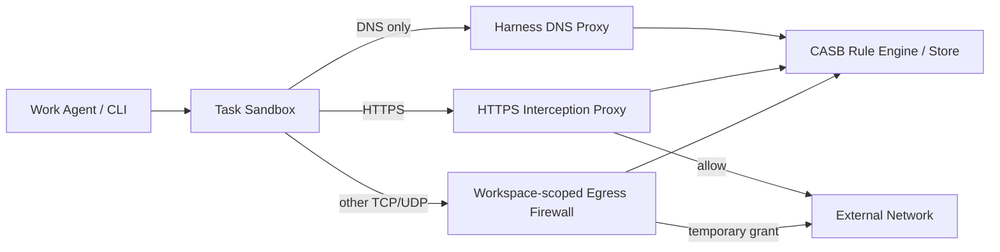
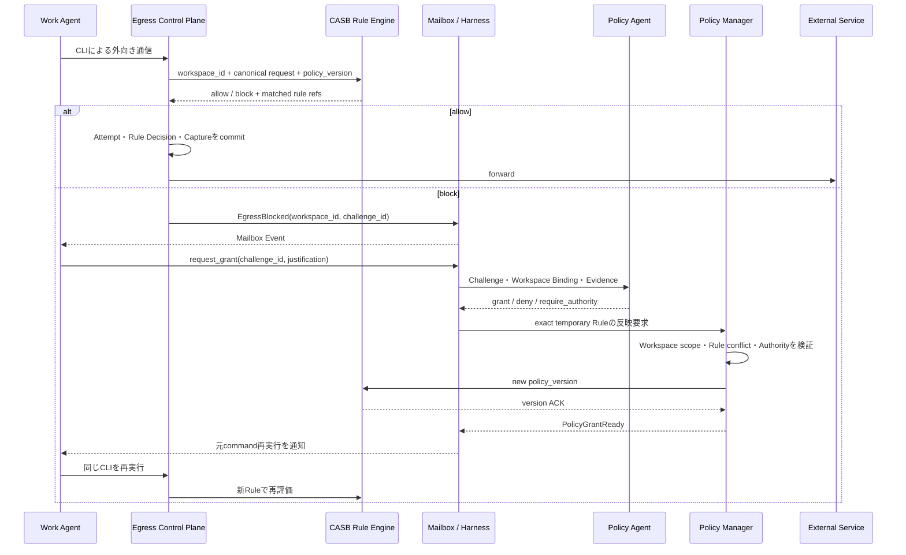

# CASB Egress Governance設計

## 1. 信頼境界

```text
Sandbox内
  原則自由: file / git local / build / test / local process

Sandbox外
  Policy対象: network / credential / publish / production / money / communication
```

Sandboxには外部Credentialを置かず、direct egressを遮断する。外向き通信はEgress Control Planeへ強制routingする。

Security Policyの適用単位は論理Workspaceである。Agent、Agent Run、Task OwnerはPolicy principalではない。TaskとAgentは要求者・目的・delegationを監査するために記録するが、Rule EngineはWorkspace network identityから`WorkspaceSecurityPolicyBinding`を解決する。

### 1.1 実装・永続化境界

Governance PlaneはRustの独立processとして実装し、`governance.db`を単独でwrite所有する。Policy、Workspace Policy Binding、Attempt、Challenge、Grant、Outbound Transaction、Finding、Revision、Governance Outbox/InboxはこのSQLiteを正本とする。Go CoreはDB fileを直接開かず、versioned JSON messageをUnix domain socketで交換する。

Control PlaneのTask、Async Operation、Task Mailbox、Authority Request/Decisionは`control.db`に残す。両DBをまたぐTransactionは作らず、message ID、idempotency key、ACK、lease、reconciliationで収束させる。Grant activation、revoke、Policy version ACKなど安全性に関わるworkflowは、Governance側の確定ACKまで外向きActionを許可しない。

## 2. Sandbox要件の優先度

Sandbox要件の優先度は、段階的な実装スコープを表す。すべてのOSで最初から同じ機能を実装することは要求しない。

| 優先度 | 実装上の意味 | リリース判断 |
|---|---|---|
| P0 | 最小限の隔離、Egress捕捉、監査可能性を備えるMVP要件 | 対応を表明するOS/Profileでは全P0が必須。不足するProfileは提供しない |
| P1 | MVP後に追加する標準的な隔離・Resource統制 | 未実装でもP0 Profileは提供できる |
| P2 | 高度な防御、性能、可観測性の改善 | 対応可能なOS/Profileから段階的に追加する |

Linuxを仕様と初期実装の正本にする。macOS / Windowsは機能ごとに実現可能性を評価し、同じ安全上の結果を別技術で実現できる場合だけ対応Profileとして追加する。Linux固有機能との完全な同型性は要求しない。

P0は「Linux、macOS、WindowsをすべてMVPでサポートする」という意味ではない。初期MVPをLinux P0 Profileだけで提供してよい。macOS / Windows nativeでP0の一部を安全に強制できない場合、そのnative Profileを未提供とし、後続でVM方式またはOS固有方式を実装する。

| 要件 | 優先度 | Linux正本 | macOS native adapter | Windows native adapter |
|---|---:|---|---|---|
| Task Workspaceと明示allowlist以外へのread/write拒否 | P0 | mount namespace + read-only runtime mount + Landlock/LSM | App Sandbox container + filesystem許可 | AppContainer + ACL |
| Task processの終了・回収 | P0 | cgroup/PID追跡 | process groupまたはVM | Job Object |
| host Credential非公開 | P0 | secret非mount、別identity | Keychain entitlementなし、環境非注入 | Credential非継承、AppContainer identity |
| Proxy到達可かつdirect egress拒否 | P0 | network namespace + firewall | Network Extension/VM等で強制できるProfileのみ | WFP/VM等で強制できるProfileのみ |
| Egress Control Planeを迂回できない | P0 | network namespace + firewall | Sandbox/VM route固定 | AppContainer/VM route固定 |
| privilege escalation拒否 | P0 | rootless、capability drop、`no_new_privs` | entitlement最小化、root helperなし | AppContainer / Restricted Token |
| host IPC・管理socket非公開 | P0 | IPC namespace、socket非mount | Mach/XPC許可最小化 | AppContainer + named object ACL |
| `shared_readonly` mode | P1 | read-only bind mount | read-only mount/ACL + Sandbox scope | read-only ACL + AppContainer scope |
| CPU / memory / PID上限 | P1 | cgroups v2 | `setrlimit` + monitor、厳密性が必要ならVM | Job Object limits |
| disk上限 | P1 | quota付きvolume | APFS volume quotaまたはVM disk | VHDX / filesystem quota |
| Workspace fork / snapshot | P1 | OverlayFS/reflink + Git worktree | APFS clone + Git worktree | VHDX differencing/block clone + Git worktree |
| syscall攻撃面の縮小 | P1 | seccomp + LSM | App Sandbox/Hardened Runtime、同等性が必要ならVM | AppContainer + process mitigation policy |
| deviceアクセス拒否 | P1 | device非公開 + capability/LSM | device entitlementなし | device capabilityなし |
| Resource使用量計測 | P2 | cgroup accounting | process monitor | Job Object accounting |
| copy-on-write高速化 | P2 | OverlayFS/reflink | APFS clone | block clone/differencing VHDX |
| Sandbox violation監査 | P2 | audit/LSM log | sandbox violation log | AppContainer/ETW log |

対応Profileとして提供するのは、そのOSでP0をすべて実装し、隔離テストを通過したものに限る。P1/P2は対応可能な機能から段階的に実装する。ただしP0適合は「攻撃やPolicy bypassが機械的に不可能」という保証ではない。inline判定はRule-basedだが、Rule作成・更新と事後Auditには確率的LLM判断を使うため、見逃しや不適切なRule更新を残余riskとして運用する。

macOS / Windows nativeで「Egress Proxyには到達できるが、それ以外のnetworkへは到達できない」境界を強制できない場合、そのnative Profileは提供せずLinux VM Profileを使用する。

## 3. Egress Control Plane

Work AgentはSandbox内で`gh`、`git`、`curl`、package managerなどを通常どおり実行する。外部作用を事前分類する`request_effect`やEffect Type Registryは設けない。境界を越えようとした実通信をEgress Control Planeが捕捉し、Baseline Policyをinline適用する。



Workspace network identityはnetwork namespace、cgroup、AppContainer等のOS adapterから付与し、通信内容をAgentの自己申告に依存してAgentやTaskへ関連付けない。Rule Engineは`workspace_id`からSecurity Policy Bindingを解決し、Task/Agentは監査provenanceとして記録する。Governance Policy StoreまたはEnforcement Pointが利用不能な場合はfail closedとする。

## 4. HTTPS interception

HTTPSは専用CAをTask Sandboxへtrustさせ、Interception ProxyでTLSを終端する。ProxyはCredentialを除いたrequest metadataと必要なbody検査結果をPolicyへ渡し、allow時だけ外部ProviderとのTLS接続を作る。

- SandboxからProxyを迂回するrouteを与えない
- DNS、DoH、DoT、QUICによる迂回を遮断する
- Authorization、Cookie、Secretは監査logへ保存しない
- Credential BrokerがWorkspace Security Policy Bindingに基づき外側requestへCredentialを注入する
- certificate pinningなどinterception非対応通信はP0では拒否する
- P0ではgeneric `CONNECT`、HTTP Upgrade、WebSocket、ambiguous framingを拒否する
- HTTP/1.1・HTTP/2をcanonicalizeし、request body検査完了前に外側へ送信しない
- streaming uploadはP0では全bufferしてから判定するか未対応として拒否する
- redirect先は新しいEgress Attemptとして再評価する

## 5. HTTPS以外の通信

非HTTP TLSはP1でSNI-aware L4 Proxyを利用できる。その他のprotocolはWorkspace-scoped firewallで`protocol + resolved IP + exact port + TTL`を短時間だけ許可する。

FQDNはDNS provenanceと監査上の識別子であり、L4の実enforcement境界はexact IP + portである。共有IP上の別serviceをFQDNだけで隔離できないため、強いFQDN拘束が必要な通信はSNI/certificate検証Profileへ昇格する。Sandboxから外部DNSへの直接通信とraw IP指定は原則拒否する。

P0ではHTTPS以外をTCPに限定し、UDPはHarness DNS Proxy以外を拒否する。ICMP、raw socket、未対応IP protocol、IPv6 extension headerによる迂回もdefault denyとする。private、loopback、link-local、metadata、Control Plane IPをdenyし、CNAME chainとDNS rebindingを検査する。DNS TTLとGrant TTLの短い方を使用し、Snapshot後の新IPを既存Grantへ自動追加しない。Git操作はHTTPSへ統一し、SSH Agent Brokerや汎用UDP GrantはP1とする。

Harness DNS Proxy自体もdefault-denyのEnforcement Pointである。P0ではA/AAAA問い合わせだけを許可し、TXT等の未対応type、過長label、高rate、高entropy labelを拒否する。未知FQDNはupstreamへ問い合わせる前にFQDNだけをbindingした`dns` Challengeを作るため、blockされた名前をDNS queryとして外部へ漏らさない。明示HTTPS Proxyはhostnameを直接受け取り、transparent modeが必要ならHarness管理のsynthetic IPを使う。許可・拒否したDNS問い合わせはWorkspace identity、Task provenance、query type、sanitized FQDN digest、Policy versionとともに監査する。

## 6. Egress AttemptとChallenge

Baseline Policyが通信を許可しない場合、外部へforwardせず`EgressAttempt`とimmutableな`EgressChallenge`を保存する。

```typescript
type EgressChallenge = {
  challenge_id: string;
  workspace_id: string;
  task_id: string;
  origin_task_id: string;
  delegation_chain_digest: string;
  contract_version: number;
  binding: {
    protocol: "dns" | "https" | "tls" | "tcp" | "udp";
    scheme: string;
    fqdn: string | null;
    resolved_ip: string | null;
    port: number;
    method: string | null;
    normalized_path_query: string | null;
    policy_headers_digest: string | null;
    body_digest: string | null;
    body_size: number | null;
    requested_credential_scope: string | null;
    dns_snapshot_ref: string | null;
    baseline_policy_version: number;
    canonical_request_digest: string;
  };
  destination_ref: string;
  request_summary_ref?: string;
  reason_codes: string[];
  grant_eligible: boolean;
  auto_grant_eligible: boolean;
  required_authority_ref: string | null;
  created_at: string;
  expires_at: string;
};
```

Challenge coreはimmutableとする。各実通信は別`EgressAttempt`として保存し、同じTask、canonical request digest、Credential scope、Policy version、DNS Snapshot、reject理由の短時間retryを`ChallengeObservation`で同じChallengeへ関連付ける。retry countやlast seenはObservation集計に置き、Challenge本体を更新しない。

## 7. Rule-based CASB Policy

Egress Control Planeはすべての通信をcanonical Egress Attemptへ変換し、versioned CASB Rule Engineだけでinlineのallow/blockを決める。通信ごとにLLMを呼ばない。

- destination / protocol / port allow・deny
- Workspace network identityとSecurity Policy Binding
- Credential scope
- request method / path / size
- Secret、PII、data classification
- DNS解決の整合性
- 既存のWorkspace限定Policy Grant
- Platform/Baseline Policyが決定する自動Grant上限と必須Authority

Ruleはdestination、protocol、port、Workspace/Profile、Credential scope、method/path、size、data classification、content pattern、期限、使用回数を条件にできる。複数Ruleのpriorityとdeny-overrides規則を固定し、未分類、Rule conflict、Governance Policy Store障害は既定でrejectする。Control Planeへの通知が一時的に失敗してもGovernance Outboxへ残し、既存Policyによるinline enforcementを継続する。

Rule documentのcanonical Schemaは[casb-policy.schema.json](../schemas/draft-v0/governance-plane/casb-policy.schema.json)と[casb-rule.schema.json](../schemas/draft-v0/governance-plane/casb-rule.schema.json)を正本とする。

各AttemptにはPolicy version、matched Rule refs、reason codes、allow/blockを持つ`EgressRuleDecision`を結び付ける。Rule Engineの結果は同じ入力とPolicy versionから再現可能にする。ただしRule setが未知の攻撃を完全に表現できるとは仮定せず、不適切なRule更新や未検出patternによるbypassを残余riskとして扱う。

allow時も外側connectionを作る前に、Egress Attempt、Rule Decision、request Capture Manifest、`intent_committed` Outbound Transactionをcommitする。DNS upstream queryとL4 connectionも同じwrite-ahead順序に従う。responseはbounded captureとManifest完了状態をcommitしてからSandboxへ返す。外部到達の可能性がある途中crashはManifestを`incomplete`、Transactionを`outcome_unknown`としてreconcileし、必ずhigh-risk Audit対象にする。`failed`は外部未到達または失敗が確定した場合だけに使う。監査ストアへ永続化できない場合はforwardせず、観測不能な外部作用を作らない。

## 8. Block通知

Agentが消費するblock通知の正本はTask Mailboxである。Governance側の配送正本はGovernance Outboxであり、CLIへ返すHTTP 403、response header、socket errorは即時feedbackだがbest effortとする。

```text
persist EgressAttempt
  → persist EgressChallenge
  → persist Governance Outbox(EgressBlocked)
  → commit
  → CLIへblock response
  → Control Inboxへat-least-once delivery + ACK
  → Control local transactionでTask Mailboxへ追加
```

`EgressBlocked`にはchallenge ID、sanitized destination/request summary、reason、grant eligibilityだけを含め、raw body、Credential、外部の未検証textを含めない。Taskは自動で`waiting`へ遷移せず、AgentがGrant申請、別手段、無視を判断する。

## 9. `request_grant`

Work AgentはMailboxで受け取ったChallengeに対してだけGrantを申請できる。

```typescript
request_grant({
  challenge_id: string,
  justification: string,
  evidence_refs: string[],
  timeout_ms: number | null
})
```

Agentはdestination、Policy patch、TTL、Credential、idempotency keyを指定しない。Harnessは現在TaskがChallengeのWorkspaceを使用していること、Challenge期限、grant eligibilityを検査し、`task_id + call_id + tool_name`からOperation Keyを生成してWorkspace、Task、Grant Request、Async Operationを保存する。同じ`workspace_id + challenge_id`の非終端Grant Requestは一つに限定し、Owner交代や別stepからの再申請でも既存Request/Async Operationを返す。

## 10. Policy Agent

Policy AgentはRule Engineのhot pathには入らず、rejectされたChallengeまたは事後Findingを契機にRule更新を判断する組み込みAgentである。Grant申請ではsanitized Challenge、Agent justification、Task Contract、現在Policy、Platform上限、Credential scope、Evidenceを入力し、Structured Outputで次を返す。

```typescript
type GrantDecision = {
  decision: "grant" | "deny" | "require_authority";
  rationale: string;
  question: string | null;
  evidence_refs: string[];
};
```

組み込みAgentはGrant scopeやAuthorityを生成せず、本番Policy Storeへ直接書かない。`grant`/`deny`では`question = null`、`require_authority`ではquestionを必須とする。Platform/Baseline PolicyがChallenge生成時に`auto_grant_eligible`と`required_authority_ref`を確定し、CASB Policy Managerがこれを強制する。Agentが`grant`を返しても自動Grant不可なら`require_authority`または`deny`へ正規化し、Authorityは`required_authority_ref`から決定する。CASB Policy Managerがimmutable Challengeからexact temporary Ruleを決定論的に生成する。

Finding起点ではPolicy AgentがEvidence、Capture Manifest、Workspace Policy Binding、現行Rule、過去Findingを調査し、隔離Policy Workspaceへcandidate Rule documentとEvalを作る。Harnessがcandidate ref/digest、base Policy version、fixed timestampをRevision Jobへ原子的に保存してから、Structured Outputとして`update | no_change | require_authority`、rationale、Evidence refsを確定する。crash/retryではJobに固定済みのcandidateだけを再利用し、出力にcandidate refを自己申告させない。

`update`と`require_authority`では固定candidateを必須、`no_change`ではcandidateなしを強制する。対象scopeはJob作成時にHarnessが`workspace:<workspace_id>`または`global:<profile_ref>`のtarget Policy keyとして固定し、Policy Agentに拡張させない。Policy ManagerがSchema、scope、Rule conflict、回帰結果、Authority要否を検証する。Policy Agentの判断は確率的であり、Rule改定後も事後Auditを継続する。

Evaluation Jobはinput snapshot/digest、Profile/Schema version、attempt、lease、deadline、errorだけを保存し、技術障害では同じ固定inputを再試行する。確定出力はID付きDecision Recordとして保存する。組み込みAgentのAgent ID、Agent Run、Response ID、tool call履歴は永続化しない。

### 10.1 Rule更新シーケンス



Egress Audit Findingからの恒久Rule改定でも、Policy Agentはcandidate RuleとEvalを作り、Policy ManagerがWorkspace/global scope、Schema、回帰結果、Authorityを検証してからRule Engineへ新versionを配布する。Policy Agentを通信のinline判定には使わない。

### 10.2 恒久Rule改定の確定

`require_authority`の場合は、Proposal ID/digest、Workspaceまたはglobal scope、base Policy version、Authority、期限をimmutableなRevision Authority Requestへ固定する。回答は認証済みresponder、approve/deny、rationale、時刻をRevision Authority Decisionへ一件だけ保存する。deny/expiry/late responseはGrant Authorityと同じ冪等な終端規則を使う。

適用時は対象Workspace Policy Bindingまたはglobal Policy rowをlockし、`current_version == proposal.base_policy_version`かつ`pending_revision_id = null`をCAS検証する。不一致または既存pendingがあるProposalは配布前に`stale`として、最新RuleでPolicy Agentの再評価へ戻す。lock下の単調sequenceでnew versionを発番し、Revisionを`pending_activation`で保存すると同時にtarget rowへ`pending_revision_id`と`pending_version`を予約する。現行active versionは維持したまま、その一件だけをRule Engineへ配布する。

authoritative Rule EngineのACK後のTransactionでは、ACK対象versionに加えて`pending_revision_id == revision_id`を再検査してRevisionを`active`、旧Revisionを`superseded`、Bindingのcurrent versionを切り替え、pending予約をclearする。配布失敗、cancel、timeoutでも旧versionをactiveのまま保ち、同一Transactionでpending予約を解放する。

Revision作成Transactionはsource Proposal、必要ならapprove済みRevision Authority Decision、target Policy ref/digest、base/new versionを一意に結び付ける。Policy ManagerはAuthority回答時とACK時にもWorkspace Binding、scope、candidate digest、base versionをlock下で再検査する。

## 11. Policy Grant

### 11.1 必須message chain

正常なGrant workflowは次の順序を省略してはならない。

1. CLI ToolCallから生じた`EgressAttempt`をRule Engineがblockする
2. `EgressChallenge`と`EgressBlocked` Mailbox Eventを確定する
3. Agentの`request_grant`から`GrantRequest`とAsync Operationを作る
4. Policy Agent結果をimmutableな`GrantDecisionRecord`として保存する
5. `PolicyGrant(status=pending_activation)`とPolicy version予約を確定する
6. authoritative Enforcement Pointの`PolicyActivationAck`を受信する
7. `PolicyGrant(status=active)`、Grant Request/Async Operation完了、`AsyncCompleted`と`PolicyGrantReady`を同一activation Transactionで確定する
8. Agentが元のCLI ToolCallを再実行し、新しいEgressAttemptとOutboundTransactionを作る

各段階はChallenge ID、Grant Request ID、Grant Decision ID、Grant ID、Async ID、Workspace ID、
Task ID、canonical binding digestを相互参照する。active Grant、OutboundTransaction、Ready Eventの
いずれか一つだけが先行するsequenceを正当な成功として扱わない。

P0のHTTPS Grantは同一Workspace、source Task、origin/delegation、Contract version、canonical request digest、Credential scope、Baseline Policy versionへ束縛し、`max_uses = 1`とする。query、Policy対象header、bodyが変われば別Challengeが必要である。L4 GrantはChallengeのDNS Snapshotにあるexact resolved IP、exact port、protocolへ束縛し、短いTTL、connection数上限、必要ならbyte上限を持つ。Challengeからscopeを拡張するfieldをLLMやAuthorityへ渡さない。

```typescript
type PolicyGrant = {
  grant_id: string;
  workspace_id: string;
  source_task_id: string;
  origin_task_id: string;
  delegation_chain_digest: string;
  contract_version: number;
  source_challenge_id: string;
  source_grant_request_id: string;
  source_grant_decision_id: string;
  source_authority_decision_id: string | null;
  binding_digest: string;
  protocol: "dns" | "https" | "tls" | "tcp" | "udp";
  resolved_ip: string | null;
  port: number;
  credential_scope: string | null;
  max_uses: 1;
  connection_limit: number;
  byte_limit: number | null;
  policy_version: number;
  status: "pending_activation" | "active" | "revoked";
  use_count: number;
  created_at: string;
  expires_at: string;
  revoked_at?: string;
};
```

Grant作成直前にGovernanceはWorkspace/Policy Binding active、固定済みsource Task snapshot、Challenge期限、Contract/delegation、binding digest、Policy version互換性、DNS Snapshot freshnessを再検査する。Policy Grantは元のGrant RequestとGrant Decision Recordを必須参照し、Authority経由ならapprove済みAuthority Decision refも必須参照する。最初のGovernance TransactionではGrant Decision、`pending_activation` PolicyGrant、Policy version、pending Ready Outboxを確定するが、ControlのAsync Operationは終端しない。authoritative Enforcement PointがPolicy versionをACKした後、Governance activation TransactionでGrantを`active`にして結果Outboxを確定する。Controlがその結果をInboxへ適用したTransactionでAsync Operationを`completed`にし、`AsyncCompleted`と`PolicyGrantReady`をTask Mailboxへ追加する。EventにはGrant Request ID、Async ID、`policy_version`を含める。`AsyncCompleted(result_ref=GrantResult)`を正本とし、`PolicyGrantReady`はCLI再実行を促す補助Eventとする。最初にrejectした通信をGatewayが自動再生せず、Agentが元のCLI commandを再実行する。

Enforcement Pointはforward前に、Workspace/Policy Binding active、source Task active、Grant未失効・未revoke、binding一致、`use_count < max_uses`をatomic compare-and-incrementでreserveし、Outbound Transaction intentを同じ原子操作で確定する。reserve失敗時は外側connectionを作らない。L4 connection slotもatomicにreserve/releaseし、source Task cancellation、Workspace freeze、Grant revoke後は新規connectionと新規送信を拒否する。

## 12. Credential Broker

本物のCredentialをSandboxへ置かない。必要なCLIにはWorkspace固有の非Secret broker sentinelを与える。ProxyはSandbox由来のAuthorization/Cookieを除去し、Workspace Security Policy Binding、Challengeに固定したrequested Credential scopeとGrant、provider principal、exact origin、method/path/resource scopeが一致する場合だけ外側requestへ実Credentialを注入する。Task/Agentは監査provenanceにのみ使う。sentinelを別Workspaceで使用できず、fork先へCredential approvalを継承しない。sentinelを外へ転送せず、redirectごとに再評価する。Network GrantとCredential利用許可は別に評価する。

## 13. Authority

人間または外部Authorityとの送受信はHarness Control PlaneのAuthority Gatewayを通してのみ行う。Governance Plane、組み込みAgent、Work Agentは直接通信せず、immutableなAuthority RequestをGatewayへ渡し、認証済みのimmutableなAuthority Decisionを受け取る。Authority Gatewayは認証、channel adapter、配送、期限、再送、重複回答排除とDecision永続化を所有するが、Grant、Incident、Revision、Task resumeの意味判断やscope変更は行わない。

Policy Agentの判断をCASB Policy Managerが`require_authority`へ正規化した場合、人間または外部サービスのAuthorityへ送る。作業上の親OwnerはAuthorityではない。AuthorityはPlatform/Baseline PolicyがChallengeの`required_authority_ref`へ固定し、LLMには選ばせない。Authority RequestにはGrant Request、Challenge、Grant Decision Record、Workspace binding digest、Authority、期限を固定し、Authorityはそのexact scopeをapprove/denyするだけとする。条件付きapproveはP0では提供しない。

回答はControl Planeが認証済みresponder principal、decision、rationale、時刻をimmutableなAuthority Decisionへ一件だけ保存する。ControlはDecisionとGovernance向けOutboxを同一Transactionで確定し、GovernanceはInbox commit後にWorkspace/Policy Binding、source Task snapshot、Challenge、binding、Policy/DNS freshnessを再検査する。期限切れ時も各Planeのlocal stateとOutboxを原子的に確定し、Governance deny ACKを受けてControlのAsync OperationとMailboxを終端する。期限後の回答や重複回答は状態を変えず、既存の終端結果へ収束する。

## 14. 権限ロンダリング対策

- Task identityとorigin/delegation chainをChallenge・Grantへ保存する
- 親子関係をGrant承認経路にしない
- Rule/Grantをrequester Workspaceへ束縛し、fork先Workspaceへ暗黙継承しない
- Work AgentにPolicy編集ToolやCredentialを渡さない
- Challenge外のdestinationやrequestへGrantを拡張しない

```text
Spawnは計算能力を増やせる
Spawnはnetwork権限を増やせない
```

## 15. Task cancellation

Task cancellation時はControl PlaneがTaskのAction gateを閉じ、GovernanceへTask/Workspaceを固定したrevoke commandをOutbox送信する。Governanceは同一local Transactionで未解決Request/Evaluation Jobをcancelし、`pending_activation`または`active` Grantをrevokeし、pending Ready Outboxを無効化してrevoke ACKを作る。ControlはACK受信後にAsync OperationとTask Mailboxを終端する。WorkspaceのBaseline Policy Binding自体は削除しない。GovernanceはCommand受信後の新規connectionを直ちに拒否し、P0では既存connectionも短いgrace period後に終了する。

Workspaceを`frozen | archived | destroyed`へ遷移する場合も同じrevoke/ACK protocolを使う。CoreはAction gateを先に閉じ、Governanceが未解決workflowのcancel、Grant revoke、pending Ready無効化、新規Egress停止をlocal Transactionで確定してからACKする。Grant作成・activation・Authority回答側はWorkspace/Binding activeと最新Core snapshotを再検査する。Owner Agentの交代、Agent Run停止、Context CompactionだけではPolicy BindingやGrantを変更しない。

Agentの`cancel_async`はGrant activation前だけ取消可能である。Controlはcancellation intentをOutboxへ固定して新規作用を閉じるが、Async statusはACKまで`running`を維持する。GovernanceはGrant RequestとEvaluation Jobをcancelし、既存の`pending_activation` Grantとpending Ready Outboxを無効化してACKする。ControlはACK後にAsyncを`cancelled`として`AsyncCancelled`を確定する。activation後は`not_cancellable`を返し、暗黙にGrantをrevokeしない。明示的なGrant revokeは将来の別操作とする。既に外部で成立した作用はrollbackせず、必要ならAgentが通常のCLIで補償操作を行い、その通信も同じCASB Policyを通る。

## 16. 監査、事後検知、Policy改善

Egress Attempt、Challenge、Mailbox Event、Grant Request、Grant Decision Record、Authority Request/Decision、Policy Grant、実際に通過したOutbound Transactionを相互参照可能に保存する。raw Secretは保存せず、bodyは既定でdigest、size、classificationを保存する。Credential注入前のbinding digestと、注入後に安全な境界内で計算したouter request digestを分離して監査する。

事後検知に必要な証跡として、retention/classification Policyに従い、Credential除去後のbounded sanitized request/response contentまたはencrypted captureを原則すべての通信についてEvidence DBへ短期保存する。各Capture Manifestにはrequest/response別のtotal bytes、captured byte rangeとchunk digest、redacted range、classification、truncated flag/reason、暗号化blob/key ref、`complete | partial | unavailable | incomplete`を保存し、保存範囲を完全captureと誤認させない。Audit Agentは未捕捉範囲が判断に重要なら`insufficient_evidence`を返す。high-riskやFinding関連captureは長期保持へ昇格する。digestだけでは後から意味的bypassを発見できないためである。

Egress Audit Agentによるレビューはhigh-risk通信とanomalyを全件、低risk通信をversioned sampling policyによる標本とする。high-risk/anomalyはingest時にReview Jobとcapture pinを作り、JobまたはIncident終端までGCしない。低risk samplingもcapture expiryより前に選定を確定する。Review deadlineはcapture expiryより前に置き、backlogがdeadlineへ達したらretention延長、capture容量制御、または明示的なcoverage gap記録とOperator通知を行う。未選定trafficもretention期間中はIncidentから再調査できる。raw Credentialはcapture前に除去する。

内容を復号できないL4通信、上限を超えるstream、end-to-end暗号化payloadはflow metadata、宛先、byte/timing pattern、bounded fingerprintと`inspection_limited`理由だけを保存する。この観測限界も残余riskとして可視化し、必要なTask/Profileでは通信自体をblockするか、inspection可能なprotocolへ限定する。

`policy_bypass`または`suspicious` Findingを検出したら、次の運用loopを実行する。

1. Attempt、Rule Decision、Outbound Transaction、Workspace、Task、EvidenceをGovernance所有のIncidentへ固定する
2. Rule-based risk floorとIncident Reviewer推奨の高い方をeffective riskとして確定する。Reviewerはfloorを引き下げられない
3. Low/Mediumはnetwork-level containmentを優先し、Highは原則Taskをsuspend、Criticalは人を待たず即時suspendする
4. High/Criticalでは一時containment後にHuman Incident Authorityを必須とし、調査継続・cancel・停止継続を判断する
5. bypassの再現caseをEval datasetと回帰テストへ追加する
6. Policy Agentがcandidate RuleとEvalを作り、対象Workspaceまたはglobal baselineを明示したversioned Policy Revisionとして修正する
7. High/Criticalの恒久Revision activationとTask resumeにはHuman Authorityを必須とする

Incident、Risk Assessment、Containment、Policy RevisionはGovernance Planeが所有する。Human Incident Authority、Revision Authority、Human resume decisionはすべてControl PlaneのAuthority Gateway経由で要求・受領する。Control Planeはリスクを判断せず、Governanceの判断またはAuthority Gatewayが返したHuman Authority Decisionに裏付けられた`SuspendTaskRequested` / `ResumeTaskRequested`をTask lifecycleへ適用する。Policy修正を通常のRemediation Taskとして作らず、Task Episodeも生成しない。コード修正、Credential rotationなどPolicy外の作業が必要な場合だけ、Incidentへlinkした別のWork TaskをControl Planeへ明示的に起票する。

Containmentは影響の小さい順に、該当Attempt block、Grant revoke、Workspace Egress制限、Workspace freeze、Task suspendを選ぶ。MVPでTask suspendが必要な場合、Governance Planeは発生元Taskを指定し、Control Planeが固定Task graph revisionから発生元の全祖先・発生元自身・全子孫をContainment集合へ展開する。兄弟Taskと別branchは含めない。集合全体の新規Actionを先に禁止し、Execution Planeへ子孫から祖先の順でAgent Run停止を要求し、停止確認後に各Taskを`suspended`へ遷移させる。Task resumeはIncident remediation完了だけでは行わず、High/Criticalでは別のHuman resume decisionを必要とし、祖先から子孫の順に保存済みの直前状態へ復元する。
5. 過去trafficへ新旧Policyをreplayし、見逃し改善と過剰blockを比較する
6. Authority承認後に新Policy versionを展開し、FindingからRevisionまでを追跡可能にする

Egress Audit Agent自身にも見逃しがあり得るため、同一model/profileだけに依存せず、random sampling、異常検知、Operator review、定期的なred-team replayを組み合わせる。検知率、誤検知率、review coverage、発見までの時間、再発率を運用指標とする。

### Failure mode

| 障害 | 既定動作 |
|---|---|
| HTTPS Proxy / Firewall unavailable | fail closed |
| DNS Proxy unavailable | fail closed |
| Egress Audit Agent unavailable | Egressを即停止せずJobを再試行し、review backlogとcoverage低下をOperatorへ通知する |
| Policy Agent unavailable | 現行Rule Engineは継続するが新しいGrant/Rule更新は行わない。同じ固定inputで再試行し、上限後はOperator障害とする |
| Policy conflict | blockし、必要ならGrant Requestを要求 |
| Policy反映timeout | `PolicyGrantReady`を送らず再試行 |
| Mailbox delivery重複 | event IDでdeduplicate |
