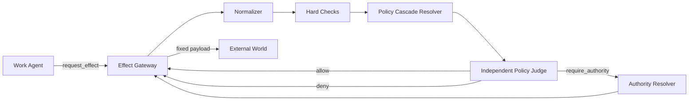

# External Effect Governance設計

## 1. 信頼境界

```text
Sandbox内
  原則自由: file / git local / build / test / local process

Sandbox外
  Policy対象: network / credential / publish / production / money / communication
```

Sandboxには外部Credentialを置かず、direct egressを遮断する。外部アクセスはEffect Gateway Adapter経由に統一する。

## 2. External Effect

```typescript
type ExternalEffectKind =
  | "network.read"
  | "network.write"
  | "repository.push"
  | "repository.create_pr"
  | "repository.merge"
  | "human.communication"
  | "data.export"
  | "production.mutation"
  | "financial.commitment"
  | "credential.use";
```

Network readもSandbox外だが、低リスクScopeはPolicyで事前許可し、Gatewayが高速に通してよい。

## 3. Governance Plane



## 4. Effect Normalization

Agentが申告した文字列をそのままJudgeへ渡さない。

```typescript
type NormalizedEffect = {
  effect_id: string;
  effect_type: string;
  target: {
    provider: string;
    resource_type: string;
    resource_id: string;
  };
  operation: string;
  payload_ref: string;
  payload_digest: string;
  payload_summary: string;
  data_classification: string[];
  estimated_cost?: number;

  requester_task_id: string;
  origin_task_id: string;
  delegation_chain: string[];
  causal_event_ids: string[];

  requester_explanation?: string;
  evidence_refs: string[];
};
```

Gateway Adapterがtarget、digest、diff、costを計算する。Agent explanationは主張として分離する。

## 5. Hard Checks

LLMへ送る前に決定論的に検査する。

- target allow/deny list
- Secret scanner
- payload digest固定
- cost上限
- data classification
- idempotency key
- signed exceptionの有効期限
- 同Effectの重複実行
- origin / delegation provenance

Hard denyはJudgeを呼ばず拒否できる。

## 6. Policy Cascade

```text
Platform Policy
  ↓
Organization Policy
  ↓
Project Policy
  ↓
Repository / Resource Policy
  ↓
Task-specific Policy
  ↓
Signed Temporary Exception
```

Policy文書は自然言語本文と最小メタデータを持つ。下位Policyは上位Policyを暗黙に緩和できない。例外は上位Policyが指定したAuthorityの署名を必要とする。

## 7. Independent Policy Judge

Judgeは作業Agentと別Context・一時API session・別Tool setで動く。このsessionはHarness管理のAgent Runではない。

最終判定は`text.format: json_schema`によるStructured Outputで受け取り、判定を確定するFunction Toolは使用しない。

### 持たないもの

- terminal
- delegate
- request_effect
- Credential
- External network
- Policy編集権限
- Taskの目的達成責任

### 入力

```typescript
type PolicyEvaluationRequest = {
  effect: NormalizedEffect;
  policies: PolicyDocument[];
  hard_check_results: HardCheckResult[];
  prior_decision_refs?: string[];
};
```

作業Agentの会話全文を渡さない。必要情報を次の区画に分ける。

```text
Authoritative facts
Requester claims
Policy texts
Artifacts / diffs
```

### 出力

```typescript
type PolicyDecision =
  | {
      decision: "allow";
      rationale: string;
      applied_policy_ids: string[];
      conditions?: ExecutionCondition[];
    }
  | {
      decision: "deny";
      rationale: string;
      applied_policy_ids: string[];
    }
  | {
      decision: "require_authority";
      rationale: string;
      applied_policy_ids: string[];
      authority_ref: string;
      question: string;
    }
  | {
      decision: "insufficient_information";
      rationale: string;
      required_evidence: string[];
    };
```

Judgeは既存Policyを解釈するだけで、新しい権限を生成しない。

## 8. Authority

AuthorityはPolicyで指定される。作業上の親とは無関係。

```yaml
authorities:
  repository.merge:
    principal: release-manager
  production.mutation:
    principal: service-owner
  data.export.customer:
    principal: data-owner
```

Authorityは人間または外部サービスのprincipalであり、Harness管理Agentにも組み込みAgentにも分類しない。LLMを使う外部adapterを構成する場合も、そのsessionは本Harnessの管理外とし、`submit_authority_decision` ingressだけを持たせる。Effectは常にGatewayが実行する。

## 9. 権限ロンダリング対策

危険な経路:

```text
Parent wants Effect
  → spawns Child
  → Child requests Effect
  → Parent approves Child
```

対策:

1. 親子関係を承認経路にしない
2. `origin_task_id`を保存する
3. delegation chainを保存する
4. 同一Principal / ancestorによる例外承認を禁止する
5. Judgeは作業階層から独立する
6. CredentialをGatewayだけが保持する
7. 評価payloadと実行payloadのdigest一致を強制する

```text
Spawnは計算能力を増やせる
Spawnは権限を増やせない
```

## 10. 実行

Allow後もGatewayが次を再検査する。

- Decisionが未失効
- conditionsが成立
- payload digestが同一
- target identityが同一
- idempotency keyが未実行

実行結果はTask MailboxとAudit Logへ送る。

## 11. Deny後の再要求

Agentはpayloadを修正して新Effectを要求できる。ただし同じorigin・target・目的を持つEffectをlineageで束ねる。

表現だけを変えた反復要求を新規独立要求として扱わない。

## 12. Task cancellationとの関係

Task cancellationはExternal Effectのrollbackではない。

- 未評価Effect: cancel可能
- waiting authority: cancel可能
- executing Effect: Adapter次第
- succeeded Effect: 補償Effectが必要

補償Effectも通常のPolicy評価を通す。

## 13. 監査

各Effectについて次を追跡する。

- requester / origin / delegation chain
- normalized target / payload digest
- hard check結果
- 適用Policy IDs
- Judge decisionと理由
- Authority decision
- 実行Credential principal
- 実際の外部結果
- retry / compensation lineage

## 14. Failure mode

| 障害 | 既定動作 |
|---|---|
| Judge unavailable | fail closed。明示的にpre-approvedなreadだけ通せる |
| Policy conflict | `require_authority`または`insufficient_information` |
| Gateway crash | idempotency keyで再開 |
| Authority timeout | async operation継続、Task Mailboxへprogress |
| payload changed | Decisionを無効化して再評価 |
