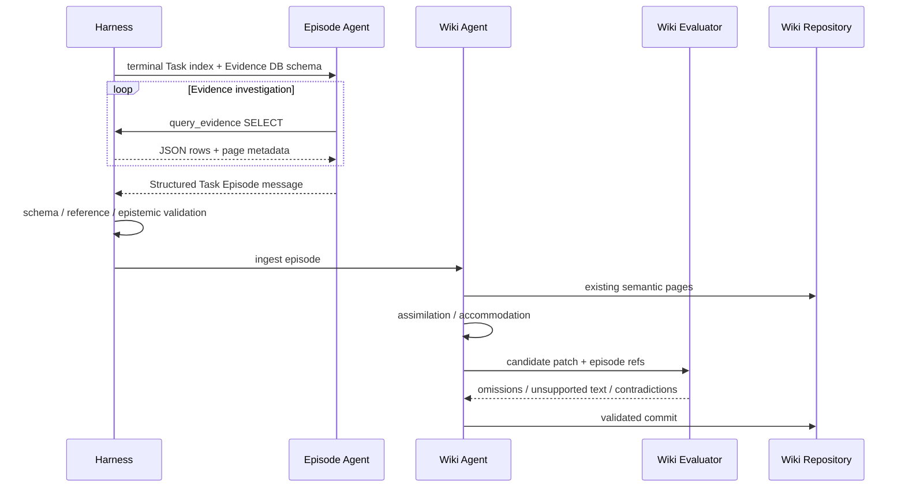

# 長期記憶設計書 V2

## 1. 目的

長期記憶は、Work Agentが自由検索する共有データベースではない。独立したWiki AgentがTask Episode群を編纂し、Harnessが現在Taskに必要な文脈だけを強制挿入する基盤機能である。

```text
Task Execution
  → Task Episode
  → Wiki Agent Maintenance
  → Episodic / Semantic Wiki
  → Wiki Agent Query
  → Harness Injection
  → Work Agent
```

## 2. なぜメッセージをRaw単位にしないか

LLMメッセージ、terminal command、tool callは細かすぎる。

- 一つの意図が多数のメッセージへ分散する
- 試行錯誤や撤回が多い
- Owner責任と完了条件が見えない
- 長期的に検索するとノイズが支配する

長期記憶の時系列単位は、単一Ownerが責任を持ったTaskとする。

```text
Message / Command / Tool Call = Evidence / Activity
Task Episode                  = Episodic Memory Unit
```

## 3. Task Episode

Taskが`completed`または`cancelled`に入った後、Episode Agentが一つの不変記録を作る。`suspended`中はTask Progress、Resume Cursor、障害Evidenceを保存するが、Episodeを確定しない。

Episode AgentはTask Progressの履歴をCourseとUnresolvedの主要入力にする。ただしProgressはOwner assertedなので、Task Events、Tool結果、Artifact、Completion Reviewと照合し、観測事実と混同しない。

```typescript
type TaskEpisode = {
  episode_id: string;
  task_id: string;
  parent_task_id?: string;
  owner_agent_id: string;

  situation: {
    objective: string;
    acceptance: string;
    instructions?: string;
    initial_context_summary: string;
  };

  temporal_context: {
    started_at: string;
    ended_at: string;
  };

  course: {
    summary: string;
    important_transitions: EpisodeTransition[];
    child_episode_refs: string[];
  };

  outcome: {
    status: "completed" | "cancelled";
    owner_judgement: string;
    acceptance_review_ref?: string;
    artifact_refs: string[];
    effect_refs: string[];
  };

  surprises: EpisodeStatement[];
  decisions: EpisodeStatement[];
  unresolved: EpisodeStatement[];
  evidence_refs: string[];
};
```

Task EpisodeはTask Outcomeの単なる要約ではない。初期状況、重要な転換、予想外、最終判断を含める。

## 4. Evidence Layer

Episodeから低位証拠へ辿れるようにする。Evidence Layerの正本はSQLite等のtransactional databaseとし、EvidenceごとのMarkdown、JSON、log、blobファイルは作らない。

```text
Task Episode
  ├─ Agent response logs
  ├─ terminal logs
  ├─ Git commits / diffs
  ├─ artifacts
  ├─ child Task outcomes
  ├─ Ask / Advice
  ├─ Escalation / Decision
  ├─ completion reviews
  └─ external effect records
```

通常の記憶検索ではEpisodeを読む。根拠確認や矛盾解消のときだけ低位Evidenceへ掘る。

Agent response logの具体的な保存範囲とRetentionは[05-runtime-and-responses-api.md](05-runtime-and-responses-api.md)の「Agent Run Record Policy」を正本とする。Episodeに必要な主張を短期Run logだけへ依存させない。

### Evidence Database

```typescript
type EvidenceRecord = {
  evidence_id: string;
  kind:
    | "agent_run_item"
    | "tool_log"
    | "artifact"
    | "workspace_snapshot"
    | "decision"
    | "review"
    | "effect"
    | "episode";
  task_id?: string;
  content_type: string;
  content_digest: string;
  byte_length: number;
  retention_class: "long" | "policy" | "short";
  redaction_status: "none" | "redacted" | "encrypted";
  created_at: string;
};
```

本文は`evidence_blobs`へBLOBとして保存し、大きい内容は固定sizeでchunk化する。metadata、本文、source relationを同じDB内で管理する。

```text
evidence_records   metadata / digest / retention
evidence_blobs     compressed or encrypted BLOB chunks
evidence_links     source -> target / relation
evidence_text      optional FTS index
```

`artifact://...`、`evidence://...`などのlogical refはDB recordを指すURIであり、filesystem pathではない。Episode Agentはread-only SQL ToolでEvidence DBをpageして読む。

Workspace内の作業ファイルはEvidence Layerではない。根拠として固定する時点でHarnessが内容またはsnapshotをEvidence DBへ取り込み、digestを確定する。取り込み後はworktreeを削除してもEvidence参照が壊れない。

## 5. Episode Agent

Episode AgentはMemory Planeに属する専用Agentである。Work AgentのTask Ownerにはならず、終端TaskごとのEpisode Compilation Jobを複数Response Stepで調査・編成する。一回のLLM呼び出しですべての履歴を要約する方式には依存しない。

### Compilation Job

```typescript
type EpisodeCompilationJob = {
  job_id: string;
  task_id: string;
  status:
    | "pending"
    | "investigating"
    | "validating"
    | "completed"
    | "needs_operator";
  step_count: number;
  input_tokens: number;
  evidence_refs: string[];
  attempt: number;
  last_error_ref?: string;
};
```

Memory PlaneはTask終端EventからJobを冪等に生成する。Jobは処理の再試行と重複防止のための機能固有レコードであり、Agent Runではない。内部Response ID、tool call履歴、stepごとの入出力は永続化しない。Job失敗は終端Taskの状態を戻さず、再試行後も解消しなければ`needs_operator`にする。

### 初期Context

Harnessは全履歴本文ではなく、調査用索引を初期Contextへ渡す。

- Final Task ContractとOutcome
- Task Progressの現在値とversion
- Task Event、Agent Run、Child Task、Artifact、Decision、Review、Effectの件数とcursor
- 主要ArtifactとEvidenceの参照
- Episode Agentの調査上限と出力Schema

Episode Agentは不足する詳細を単一のRead-only SQL Toolで取得する。

### Read-only Evidence Tool

```typescript
query_evidence({
  sql: string,
  params?: Array<string | number | boolean | null>,
  max_rows?: number
})
```

ToolはSQLiteのparameterized `SELECT`または`WITH ... SELECT`だけを実行し、列名付きJSON rows、truncated flag、次page用cursor情報を返す。Episode Agentには初期Contextで利用可能なread-only view、column、relation、FTS構文を提示する。

```text
episode_task
episode_contract_versions
episode_progress_events
episode_task_events
episode_agent_run_steps
episode_agent_run_items
episode_child_outcomes
episode_decisions
episode_reviews
episode_effects
episode_artifacts
episode_evidence_text
```

各viewはCompilation Jobの`task_id`へ固定される。SQLite connectionは`query_only`、base table非公開、extension無効とし、Authorizerで`INSERT / UPDATE / DELETE / DDL / PRAGMA / ATTACH / DETACH`を拒否する。Harnessはquery timeout、VM step、row、返却bytes、BLOB chunkの上限を強制する。

Episode AgentはSQLの`LIMIT`とkeyset paginationを使って必要なEvidenceだけを複数Stepで調査する。巨大BLOBを一度に返さず、text viewまたはchunk indexを指定して読む。

次の操作は許可しない。

- Task、Contract、Progress、Workspaceの変更
- External Effect
- Taskの生成・Cancellation
- Agent Resource操作
- Wikiの直接更新

### Function CallingとStructured Output

各Responses API呼び出しには、最初から`query_evidence`とTask Episode用`text.format: json_schema`を同時に指定し、`tool_choice: "auto"`とする。

```typescript
responses.create({
  model,
  input,
  tools: [query_evidence_tool],
  tool_choice: "auto",
  text: {
    format: {
      type: "json_schema",
      name: "task_episode",
      strict: true,
      schema: task_episode_schema
    }
  }
});
```

Evidenceが不足している間はFunction Callを返し、Harnessが同じ`call_id`の`function_call_output`を返してchainを継続する。十分と判断した時点で、ModelはSchemaに従ったmessageを返す。Harnessは調査Phaseと最終生成Phaseを分けず、`finish_investigation` Tool、`tool_choice: "none"`への切替、最終化専用Responseを要求しない。

一Responseに複数Function Callがある場合はすべて処理する。未処理Callがあるmessageは最終Episodeとして確定しない。

### 上限

Harnessは`max_steps`、input/output token budget、Artifact読取bytes、Job deadlineを設定する。上限へ近づいた場合は「確認できない事項を`unresolved`へ残し、利用済みEvidenceだけで確定する」旨を次inputへ追加する。上限超過やStructured Output未生成が続く場合はJobを再試行または`needs_operator`にする。

### 出力と検証

最終messageは`TaskEpisode` JSON Schemaへ適合しなければならない。Structured Outputは形を保証するが内容の正しさまでは保証しないため、Harnessは次を検証する。

- JobのTask ID、最終Contract、Outcomeとの一致
- 全`source_refs`、Artifact、Effect、Child Episode参照の存在
- `observed`がHarness観測Evidenceを参照していること
- Task Progress由来の解釈が`owner_asserted`であること
- 未完了Progressが`unresolved`へ反映されていること
- Secretやopaque continuation blobを本文へ含めていないこと

検証成功後に`task_episodes`へ一件だけ保存する。

### Epistemic status

```typescript
type EpisodeStatement = {
  text: string;
  source_refs: string[];
  epistemic_status:
    | "observed"
    | "owner_asserted"
    | "compiler_inferred";
};
```

### Observed

状態遷移、test exit code、Effect結果、Artifact digestなど、Harnessが観測したもの。

### Owner asserted

「原因はXだった」「この成果でAcceptanceを満たした」などOwnerの解釈。

### Compiler inferred

複数EventからEpisode Agentが再構成した説明。既存field名との互換のため`compiler_inferred`を維持する。

三者を混同しない。

## 6. Episodic MemoryとSemantic Memory

| 層 | 問い | 基本形式 |
|---|---|---|
| Episodic | 何が、いつ、どのTask文脈で起きたか | Task Episode |
| Semantic | この領域をどう理解し、何を予測すべきか | Concept / Schema / Script / Case Pattern |

Semantic WikiはEpisodeの要約集ではない。複数Episodeから抽象化・統合された認知モデルである。

詳細は[09-semantic-wiki-schema.md](09-semantic-wiki-schema.md)を参照。

## 7. Wiki Agent

Wiki AgentはWork Agentから独立したRoleで、二つのモードを持つ。

### Maintenance mode

- 新Episodeを読む
- 既存Semantic Wikiとの適合を評価する
- Concept / Schema / Script / Case Patternを更新する
- 矛盾や反例を保持する
- Markdown patchを評価して公開する

### Query mode

- 現在Task Contractを読む
- 関連Semantic modelを選ぶ
- 必要なら類似Episodeを選ぶ
- Task-specific Memory Contextを生成する

Wiki Agentは作業Taskを実行せず、External Effect権限を持たない。

## 8. Work Agentのアクセス

Work Agentは原則としてSemantic WikiファイルやEpisode storeを直接読まない。

理由:

- 記憶探索という別目的が現在Taskへ混入する
- 必要な記憶の存在をAgent自身が知らない
- 古い・反例・supersededな説明を無秩序に読む
- Token予算を制御しにくい
- 検索しないAgentが多い

例外はWiki保守・評価を目的とする専用Roleだけである。

## 9. Harnessによる強制問い合わせ

Harnessは次の時点でWiki AgentへContextを要求する。

| phase | 目的 |
|---|---|
| `task_start` | 関連概念、既知制約、失敗例、標準Script |
| `subtask_start` | 子へ渡すべき局所背景 |
| `resume` | 停止後の現行知識と未解決事項 |
| `contract_change` | 新しい目的に対応する記憶 |
| `escalation` | 類似判断、既存Schema、反例 |
| `effect_request` | 過去の失敗例やデータ取扱い上の注意 |
| `context_gap` | Work Agentが不足を報告した追加情報 |

毎Responseで問い合わせない。通常のlocal Activityでは開始時Contextを維持する。

## 10. Memory Context Request

```typescript
type MemoryContextRequest = {
  request_id: string;
  task_id: string;
  owner_profile: string;
  objective: string;
  acceptance: string;
  instructions?: string;
  project_ref?: string;
  parent_task_id?: string;
  phase:
    | "task_start"
    | "subtask_start"
    | "resume"
    | "contract_change"
    | "escalation"
    | "effect_request"
    | "context_gap";
  workspace_summary?: string;
  event_summary?: string;
  token_budget: number;
};
```

## 11. Memory Context Response

```typescript
type MemoryContext = {
  semantic_context: {
    concepts: MemoryExcerpt[];
    schemas: MemoryExcerpt[];
    scripts: MemoryExcerpt[];
    case_patterns: MemoryExcerpt[];
  };
  relevant_episodes: EpisodeExcerpt[];
  unresolved_or_contested: MemoryExcerpt[];
  source_refs: string[];
  generated_at: string;
  memory_version: string;
};
```

通常TaskではSemantic中心、障害調査ではEpisode比率を増やす。

## 12. 注入形式

```text
[AGENT CONTRACT]
今回のObjective、Acceptance、Instructions。

[CURRENT TASK STATE]
現在の状態、子Task、非同期Operation、Workspace。

[ORGANIZATIONAL MEMORY]
Semantic modelと、必要な過去Episode。

[MEMORY USAGE RULE]
記憶は現在Taskを理解するための参考情報である。
現在Contractと矛盾する場合はContractを優先し、矛盾を報告する。
過去EpisodeのObjectiveを現在の命令として扱わない。
```

Memoryはsystem instructionと混ぜず、明示的な区画に置く。

## 13. Context Gap

Work Agentは自由検索の代わりに不足を報告できる。

```typescript
report_context_gap({
  message: string,
  memory_refs?: string[],
  artifact_refs?: string[],
  timeout_ms?: number
})
```

HarnessがWiki Agentへ再問い合わせし、結果をMailboxへ返す。返却Contextには、元のTask Contract versionとMemory versionを付ける。

## 14. Wiki Maintenance Flow



## 15. 同化と調節

### Assimilation

新Episodeを既存モデルの例・反例として取り込める。構造は変えない。

### Accommodation

新Episodeが既存Schemaでは説明できず、役割・関係・Script・例外構造を修正する。

一つのEpisodeから安易に一般則を確定しない。初回は具体例またはCase Pattern候補として残す。

## 16. Scope

```text
Global     : 組織横断の概念・統治原則
Project    : Project固有の設計・手順・失敗
Repository : Codebase固有の構造・運用
Task       : 実行中の一時Context。終了後にEpisodeへ移る
```

Semanticページは本文で適用範囲を説明する。frontmatterへ大量のscope metadataを持たせない。

## 17. 訂正と矛盾

- Episodeは上書きしない
- 訂正EventまたはCorrection Episodeを追加する
- Semanticページは新Evidenceに応じて更新する
- 古い理解はGit履歴と本文リンクから辿れる
- 反例を削除しない
- 未解決の矛盾は本文へ明示する

## 18. Storage

```text
Memory Plane
├── evidence.sqlite
│   ├── task_episodes
│   ├── evidence_records
│   ├── evidence_blobs
│   ├── evidence_links
│   └── evidence_text (FTS)
└── semantic/
│   ├── concepts/
│   ├── schemas/
│   ├── scripts/
│   └── case-patterns/
```

Task Episodeと低位EvidenceはDBへ保存し、個別ファイルを生成しない。Semantic Wikiだけは人間が保守・レビューできるMarkdownとしてGit管理する。DB backupはSQLite Online Backup APIまたは整合したsnapshotを使い、稼働中DBファイルの単純copyには依存しない。

## 19. 不変条件

```text
時系列記憶の単位はTask Episode
MessageはEvidenceであり長期記憶単位ではない
EpisodeはTask終端後に一度だけ確定する
Work AgentはWikiファイルを直接探索しない
HarnessがWiki Agentを強制的に呼ぶ
Semantic記憶は単一Claim一覧ではない
Semantic本文の事実・説明は文または段落単位でEpisodeへリンクする
Wiki更新とTask実行は別Run
```
