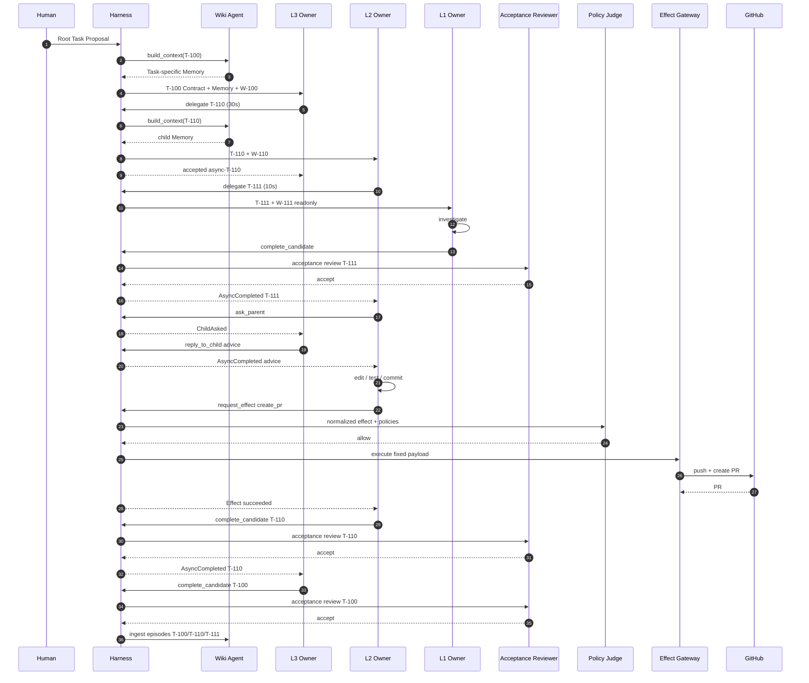

# Running Example: 認証バグ修正Root Task

## 1. シナリオ

人間が次を依頼する。

> refresh後も古いaccess tokenが再利用される問題を修正し、テストを通し、GitHubにPRを作成する。

Root Task Acceptance:

- 問題を再現するテストがある
- 修正後に再現テストが成功する
- 既存テストが成功する
- 公開API互換性を維持する
- PRが作成されている

## 2. 実体

```text
Agent A-10 (L3) owns Task T-100, Workspace W-100
  └─ delegates Task T-110

Agent A-20 (L2) owns Task T-110, Workspace W-110 (fork of W-100)
  └─ delegates Task T-111

Agent A-30 (L1) owns Task T-111, Workspace W-111 (readonly view of W-110)
```

一つのAgentが複数Taskを同時に持たない。

## 3. Root Task作成

```yaml
objective: >
  refresh後も古いaccess tokenが使われる問題を修正し、PRを作成する
acceptance: |
  - 再現テストが追加されている
  - 修正後に再現テストが成功する
  - 既存テストが成功する
  - 公開API互換性を維持する
  - PRが作成されている
owner_profile: L3
workspace_source: github://example/auth-service@main
```

HarnessはA-10、T-100、W-100を確定し、Wiki Agentへ`task_start` Queryを送る。

注入Memory:

```text
Applicable schema:
- External Effectは独立Policy Judgeが評価する。

Case warning:
- 親Agentが子のEffectを承認すると権限ロンダリング経路になる。

Known project preference:
- 認証修正では公開API互換性を優先する。
```

## 4. L3がL2へ委譲

```json
delegate({
  "objective": "認証バグを再現し、修正してPR作成可能な状態にする",
  "acceptance": "再現テストと修正を追加し、全テストを成功させ、PRを作成する",
  "owner_profile": "L2",
  "workspace_mode": "fork",
  "dependency": "required",
  "artifact_refs": null,
  "timeout_ms": 30000,
  "idempotency_key": "T-100-delegate-auth-fix"
})
```

HarnessはT-110/A-20/W-110を生成する。30秒以内に終わらないためL3へ返す。

```json
{
  "status": "accepted",
  "async_id": "async-T-110",
  "operation": "delegate"
}
```

T-100は`running`のまま。A-10は同じTask内で関連仕様を確認できる。

## 5. L2がL1へ原因調査を委譲

```json
delegate({
  "objective": "古いaccess tokenが再利用される実行経路を特定する",
  "acceptance": "再現手順、原因箇所、根拠となるコード参照を提示する",
  "owner_profile": "L1",
  "workspace_mode": "shared_readonly",
  "dependency": "required",
  "artifact_refs": null,
  "timeout_ms": 10000,
  "idempotency_key": "T-110-delegate-root-cause"
})
```

L1はW-111で次をActivityとして実行する。

```bash
rg "refreshToken" src test
npm test -- auth-refresh
git log -p -- src/auth/token.ts
```

## 6. L1の完了候補

L1は調査報告を作り、Completion Candidateを提出する。

```json
complete_candidate({
  "owner_judgement": "再現手順と原因箇所を特定し、コード参照を添付した",
  "outcome_ref": "artifact://T-111/root-cause.md",
  "artifact_refs": [
    "artifact://T-111/root-cause.md",
    "artifact://T-111/reproduction.log"
  ],
  "evidence_refs": ["workspace://W-111/src/auth/session.ts#L88-L104"],
  "contract_version": 1,
  "timeout_ms": 5000,
  "idempotency_key": "T-111-completion-v1"
})
```

軽量ReviewerがAcceptanceとの整合を確認し、5秒以内にacceptする。

```json
{
  "status": "completed",
  "value": {
    "task_status": "completed",
    "review_id": "review-T-111-v1"
  }
}
```

HarnessはT-111を`completed`へ遷移し、`AsyncCompleted(async-T-111)`をT-110 Mailboxへ送る。

## 7. L2が親へAsk

L2は二案を見つける。

- A: refresh APIの戻り値を変更する
- B: 呼び出し側で新Tokenを取得する

Aは公開API変更になる。L2は判断責任を保持したまま助言を求める。

```json
ask_parent({
  "message": "案AはAPI変更、案Bは局所修正だが重複取得がある。互換性と性能の優先順位を確認したい",
  "artifact_refs": ["artifact://T-110/options.md"],
  "timeout_ms": 10000,
  "idempotency_key": "T-110-ask-fix-option"
})
```

期限を超えたためL2へ`async_id`が返る。Ask eventはT-100 Mailboxへ届く。

L3は`reply_to_child`を呼ぶ。

```json
reply_to_child({
  "request_id": "ask-T-110-1",
  "response_kind": "advice",
  "message": "公開API互換性を優先し、案Bを採用する。性能問題は別Task候補として残す",
  "contract_patch": null,
  "terminate": false,
  "timeout_ms": 5000,
  "idempotency_key": "reply-ask-T-110-1"
})
```

回答がL2 Mailboxへ届き、L2は案Bを選ぶ。

## 8. Sandbox内の実装

L2は自由に作業する。

```bash
git checkout -b fix/stale-access-token
$EDITOR src/auth/session.ts
$EDITOR test/auth/session.test.ts
npm test
git add .
git commit -m "Fix stale access token reuse after refresh"
```

結果:

```text
reproduction test: PASS
existing tests: 428 PASS
lint: PASS
```

Policy Judgeは関与しない。

## 9. PR作成Effect

L2がExternal Effectを要求する。

```json
request_effect({
  "effect_type": "repository.create_pr",
  "target": "github://example/auth-service",
  "payload_ref": "artifact://T-110/pr-request.json",
  "explanation": "Task Acceptanceを満たした修正をレビューへ提出する",
  "timeout_ms": 30000,
  "idempotency_key": "T-110-create-pr-v1"
})
```

Gatewayはpayloadを固定し、次を計算する。

```json
{
  "effect_id": "effect-482",
  "effect_type": "repository.create_pr",
  "target": {
    "provider": "github",
    "resource_type": "repository",
    "resource_id": "example/auth-service"
  },
  "payload_digest": "sha256:8a7...",
  "payload_summary": "3 files changed, 42 insertions, 8 deletions",
  "requester_task_id": "T-110",
  "origin_task_id": "T-100",
  "delegation_chain": ["T-100", "T-110"]
}
```

JudgeはPolicy Cascadeを読み、allowする。GatewayがCredentialを取得し、固定payloadでPR #482を作る。

```json
{
  "status": "completed",
  "value": {
    "outcome": "succeeded",
    "result_ref": "github://example/auth-service/pull/482"
  }
}
```

## 10. L2のCompletion Review

L2がCompletion Candidateを提出する。Reviewerはコードレビューをせず、以下だけを確認する。

- 再現テスト参照がある
- test resultが成功
- PR refがある
- required child T-111が終端
- 現行Contract versionと一致

Reviewがacceptし、T-110がcompletedになる。`AsyncCompleted(async-T-110)`がT-100 Mailboxへ届く。

## 11. Root Ownerの統合と完了

L3は子の完了をRoot完了と同一視しない。T-100 Acceptanceを確認し、自分のCompletion Candidateを出す。

```json
complete_candidate({
  "owner_judgement": "Root Acceptanceをすべて満たし、レビュー可能なPRが作成された",
  "outcome_ref": "github://example/auth-service/pull/482",
  "artifact_refs": ["github://example/auth-service/pull/482"],
  "evidence_refs": ["artifact://T-110/test-result.txt"],
  "contract_version": 1,
  "timeout_ms": 10000,
  "idempotency_key": "T-100-completion-v1"
})
```

Root Reviewerがacceptし、T-100がcompletedになる。T-100、T-110、T-111それぞれにTask Episodeが生成される。

## 12. 全体シーケンス



## 13. キャンセル分岐

調査中にL2が「L1調査は不要」と判断した場合、直接子T-111をcancelできる。

```json
cancel_child_task({
  "child_task_id": "T-111",
  "reason": "親Task内で原因を確定できたため重複調査を停止する",
  "cancellation_policy": "cascade",
  "timeout_ms": 5000,
  "idempotency_key": "T-110-cancel-T-111"
})
```

L1はlocal processを停止し、Workspace snapshotを作ってackする。期限を超えた場合は`async_id`が返り、最終`ChildTaskCancelled`がMailboxへ届く。

L3は孫T-111を直接cancelしない。必要なら直接子T-110へ方針を伝えるか、T-110自体をcancelする。

## 14. 最終Episode

- E-111: 原因調査という具体的経験
- E-110: 実装・Ask・Effect・Reviewを含む実行経験
- E-100: Root目的の統合と最終完了経験

Semantic Wikiは三件をそのまま要約せず、既存Concept、Task Ownership Schema、Task Completion Script、関連Case Patternへ同化・調節する。
