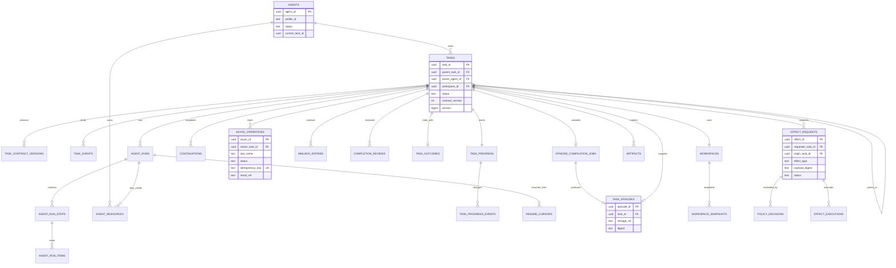

# 永続化・データモデル設計

## 1. 集約境界

```text
Task Aggregate
  task
  task_contract_versions
  task_progress
  task_progress_events
  task_events
  task_outcome
  completion_reviews

Execution Aggregate
  agent_runs
  agent_run_steps
  agent_run_items
  agent_resources
  resume_cursors
  continuations
  async_operations
  mailbox_entries

Workspace Aggregate
  workspaces
  workspace_snapshots
  artifacts

Governance Aggregate
  effect_requests
  effect_decisions
  effect_executions
  policy_documents
  authority_requests

Memory Aggregate
  episode_compilation_jobs
  task_episodes
  memory_context_requests
  wiki_commits
```

Task状態とTask Eventは同一Transactionで更新する。他AggregateとはOutbox/Eventで連携する。

## 2. 主要テーブル

### `agents`

| 列 | 型 | 説明 |
|---|---|---|
| `agent_id` | uuid PK | 論理Agent |
| `profile_id` | text | L1/L2/L3等のProfile |
| `status` | text | idle / assigned / retired |
| `current_task_id` | uuid nullable | 現在Task |
| `created_at` | timestamptz | 生成時刻 |

### `tasks`

| 列 | 型 | 説明 |
|---|---|---|
| `task_id` | uuid PK | Task ID |
| `parent_task_id` | uuid FK nullable | 直接親 |
| `owner_agent_id` | uuid FK | Owner |
| `workspace_id` | uuid FK unique | 論理Workspace |
| `objective` | text | 現行Objective |
| `acceptance` | text | 現行Acceptance |
| `instructions` | text nullable | 補助指示 |
| `contract_version` | int | 楽観ロック対象 |
| `status` | text | Lifecycle state |
| `dependency` | text | required / optional |
| `version` | bigint | state更新用 |
| `created_at` | timestamptz | |
| `started_at` | timestamptz nullable | |
| `ended_at` | timestamptz nullable | |

### `task_contract_versions`

Contract変更の履歴を保存する。過去のCompletion CandidateがどのContractを基準にしたか追跡できる。

### `task_progress` / `task_progress_events`

現在のTodo形式Progressとappend-onlyな更新履歴を保存する。`task_progress`は`task_id`、`version`、`current_focus_id`、Task EventとAgent Run Eventのwatermark、`updated_at`を持ち、itemは子tableまたはJSONとして保持できる。更新はOwner Agentの認識であり、Acceptance達成の正本ではない。

### `task_events`

append-only。`event_id`、`task_id`、`sequence_no`、`event_type`、`payload_ref`、`actor_ref`を持つ。

### `agent_runs`

一Taskの実行セッション。`previous_response_id`は補助列で、復元の必須条件にしない。`normal_step_count`と`last_progress_refresh_step`を持ち、Maintenance Responseを除いたStep周期でProgress Refreshを起動する。

### `agent_run_steps` / `agent_run_items`

Responses API呼び出し単位のStep metadataと、完成したoutput itemの正規化記録を保存する。同じOwner Assignment内で単調増加する`assignment_event_sequence`を持ち、Runをまたぐ再開Contextの選択に使う。request本文やStreaming deltaを無条件には保存せず、Context version／参照／digestと完成itemを基本とする。保存対象、Retention、Reasoning、Compaction item、Redactionの正本は[04-runtime-and-responses-api.md](04-runtime-and-responses-api.md)の「Agent Run Record Policy」とする。

### `agent_resources`

| 列 | 説明 |
|---|---|
| `resource_id` | Agent Resource ID |
| `agent_id` | Resourceを所有する論理Agent |
| `assignment_id` | assignment scopeのOwner割当ID、nullable |
| `run_id` | run scopeの場合のAgent Run、nullable |
| `kind` | process / server / worktree / temporary_directory |
| `resource_ref` | Process ManagerやWorkspace Manager上の参照 |
| `lifetime` | run / assignment / agent |
| `cleanup_policy` | stop / delete / retain |
| `status` | active / cleanup_pending / cleaning / released / needs_operator |
| `retry_count` | Cleanup試行回数 |
| `last_error_ref` | 最終Cleanupエラー、nullable |

AgentまたはTool実行基盤がResourceを登録し、HarnessがCleanup開始、再試行、Operator移管を管理する。Task終端後もCleanup状態は独立して進み、Task状態を変更しない。

### `resume_cursors`

Run切替境界ごとの最小再開位置を保存する。`cursor_id`、`task_id`、`agent_id`、`source_run_id`、`contract_version`、`task_version`、`progress_version`、Workspace参照、Task Event・Agent Run Event・Mailboxのwatermark、`created_at`を持つ。

Cursorは意味的要約を持たない。Task、Contract、Progress、Mailbox、Async Operation、Artifact、Workspaceの正本を置き換えない。新Runが参照したCursor IDを`agent_runs`へ記録し、再開元を監査可能にする。

### `continuations`

待機理由、awaited event、contract version、workspace snapshot、context snapshotを保持する。

### `async_operations`

| 列 | 説明 |
|---|---|
| `async_id` | Harness Operation ID |
| `owner_task_id` | 結果を受け取るTask |
| `tool_call_id` | 元Responses Function call |
| `tool_name` | delegate等 |
| `status` | running / completed / failed / cancelled |
| `sync_deadline` | 直接待機の期限 |
| `result_ref` | 最終結果 |
| `idempotency_key` | 重複防止 |

### `mailbox_entries`

Taskごとのイベントキュー。at-least-once deliveryを前提とし、`event_id` unique、`consumed_at` nullable、`sequence_no`を持つ。

### `completion_reviews`

Completion Candidate versionごとのReviewer判断。Task Ownerとは別Runであることを制約・監査する。

### `workspaces`

Taskと1:1。source workspace、mode、storage ref、statusを持つ。

### `artifacts`

immutable content digestとlogical refを持つ。Task Outcome、Effect payload、Episodeから参照される。

### `effect_requests`

normalized payload、origin、delegation chain、statusを持つ。

### `policy_decisions`

Judge decision、applied policy IDs、rationale、decision input digestを保存する。

### `task_episodes`

Task終端後に一件。Episode内容のstorage refとdigestを持つ。

### `episode_compilation_jobs`

終端TaskごとのEpisode Agent調査Jobを保存する。status、Episode Agent Run、step/token使用量、Evidence参照、attempt、errorを持つ。`task_id`で冪等化し、Job失敗や`needs_operator`はTask状態へ影響させない。

## 3. 詳細ER図



## 4. SQL制約例

```sql
CREATE UNIQUE INDEX one_active_task_per_owner
ON tasks(owner_agent_id)
WHERE status NOT IN ('completed', 'cancelled');

CREATE UNIQUE INDEX one_workspace_per_task
ON workspaces(task_id);

CREATE UNIQUE INDEX one_outcome_per_task
ON task_outcomes(task_id);

CREATE UNIQUE INDEX one_episode_per_task
ON task_episodes(task_id);

CREATE UNIQUE INDEX async_idempotency
ON async_operations(owner_task_id, tool_name, idempotency_key)
WHERE idempotency_key IS NOT NULL;

CREATE UNIQUE INDEX mailbox_event_dedup
ON mailbox_entries(event_id);
```

循環Task graphはDB triggerまたはTask Managerで検査する。

## 5. Transaction境界

### Task state transition

```text
BEGIN
  SELECT task FOR UPDATE
  validate transition and version
  UPDATE task
  INSERT task_event
  INSERT outbox_event
COMMIT
```

### Mailbox consume

```text
BEGIN
  SELECT unconsumed mailbox entries FOR UPDATE SKIP LOCKED
  update task / continuation if condition resolves
  mark entries consumed
  insert task events
COMMIT
```

### Effect execution

Policy Decision commitと実行を同一Transactionにできない。Outbox + idempotency keyでexactly-once effectに近づける。

## 6. 状態の正本

| 対象 | 正本 |
|---|---|
| Task lifecycle | `tasks` + `task_events` |
| Workspace content | Workspace storage + snapshots |
| LLM short continuation | Response ID補助、独自Continuationが正本 |
| Async result | `async_operations` + `mailbox_entries` |
| External effect | Gateway execution ledger |
| Episodic memory | immutable Task Episode |
| Semantic memory | Git管理Markdown |

## 7. Retention

- Task Events / Outcomes / Effect Audit: 長期保持
- Agent response logs: retention policyに従う
- terminal logs: Artifact化された重要部分以外は短期化可能
- Workspace: Task終端後にsnapshotし、実体はpolicyで削除
- Task Episode:長期保持
- Semantic Wiki: Git履歴付きで長期保持

PIIやSecretを含むEvidenceは分類し、EpisodeやSemantic本文へ直接複製しない。

## 8. Versioning

- `task.contract_version`: Objective / Acceptance / Instructions変更
- `task.version`: すべての状態更新
- `memory_version`: Query時のWiki commit
- `candidate_version`: Completion Candidateの連番
- `policy_bundle_digest`: Judgeが読んだPolicy集合
- `payload_digest`: 評価・実行したEffect payload

これらをEventへ記録して再現性を確保する。
