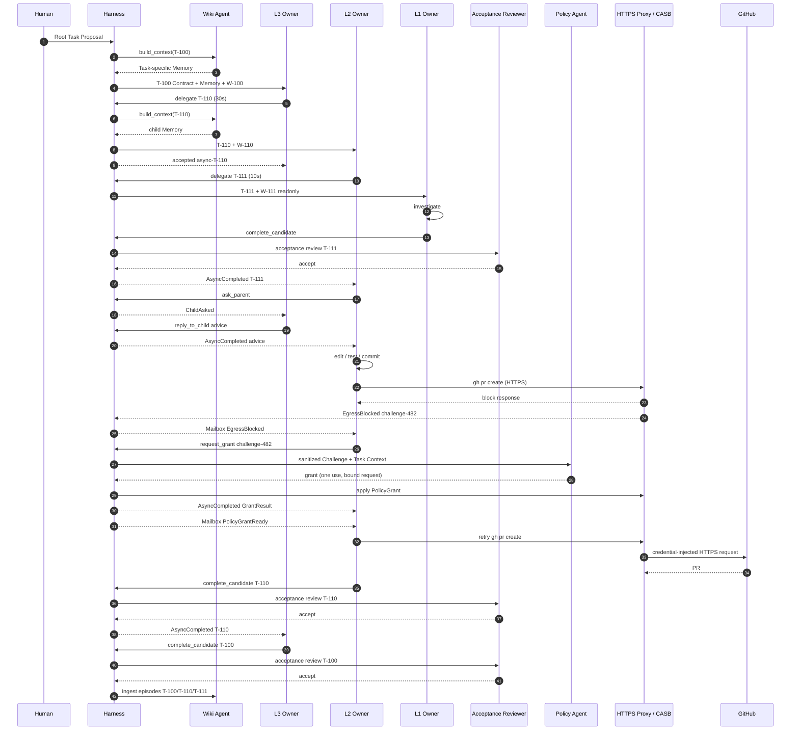

# 実行例: 認証バグ修正ルートTask

## 1. シナリオ

人間が次を依頼する。

> 更新後も古いアクセス トークンが再利用される問題を修正し、テストを通し、GitHubにPRを作成する。

ルートTask 受け入れ条件:

- 問題を再現するテストがある
- 修正後に再現テストが成功する
- 既存テストが成功する
- 公開API互換性を維持する
- PRが作成されている

## 2. 実体

```text
Agent A-10 (L3) owns Task T-100, Workspace W-100
  └─ delegates Task T-110

Agent A-20 (L2) owns Task T-110, Workspace W-110 (fork of W-100)
  └─ delegates Task T-111

Agent A-30 (L1) owns Task T-111, Workspace W-111 (readonly view of W-110)
```

1つのAgentが複数Taskを同時に持たない。

## 3. ルートTask作成

```yaml
objective: >
  refresh後も古いaccess tokenが使われる問題を修正し、PRを作成する
acceptance: |
  - 再現テストが追加されている
  - 修正後に再現テストが成功する
  - 既存テストが成功する
  - 公開API互換性を維持する
  - PRが作成されている
owner_profile: L3
workspace_source: github://example/auth-service@main
```

ハーネスはA-10、T-100、W-100を確定し、Wiki Agentへ`task_start` クエリを送る。

注入する記憶を示す。

```text
Applicable schema:
- 外向き通信はWorkspaceに束縛したversioned CASB Ruleで制御し、block後のRule更新を独立Policy Agentが評価する。通過通信はEgress Audit Agentの事後Review対象になる。

Case warning:
- 親Agentが子TaskのEgress Grantを承認すると権限ロンダリング経路になる。

Known project preference:
- 認証修正では公開API互換性を優先する。
```

## 4. L3がL2へ委譲

```json
delegate({
  "objective": "認証バグを再現し、修正してPR作成可能な状態にする",
  "acceptance": "再現テストと修正を追加し、全テストを成功させ、PRを作成する",
  "owner_profile": "L2",
  "workspace_mode": "fork",
  "dependency": "required",
  "artifact_refs": null,
  "timeout_ms": 30000
})
```

ハーネスはT-110/A-20/W-110を生成する。30秒以内に終わらないためL3へ返す。

```json
{
  "status": "accepted",
  "async_id": "async-T-110",
  "operation": "delegate"
}
```

T-100は`running`のまま。A-10は同じTask内で関連仕様を確認できる。

## 5. L2がL1へ原因調査を委譲

```json
delegate({
  "objective": "古いaccess tokenが再利用される実行経路を特定する",
  "acceptance": "再現手順、原因箇所、根拠となるコード参照を提示する",
  "owner_profile": "L1",
  "workspace_mode": "shared_readonly",
  "dependency": "required",
  "artifact_refs": null,
  "timeout_ms": 10000
})
```

L1はW-111で次を作業として実行する。

```bash
rg "refreshToken" src test
npm test -- auth-refresh
git log -p -- src/auth/token.ts
```

## 6. L1の完了候補

L1は調査報告を作り、完了案を提出する。

```json
complete_candidate({
  "owner_judgement": "再現手順と原因箇所を特定し、コード参照を添付した",
  "outcome_ref": "artifact://T-111/root-cause.md",
  "artifact_refs": [
    "artifact://T-111/root-cause.md",
    "artifact://T-111/reproduction.log"
  ],
  "evidence_refs": ["workspace://W-111/src/auth/session.ts#L88-L104"],
  "contract_version": 1,
  "timeout_ms": 5000
})
```

軽量レビュアーが受け入れ条件との整合を確認し、5秒以内に受理する。

```json
{
  "status": "completed",
  "value": {
    "task_status": "completed",
    "review_id": "review-T-111-v1"
  }
}
```

ハーネスはT-111を`completed`へ遷移し、`AsyncCompleted(async-T-111)`をT-110 メールボックスへ送る。

## 7. L2が親へ質問

L2は二案を見つける。

- A: 更新 APIの戻り値を変更する
- B: 呼び出し側で新トークンを取得する

Aは公開API変更になる。L2は判断責任を保持したまま助言を求める。

```json
ask_parent({
  "message": "案AはAPI変更、案Bは局所修正だが重複取得がある。互換性と性能の優先順位を確認したい",
  "artifact_refs": ["artifact://T-110/options.md"],
  "timeout_ms": 10000
})
```

期限を超えたためL2へ`async_id`が返る。質問 イベントはT-100 メールボックスへ届く。

L3は`reply_to_child`を呼ぶ。

```json
reply_to_child({
  "request_id": "ask-T-110-1",
  "response_kind": "advice",
  "message": "公開API互換性を優先し、案Bを採用する。性能問題は別Task候補として残す",
  "contract_patch": null,
  "terminate": false,
  "timeout_ms": 5000
})
```

回答がL2 メールボックスへ届き、L2は案Bを選ぶ。

## 8. サンドボックス内の実装

L2は自由に作業する。

```bash
git checkout -b fix/stale-access-token
$EDITOR src/auth/session.ts
$EDITOR test/auth/session.test.ts
npm test
git add .
git commit -m "Fix stale access token reuse after refresh"
```

結果を示す。

```text
reproduction test: PASS
existing tests: 428 PASS
lint: PASS
```

ポリシーAgentは関与しない。

## 9. CASB 拒否、許可、PR作成

L2はサンドボックス内で通常のCLIを実行する。

```bash
git push origin HEAD
gh pr create --base main --title "Fix session refresh handling" --body-file pr.md
```

`git push`と`gh pr create`は別の通信系列であり、許可を共有しない。まずGit HTTPS通信が`challenge-481`として拒否され、同じ`request_grant → PolicyGrantReady → command再実行`を経てリモート ブランチを作る。以下では続くPR作成側の`challenge-482`を示す。1つのCLI コマンドが複数の正規 リクエストを送る場合も、未許可リクエストごとに同じワークフローを繰り返す。

HTTPS プロキシは`api.github.com`へのPOSTを基本ポリシーで拒否し、外部へ転送する前に許可確認とメールボックス イベントを保存する。

```json
{
  "event_id": "mailbox-event-482",
  "event_type": "EgressBlocked",
  "workspace_id": "W-110",
  "task_id": "T-110",
  "challenge_id": "challenge-482",
  "protocol": "https",
  "destination_ref": "egress-destination://challenge-482",
  "request_summary_ref": "egress-summary://challenge-482",
  "reason_codes": ["task_grant_required"],
  "grant_eligible": true,
  "challenge_expires_at": "2026-07-11T12:05:00Z"
}
```

ハーネスはメールボックスをAgent コンテキストへ入れる際、これらの参照から無害化済み 要約として`api.github.com:443`、`POST /graphql`、本文 ダイジェストを併記する。

L2はメールボックス通知を受けて許可を申請する。

```json
request_grant({
  "challenge_id": "challenge-482",
  "justification": "Task Acceptanceを満たした修正をレビューへ提出する",
  "evidence_refs": ["artifact://T-110/test-result.txt"],
  "timeout_ms": 30000
})
```

ポリシーAgentが`grant`を返すと、CASB ポリシー マネージャーが許可確認から同一Workspace・同一リクエスト ダイジェストに1回だけ使える完全一致 HTTPS ルールを生成・反映し、`PolicyGrantReady`をメールボックスへ送る。L2は`gh pr create`を再実行する。認証情報 ブローカーがGitHub 認証情報を外側リクエストへ注入し、PR #482が作成される。最初に拒否したリクエストをゲートウェイが自動再生することはない。

## 10. L2の完了レビュー

L2が完了案を提出する。レビュアーはコードレビューをせず、以下だけを確認する。

- 再現テスト参照がある
- テスト 結果が成功
- PR 参照がある
- 必須 子 T-111が終端
- 現行契約バージョンと一致

レビューが受理し、T-110が`completed`になる。`AsyncCompleted(async-T-110)`がT-100 メールボックスへ届く。

## 11. ルート オーナーの統合と完了

L3は子の完了をルート完了と同一視しない。T-100 受け入れ条件を確認し、自分の完了案を出す。

```json
complete_candidate({
  "owner_judgement": "Root Acceptanceをすべて満たし、レビュー可能なPRが作成された",
  "outcome_ref": "github://example/auth-service/pull/482",
  "artifact_refs": ["github://example/auth-service/pull/482"],
  "evidence_refs": ["artifact://T-110/test-result.txt"],
  "contract_version": 1,
  "timeout_ms": 10000
})
```

ルート レビュアーが受理し、T-100が`completed`になる。T-100、T-110、T-111それぞれにTaskエピソードが生成される。

## 12. 全体シーケンス



## 13. キャンセル分岐

調査中にL2が「L1調査は不要」と判断した場合、直接子T-111をキャンセルできる。

```json
cancel_child_task({
  "child_task_id": "T-111",
  "reason": "親Task内で原因を確定できたため重複調査を停止する",
  "cancellation_policy": "cascade",
  "timeout_ms": 5000
})
```

ハーネスはT-111を直ちに`cancelled`へ確定し、`ChildTaskCancelled`を親メールボックスへ送る。その後、A-30の割り当て リソースとして登録されたローカル プロセス停止とワークツリー削除を非同期クリーンアップする。クリーンアップ失敗はT-111の状態を戻さず、リソース側で再試行または運用者対応にする。

L3は孫T-111を直接キャンセルしない。必要なら直接子T-110へ方針を伝えるか、T-110自体をキャンセルする。

## 14. 最終エピソード

- E-111: 原因調査という具体的経験
- E-110: 実装・質問・外向き通信 許可・レビューを含む実行経験
- E-100: ルート目的の統合と最終完了経験

意味 Wikiは三件をそのまま要約せず、既存概念、Task 所有権 Schema、Task 完了 スクリプト、関連ケース パターンへ同化・調節する。
