# 永続化・データモデル設計

## 1. 集約境界

```text
Task Aggregate
  task
  task_contract_versions
  task_progress
  task_progress_events
  task_events
  task_outcome
  ask_requests
  ask_advices
  escalation_requests
  escalation_decisions
  completion_candidates
  completion_review_jobs
  completion_reviews

Execution Aggregate
  agent_runs
  agent_run_steps
  agent_run_items
  agent_resources
  resume_cursors
  continuations
  async_operations
  mailbox_entries

Workspace Aggregate
  workspaces
  workspace_security_policy_bindings
  workspace_snapshots
  artifacts

Governance Aggregate
  global_security_policy_bindings
  egress_attempts
  egress_capture_manifests
  egress_rule_decisions
  egress_challenges
  challenge_observations
  grant_requests
  grant_evaluation_jobs
  grant_decisions
  policy_grants
  outbound_transactions
  dns_resolutions
  policy_documents
  authority_requests
  authority_decisions
  egress_review_jobs
  egress_findings
  policy_revision_jobs
  policy_revision_job_findings
  policy_revision_proposals
  policy_revision_authority_requests
  policy_revision_authority_decisions
  policy_revisions

Memory Aggregate
  episode_compilation_jobs
  task_episodes
  evidence_records
  evidence_blobs
  evidence_links
  memory_context_requests
  wiki_commits
```

Task状態とTask Eventは同一Transactionで更新する。他AggregateとはOutbox/Eventで連携する。

## 2. 主要テーブル

### `agents`

| 列 | 型 | 説明 |
|---|---|---|
| `agent_id` | uuid PK | 論理Agent |
| `profile_id` | text | L1/L2/L3等のProfile |
| `status` | text | idle / assigned / retired |
| `current_task_id` | uuid nullable | 現在Task |
| `created_at` | timestamptz | 生成時刻 |

### `tasks`

| 列 | 型 | 説明 |
|---|---|---|
| `task_id` | uuid PK | Task ID |
| `parent_task_id` | uuid FK nullable | 直接親 |
| `owner_agent_id` | uuid FK | Owner |
| `workspace_id` | uuid FK unique | 論理Workspace |
| `objective` | text | 現行Objective |
| `acceptance` | text | 現行Acceptance |
| `instructions` | text nullable | 補助指示 |
| `contract_version` | int | 楽観ロック対象 |
| `status` | text | Lifecycle state |
| `dependency` | text | required / optional |
| `version` | bigint | state更新用 |
| `created_at` | timestamptz | |
| `started_at` | timestamptz nullable | |
| `ended_at` | timestamptz nullable | |

### `task_contract_versions`

Contract変更の履歴を保存する。過去のCompletion CandidateがどのContractを基準にしたか追跡できる。

### `task_progress` / `task_progress_events`

現在のTodo形式Progressとappend-onlyな更新履歴を保存する。`task_progress`は`task_id`、`version`、`current_focus_id`、Task EventとAgent Run Eventのwatermark、`updated_at`を持ち、itemは子tableまたはJSONとして保持できる。更新はOwner Agentの認識であり、Acceptance達成の正本ではない。

### `task_events`

append-only。`event_id`、`task_id`、`sequence_no`、`event_type`、`payload_ref`、`actor_ref`を持つ。

### `agent_runs`

一Taskの実行セッション。`previous_response_id`は補助列で、復元の必須条件にしない。`normal_step_count`と`last_progress_refresh_step`を持ち、Maintenance Responseを除いたStep周期でProgress Refreshを起動する。

### `agent_run_steps` / `agent_run_items`

Responses API呼び出し単位のStep metadataと、完成したoutput itemの正規化記録を保存する。同じOwner Assignment内で単調増加する`assignment_event_sequence`を持ち、Runをまたぐ再開Contextの選択に使う。request本文やStreaming deltaを無条件には保存せず、Context version／参照／digestと完成itemを基本とする。保存対象、Retention、Reasoning、Compaction item、Redactionの正本は[05-runtime-and-responses-api.md](05-runtime-and-responses-api.md)の「Agent Run Record Policy」とする。

### `agent_resources`

| 列 | 説明 |
|---|---|
| `resource_id` | Agent Resource ID |
| `agent_id` | Resourceを所有する論理Agent |
| `assignment_id` | assignment scopeのOwner割当ID、nullable |
| `run_id` | run scopeの場合のAgent Run、nullable |
| `kind` | process / server / worktree / temporary_directory |
| `resource_ref` | Process ManagerやWorkspace Manager上の参照 |
| `lifetime` | run / assignment / agent |
| `cleanup_policy` | stop / delete / retain |
| `status` | active / cleanup_pending / cleaning / released / needs_operator |
| `retry_count` | Cleanup試行回数 |
| `last_error_ref` | 最終Cleanupエラー、nullable |

AgentまたはTool実行基盤がResourceを登録し、HarnessがCleanup開始、再試行、Operator移管を管理する。Task終端後もCleanup状態は独立して進み、Task状態を変更しない。

### `resume_cursors`

Run切替境界ごとの最小再開位置を保存する。`cursor_id`、`task_id`、`agent_id`、`source_run_id`、`contract_version`、`task_version`、`progress_version`、Workspace参照、Task Event・Agent Run Event・Mailboxのwatermark、`created_at`を持つ。

Cursorは意味的要約を持たない。Task、Contract、Progress、Mailbox、Async Operation、Artifact、Workspaceの正本を置き換えない。新Runが参照したCursor IDを`agent_runs`へ記録し、再開元を監査可能にする。

### `continuations`

待機理由、awaited event、contract version、workspace snapshot、context snapshotを保持する。

### `async_operations`

| 列 | 説明 |
|---|---|
| `async_id` | Harness Operation ID |
| `owner_task_id` | 結果を受け取るTask |
| `tool_call_id` | 元Responses Function call |
| `tool_name` | delegate等 |
| `status` | running / completed / failed / cancelled |
| `sync_deadline` | 直接待機の期限 |
| `result_ref` | 最終結果 |
| `operation_key` | `task_id + call_id + tool_name`からHarnessが生成する重複防止key |

### `mailbox_entries`

Taskごとのイベントキュー。at-least-once deliveryを前提とし、`event_id` unique、`consumed_at` nullable、`sequence_no`を持つ。

### `ask_requests` / `ask_advices`

Agent間助言の正本を保存する。requestにはchild/parent Task、双方のOwner Agent、Contract version、question、status、`async_id`を持たせ、adviceにはresponderと解決時刻を持たせる。Task Contractを変更するfieldは持たない。

### `escalation_requests` / `escalation_decisions`

TaskからAuthorityへの判断移転の正本を保存する。requestにはrequester Task、親Authority TaskまたはRoot Authority refの排他的な一方、Contract version、question、options、status、`async_id`を持たせる。decisionにはAuthority、判断、任意のContract patch、terminate、解決時刻を持たせる。Ask aggregateと同一テーブルへ潰さない。

### `completion_candidates` / `completion_review_jobs` / `completion_reviews`

`completion_candidates`はOwnerが提出したOutcome、Artifact、Evidence、Contract versionのimmutable snapshotとdigestを保存する。`completion_review_jobs`はcandidate/input snapshot refとdigest、status、attempt、lease、invocation deadline、last error、reviewer profile version、output schema versionを持ち、process再起動後も同じ入力を冪等に再試行できるようにする。期限切れ`reviewing` Jobは部分Responseを破棄して新しい一時sessionで再claimする。`completion_reviews`は確定したStructured Outputと入力digest、使用したEvidence参照を保存する。

Reviewerの一時API session、Response ID、tool call履歴は保存しない。独立性はOwnerと分離した入力Snapshot、Profile version、Tool権限、入力digestで監査する。

Review確定時はCompletion Review insert、Review Job completed、Task遷移、`CompletionReviewed` EventをTask Aggregateの同一Transactionでcommitする。

### `workspaces`

Taskと1:1。source workspace、mode、storage ref、statusを持つ。

### `workspace_security_policy_bindings`

Workspaceと1:1で、Security Profile ref、active Baseline Policy version、pending Revision/version予約、status、versionを持つ。CASB Rule Engine、Credential Broker、FirewallはAgent/TaskではなくこのBindingを適用する。Owner交代やAgent Run再開では更新しない。Workspace fork時はPlatform Policyが許すProfileだけを新Bindingへcopyし、一時Grantは継承しない。

global baselineを改定する場合は`global_security_policy_bindings`をtarget rowとし、`global:<profile_ref>` key、active version、pending Revision/version予約を持たせる。Workspace Bindingと同じCAS/ACK lifecycleを適用する。

### `artifacts`

immutable content digestとlogical refを持つ。Artifact本文はfilesystemへ保存せず、Evidence DBの`evidence_blobs`を参照する。Task Outcome、Grant Request、Episodeから参照される。

### `egress_attempts` / `outbound_transactions`

Egress Enforcement Pointが実通信を観測した時点で`egress_attempts`へWorkspace network identity、Task/Agent provenance、protocol、宛先、sanitized request metadata、body digest/size/classification、Rule結果を保存し、同じTransactionでAttemptを一意参照するCapture Manifestを必ず作る。Manifestはrequest/response別のtotal bytes、captured/redacted rangesとchunk digest、truncated flag/reason、classification、encrypted blob/key ref、completion status、retention/pinを持つ。capture不能・部分captureでもManifestを必須とし、欠落範囲と理由を表す。captureは原則全通信を短期保持し、high-risk/Finding関連を長期保持へ昇格する。allowしてforwardした通信は`outbound_transactions`へrequest/response digest、適用Grant、開始・完了状態を保存する。

### `egress_rule_decisions`

Attemptごとにallow/block、Policy version、matched Rule refs、reason codes、評価時刻を保存する。同じcanonical bindingとPolicy versionからRule Engineの判断を再現でき、後続のEgress Reviewが「どのRuleで通過したか」を確認する監査正本とする。

### `egress_challenges` / `challenge_observations`

blockした通信に対してimmutableなChallenge coreを作る。Workspace、requester Task/origin/delegation/Contract、canonical request binding、sanitized refs、reason、grant eligibility、Platform Policyが決めた`auto_grant_eligible`と`required_authority_ref`、期限を持つ。個々の`egress_attempt`は`challenge_observations` joinでChallengeへ関連付け、retry count/last seenはObservation集計から求める。同一binding fingerprintの短時間retryだけを同じChallengeへcoalesceする。

### `grant_requests` / `grant_evaluation_jobs` / `grant_decisions`

`request_grant`からWorkspace、requester Task/origin/delegation、Challenge、Async Operation、justification、Evidence、Harness生成Operation Key、statusを保存する。`(workspace_id, challenge_id)`には非終端Requestのpartial unique制約を置き、Owner交代や別`call_id`で再申請されても既存Request/Async Operationを返す。Evaluation Jobはinput snapshot/digest、Profile/Schema version、attempt、lease、deadline、errorを持ち、技術障害時は同じinputで再試行する。Policy Agentの確定Structured Outputはdecision ID、Job、input digest、Profile/Schema version、決定時刻を持つimmutableな`grant_decisions`へ保存するが、一時API session、Response ID、tool call履歴は保存しない。

### `policy_grants`

Workspace、source Task/origin/delegation/Contract version、source Challenge、source Grant Request/Decision、Authority経由ならsource Authority Decision、binding digest、exact IP/port/protocol、Credential scope、`max_uses=1`、connection/byte limit、期限、Policy version、`pending_activation | active | revoked` status、use count、revocationを保存する。Policy作成Transactionでは認可経路を検証してpending Grantとpending Ready Outboxを保存し、Enforcement Point ACK後のactivation TransactionでRequest非終端・Grant pendingを再検査してGrant、Grant Request、Async Operationを完了しReady Eventを配送可能にする。

### `authority_requests` / `authority_decisions`

Control PlaneのAuthority Gatewayが、全Planeから受けた人間・外部Authority通信の正本を保存する。他Planeはこれらのtableや外部channelへ直接書き込まない。要求元Planeは判断対象と要否を所有し、Gatewayは認証・配送・期限・重複排除を所有する。

`require_authority`時にGrant Request、Challenge、Grant Decision ID、immutable binding digest、Platform Policyが選んだAuthority、status、期限を固定する。Authorityはapprove/denyだけを返す。`authority_decisions`は認証済みresponder principal、decision、rationale、決定時刻をRequestごとに一件保存する。回答TransactionはRequestをlockして未解決・未期限切れを検証し、approveならTask/Challenge/Policy/DNS freshnessを再検査してpending Grantを作り、denyならGrant RequestとAsync Operationを終端する。期限切れworkerもexpired/deny/Async完了/Mailboxを原子的に確定し、late responseは既存終端結果を返す。

### `dns_resolutions`

WorkspaceごとのFQDN、resolved IPv4/IPv6、DNS TTL、観測時刻とrequester Task provenanceを保存する。L4 Grantは同一WorkspaceのSnapshotに含まれるIPだけへ適用し、fork先へSnapshotを継承せず、Sandboxからの外部DNS、DoH、DoTによる迂回を許さない。

### `egress_review_jobs` / `egress_findings`

Review Jobは固定watermark、選定理由（high risk / anomaly / random sample / incident replay）、入力Snapshot/digest、Profile/Schema version、status、attempt、lease、review deadline、capture pin、errorを保存する。一Jobは最大一Findingとし、Findingは対象Attempt群、`benign | policy_bypass | suspicious | insufficient_evidence`、severity、rationale、Evidenceを保存する。Job完了とFinding insertを同一Transactionで確定し、`review_job_id` uniqueで再試行重複を防ぐ。Egress Audit AgentのAgent Run、Response ID、tool call履歴は保存しない。

### `policy_revision_jobs` / `policy_revision_proposals` / `policy_revisions`

FindingからPolicy Agentを起動するJobはtarget Policy key、対象Workspace（global baselineならnull）、固定input snapshot/digest、nullable candidate Rule ref/digest、base Policy version、candidate fixed timestamp、Profile/Schema version、attempt、lease、deadline、errorを保存し、Finding群は`policy_revision_job_findings` joinでFK固定する。candidateは最終Decision前にJobへ原子的に固定し、ProposalはJobの固定値だけをcopyして回帰Evidence、`update | no_change | require_authority` Decision、application statusを保存する。

`require_authority`ではProposal ID/digest、target Policy key、scope、base version、Authority、status、期限をRevision Authority Requestへ固定し、Decisionへ認証済みresponder、approve/deny、rationale、時刻を一件保存する。確定Revisionはsource Proposal、必要なAuthority Decision、target Policy key/ref/digest、base/previous/new version、`pending_activation | active | superseded | cancelled`、ACKを保存する。Policy Agentの提案からPolicy Managerによるversion CAS、Rule Engine ACK、active切替までを追跡可能にする。Policy AgentのAgent Run、Response ID、tool call履歴は保存しない。

### `task_episodes`

Task終端後に一件。`TaskEpisode`はStructured Output本文型であり、`task_episodes`永続行は`episode_id`、`task_id`、本文を保持するEvidence DBへの`evidence_ref`、digestを持つ。runtimeではEpisode Markdownファイルを生成しない。

### `episode_compilation_jobs`

終端TaskごとのEpisode Agent調査Jobを保存する。status、step/input/output token使用量の集計、上限Snapshot、profile/output schema version、Evidence参照、attempt、lease/heartbeat、errorを持つが、Agent ID、Agent Run、Response ID、tool call履歴は持たない。`task_id`で冪等化し、期限切れleaseは新しい一時sessionで最初から再調査する。Job失敗や`needs_operator`はTask状態へ影響させない。

### `evidence_records` / `evidence_blobs` / `evidence_links`

Evidence LayerはSQLiteを初期実装の正本とする。

| table | 役割 |
|---|---|
| `evidence_records` | kind、task、content type、digest、size、retention、redaction metadata |
| `evidence_blobs` | compressed/encrypted contentのchunk BLOB |
| `evidence_links` | Episode Statement、Artifact、Run Item等の根拠関係 |
| `evidence_text` | 検索対象textのFTS index。再構築可能 |

Evidence IDとcontent digestをuniqueにし、metadata insertとBLOB保存を同一Transactionで確定する。Evidence contentを個別ファイル、sidecar JSON、Markdownへ二重保存しない。

Artifactなど別Aggregateまたは別DBから取り込む場合は、先にEvidence DBでBLOBとmetadataをcommitしてimmutable `evidence_ref`を得てから、Aggregate側の参照をoutbox付きTransactionで確定する。逆順は禁止する。参照されなかったEvidenceはorphan reconciliation/GCで回収し、参照確定時と定期監査でdigestを照合する。

Episode Compilation Job開始時に、対象`task_id`へ固定した`episode_*` read-only viewをconnection上へ公開する。Episode Agentはbase tableへアクセスせず、単一`query_evidence` ToolからこれらのviewだけをSQL queryする。

Control/Execution DBが別DBの場合は、Job開始前に対象Taskのterminal snapshotをwatermark/digest付きでEvidence DBへmaterializeし、そのsnapshotからJob scoped viewを構築する。Agent用connectionには別DBを`ATTACH`せず、snapshot後の変化を混入させない。

## 3. 詳細ER図

```mermaid
erDiagram
    AGENTS ||--o{ TASKS : owns
    TASKS ||--o{ TASKS : parent_of
    TASKS ||--o{ TASK_CONTRACT_VERSIONS : versions
    TASKS ||--o{ TASK_EVENTS : emits
    TASKS ||--o{ AGENT_RUNS : runs
    AGENT_RUNS ||--o{ AGENT_RUN_STEPS : contains
    AGENT_RUN_STEPS ||--o{ AGENT_RUN_ITEMS : emits
    AGENTS ||--o{ AGENT_RESOURCES : owns
    AGENT_RUNS ||--o{ AGENT_RESOURCES : may_create
    TASKS ||--|| TASK_PROGRESS : tracks
    TASK_PROGRESS ||--o{ TASK_PROGRESS_EVENTS : changes
    AGENT_RUNS ||--o{ RESUME_CURSORS : resumes_from
    TASKS ||--o{ CONTINUATIONS : suspends
    TASKS ||--o{ ASYNC_OPERATIONS : starts
    TASKS ||--o{ MAILBOX_ENTRIES : receives
    TASKS ||--o{ COMPLETION_REVIEWS : reviewed
    TASKS ||--o| TASK_OUTCOMES : ends_with
    TASKS ||--o| EPISODE_COMPILATION_JOBS : compiles
    EPISODE_COMPILATION_JOBS ||--o| TASK_EPISODES : produces
    TASKS ||--|| WORKSPACES : uses
    WORKSPACES ||--|| WORKSPACE_SECURITY_POLICY_BINDINGS : governed_by
    WORKSPACES ||--o{ WORKSPACE_SNAPSHOTS : snapshots
    WORKSPACES ||--o{ DNS_RESOLUTIONS : resolves
    TASKS ||--o{ ARTIFACTS : creates
    TASKS ||--o{ EGRESS_ATTEMPTS : originates
    EGRESS_ATTEMPTS ||--|| EGRESS_RULE_DECISIONS : governed_by
    EGRESS_ATTEMPTS ||--|| EGRESS_CAPTURE_MANIFESTS : captured_by
    EGRESS_CHALLENGES ||--o{ CHALLENGE_OBSERVATIONS : observed_as
    EGRESS_ATTEMPTS ||--o| CHALLENGE_OBSERVATIONS : links
    EGRESS_CHALLENGES ||--o{ GRANT_REQUESTS : requested_for
    GRANT_REQUESTS ||--o{ GRANT_EVALUATION_JOBS : evaluates
    GRANT_REQUESTS ||--o| GRANT_DECISIONS : decided_by
    GRANT_REQUESTS ||--o| AUTHORITY_REQUESTS : may_require
    AUTHORITY_REQUESTS ||--o| AUTHORITY_DECISIONS : decided_by
    EGRESS_CHALLENGES ||--o{ POLICY_GRANTS : grants
    GRANT_REQUESTS ||--o{ POLICY_GRANTS : authorizes
    GRANT_DECISIONS ||--o{ POLICY_GRANTS : authorizes
    AUTHORITY_DECISIONS ||--o{ POLICY_GRANTS : may_authorize
    EGRESS_ATTEMPTS ||--o| OUTBOUND_TRANSACTIONS : forwards
    EGRESS_REVIEW_JOBS ||--o| EGRESS_FINDINGS : produces
    EGRESS_FINDINGS ||--o{ POLICY_REVISION_JOB_FINDINGS : drives
    POLICY_REVISION_JOBS ||--o{ POLICY_REVISION_JOB_FINDINGS : includes
    POLICY_REVISION_JOBS ||--o| POLICY_REVISION_PROPOSALS : produces
    POLICY_REVISION_PROPOSALS ||--o| POLICY_REVISION_AUTHORITY_REQUESTS : may_require
    POLICY_REVISION_AUTHORITY_REQUESTS ||--o| POLICY_REVISION_AUTHORITY_DECISIONS : decided_by
    POLICY_REVISION_PROPOSALS ||--o| POLICY_REVISIONS : applied_as
    TASKS ||--o| TASK_EPISODES : compiles

    AGENTS {
      uuid agent_id PK
      text profile_id
      text status
      uuid current_task_id
    }

    TASKS {
      uuid task_id PK
      uuid parent_task_id FK
      uuid owner_agent_id FK
      uuid workspace_id FK
      text status
      int contract_version
      bigint version
    }

    WORKSPACE_SECURITY_POLICY_BINDINGS {
      uuid workspace_id PK
      text profile_ref
      int baseline_policy_version
      uuid pending_revision_id FK
      int pending_policy_version
      text status
      int version
    }

    GLOBAL_SECURITY_POLICY_BINDINGS {
      text target_policy_key PK
      text profile_ref
      int active_policy_version
      uuid pending_revision_id FK
      int pending_policy_version
      int version
    }

    ASYNC_OPERATIONS {
      uuid async_id PK
      uuid owner_task_id FK
      text tool_name
      text status
      text operation_key UK
      text result_ref
    }

    EGRESS_ATTEMPTS {
      uuid attempt_id PK
      uuid workspace_id FK
      uuid task_id FK
      uuid origin_task_id FK
      text delegation_chain_digest
      text binding_digest
      text decision
    }

    EGRESS_RULE_DECISIONS {
      uuid rule_decision_id PK
      uuid attempt_id FK
      text decision
      int policy_version
      text matched_rule_refs
      text reason_codes
      datetime evaluated_at
    }

    EGRESS_CAPTURE_MANIFESTS {
      uuid capture_manifest_id PK
      uuid attempt_id FK
      text request_coverage_json
      text response_coverage_json
      text completion_status
      datetime retention_expires_at
      text pinned_until_ref
    }

    DNS_RESOLUTIONS {
      uuid resolution_id PK
      uuid workspace_id FK
      uuid task_id FK
      text fqdn
      text resolved_ips
      int ttl_seconds
      datetime observed_at
    }

    EGRESS_CHALLENGES {
      uuid challenge_id PK
      uuid workspace_id FK
      uuid task_id FK
      uuid origin_task_id FK
      text binding_json
      text binding_digest
      text reason_codes
      boolean grant_eligible
      boolean auto_grant_eligible
      text required_authority_ref
      datetime expires_at
    }

    CHALLENGE_OBSERVATIONS {
      uuid challenge_id FK
      uuid attempt_id FK
      datetime observed_at
    }

    GRANT_REQUESTS {
      uuid request_id PK
      uuid challenge_id FK
      uuid workspace_id FK
      uuid task_id FK
      uuid origin_task_id FK
      text delegation_chain_digest
      uuid async_id FK
      text justification
      text operation_key UK
      text status
    }

    GRANT_EVALUATION_JOBS {
      uuid job_id PK
      uuid request_id FK
      text input_digest
      text status
      int attempt
      datetime lease_expires_at
    }

    GRANT_DECISIONS {
      uuid decision_id PK
      uuid request_id FK
      text decision
      text input_digest
      text profile_version
      text output_schema_version
      text decision_json
      datetime decided_at
    }

    POLICY_GRANTS {
      uuid grant_id PK
      uuid challenge_id FK
      uuid source_request_id FK
      uuid source_decision_id FK
      uuid source_authority_decision_id FK
      uuid workspace_id FK
      uuid source_task_id FK
      uuid origin_task_id FK
      text delegation_chain_digest
      int contract_version
      text scope_json
      int policy_version
      int max_uses
      int use_count
      int connection_limit
      text status
      datetime expires_at
      datetime revoked_at
    }

    AUTHORITY_REQUESTS {
      uuid authority_request_id PK
      uuid request_id FK
      uuid decision_id FK
      uuid challenge_id FK
      text binding_digest
      text authority_ref
      text status
      datetime expires_at
    }

    AUTHORITY_DECISIONS {
      uuid authority_decision_id PK
      uuid authority_request_id FK
      text responder_principal
      text decision
      text rationale
      datetime decided_at
    }

    EGRESS_REVIEW_JOBS {
      uuid review_job_id PK
      text watermark
      text selection_reason
      text input_digest
      text profile_version
      text status
      int attempt
      text lease_owner
      datetime lease_expires_at
      datetime review_deadline_at
      text capture_pin_ref
      text last_error_ref
    }

    EGRESS_FINDINGS {
      uuid finding_id PK
      uuid review_job_id FK
      text verdict
      text severity
      text rationale
      text evidence_refs
    }

    POLICY_REVISIONS {
      uuid revision_id PK
      uuid workspace_id FK
      text target_policy_key
      uuid source_proposal_id FK
      uuid source_authority_decision_id FK
      int base_policy_version
      int previous_policy_version
      int new_policy_version
      text target_policy_ref
      text target_policy_digest
      text regression_evidence_refs
      text approved_by
      text status
      text activation_ack_ref
      datetime activated_at
    }

    POLICY_REVISION_JOBS {
      uuid job_id PK
      uuid workspace_id FK
      text target_policy_key
      text input_digest
      text candidate_policy_ref
      text candidate_policy_digest
      int base_policy_version
      datetime candidate_fixed_at
      text profile_version
      text output_schema_version
      text status
      int attempt
      datetime lease_expires_at
      datetime invocation_deadline_at
    }

    POLICY_REVISION_PROPOSALS {
      uuid proposal_id PK
      uuid job_id FK
      uuid workspace_id FK
      text target_policy_key
      text candidate_policy_ref
      text candidate_policy_digest
      int base_policy_version
      text decision_json
      text application_status
      text regression_evidence_refs
    }

    POLICY_REVISION_JOB_FINDINGS {
      uuid job_id FK
      uuid finding_id FK
    }

    POLICY_REVISION_AUTHORITY_REQUESTS {
      uuid authority_request_id PK
      uuid proposal_id FK
      text candidate_policy_digest
      uuid workspace_id FK
      text target_policy_key
      int base_policy_version
      text authority_ref
      text status
      datetime expires_at
    }

    POLICY_REVISION_AUTHORITY_DECISIONS {
      uuid authority_decision_id PK
      uuid authority_request_id FK
      text responder_principal
      text decision
      text rationale
      datetime decided_at
    }

    OUTBOUND_TRANSACTIONS {
      uuid transaction_id PK
      uuid attempt_id FK
      uuid workspace_id FK
      uuid task_id FK
      uuid grant_id FK
      text request_binding_digest
      text outer_request_digest
      text response_digest
      text status
    }

    TASK_EPISODES {
      uuid episode_id PK
      uuid task_id FK
      text evidence_ref
      text digest
    }
```



## 4. SQL制約例

```sql
CREATE UNIQUE INDEX one_active_task_per_owner
ON tasks(owner_agent_id)
WHERE status NOT IN ('completed', 'cancelled');

CREATE UNIQUE INDEX one_workspace_per_task
ON workspaces(task_id);

CREATE UNIQUE INDEX one_security_policy_binding_per_workspace
ON workspace_security_policy_bindings(workspace_id);

CREATE UNIQUE INDEX one_outcome_per_task
ON task_outcomes(task_id);

CREATE UNIQUE INDEX one_episode_per_task
ON task_episodes(task_id);

CREATE UNIQUE INDEX async_operation_key
ON async_operations(operation_key);

CREATE UNIQUE INDEX mailbox_event_dedup
ON mailbox_entries(event_id);

CREATE UNIQUE INDEX one_active_grant_request_per_challenge
ON grant_requests(workspace_id, challenge_id)
WHERE status IN ('pending', 'evaluating', 'waiting_authority');

CREATE UNIQUE INDEX one_challenge_observation_per_attempt
ON challenge_observations(attempt_id);

CREATE UNIQUE INDEX one_rule_decision_per_attempt
ON egress_rule_decisions(attempt_id);

CREATE UNIQUE INDEX one_capture_manifest_per_attempt
ON egress_capture_manifests(attempt_id);

CREATE UNIQUE INDEX one_authority_decision_per_request
ON authority_decisions(authority_request_id);

CREATE UNIQUE INDEX one_finding_per_review_job
ON egress_findings(review_job_id);

CREATE UNIQUE INDEX one_proposal_per_policy_revision_job
ON policy_revision_proposals(job_id);

CREATE UNIQUE INDEX one_revision_per_policy_proposal
ON policy_revisions(source_proposal_id);

CREATE UNIQUE INDEX one_pending_revision_per_policy_target
ON policy_revisions(target_policy_key)
WHERE status = 'pending_activation';

CREATE UNIQUE INDEX one_policy_revision_job_finding
ON policy_revision_job_findings(job_id, finding_id);

CREATE UNIQUE INDEX one_revision_authority_request_per_proposal
ON policy_revision_authority_requests(proposal_id);

CREATE UNIQUE INDEX one_revision_authority_decision_per_request
ON policy_revision_authority_decisions(authority_request_id);
```

`egress_rule_decisions.attempt_id`と`egress_capture_manifests.attempt_id`だけをFK方向とし、Attemptとの循環必須FKを作らない。Attempt、Capture Manifest、Rule Decision、Outbound intentはdeferred constraintまたは一つのTransactionで確定し、commit時に一対一を満たす。Capture Manifestはrequest/response coverageのいずれも無言のnullにせず、`complete | partial | unavailable | incomplete`と欠落理由をCHECK/validatorで要求する。Policy Grantはsource Request/Decisionを必須とし、Authority経由ではapprove済みsource Authority Decisionを要求するtriggerまたはPolicy Manager検証を置く。

Policy Revision Jobはfinal Decision受理前にcandidate ref/digest/base version/fixed timeを原子的に固定する。`update | require_authority`では全candidate fieldを必須、`no_change`ではcandidate ref/digestをnullにする。ProposalはJob固定値との一致をCHECK/validatorで要求する。target rowのpending reservationとpartial unique indexを併用し、同じtargetへ複数Revisionを配布しない。

循環Task graphはDB triggerまたはTask Managerで検査する。

## 5. Transaction境界

### Task state transition

```text
BEGIN
  SELECT task FOR UPDATE
  validate transition and version
  UPDATE task
  INSERT task_event
  INSERT outbox_event
COMMIT
```

### Mailbox consume

```text
BEGIN
  SELECT unconsumed mailbox entries FOR UPDATE SKIP LOCKED
  update task / continuation if condition resolves
  mark entries consumed
  insert task events
COMMIT
```

### CASB blockとGrant反映

通常allowでも外側connection前にEgress Attempt、Rule Decision、request Capture Manifest、`intent_committed` Outbound Transactionをcommitする。DNS upstream queryとL4 connectionも同じ順序を使う。response captureと完了状態はSandboxへ返す前にcommitする。外部到達の可能性がある途中crashはManifestを`incomplete`、Transactionを`outcome_unknown`としてreconcileし、必ずhigh-risk Reviewへ送る。`failed`は外部未到達または失敗が確定した場合だけに使う。監査永続化失敗時はforwardしない。

Challengeと`EgressBlocked` Outboxを同一TransactionでcommitしてからCLIへblock responseを返す。Grant作成時はWorkspace Policy Binding、source Task、GrantRequest、Challenge、Decisionを同じlock順で取得し、Workspace/Binding active、source Task active、Request非終端、Challenge有効、Decisionの認可経路、Authority経由ならapprove Decisionを再検査して`pending_activation` PolicyGrant、Policy version、pending Ready Outboxを確定する。この時点ではAsyncを完了しない。authoritative Enforcement Pointのversion ACKを受けるactivation TransactionでBinding active、Request非終端かつGrant pendingをlock下で再検査し、Grantを`active`、Grant RequestとAsync Operationを`completed`にして`AsyncCompleted`と`PolicyGrantReady`を配送可能にする。DispatcherもWorkspace/Binding active、source Task active、Grant active、Policy versionを再検査する。

Task cancellationとWorkspace freeze/archive/destroy側は同じlock順でWorkspace Binding、未解決Request/Authority Request/Evaluation Job/Asyncをcancelし、pendingまたはactive Grantをrevokeし、pending Ready Outboxを無効化して`AsyncCancelled`を原子的に確定する。Grant作成・activation・Authority回答側もWorkspace/Binding activeをlock下で再検査する。Authority期限切れworkerはRequestをlockし、expired、Grant deny、Async completed、Mailbox Outboxを一つのTransactionで確定する。

Enforcement Pointはforward前にactive/unexpired/unrevoked/binding一致/use countを条件付き更新し、use count incrementまたはL4 connection slot reserveとOutbound Transaction intentを同一原子操作で確定する。reserve失敗時は外部へ接続しない。

### 恒久Rule Revision

Policy Managerは対象Workspace Bindingまたはglobal Policy rowをlockし、Proposalのcandidate digest、target Policy key、scope、回帰結果、必要なapprove済みRevision Authority Decision、`current_version == base_policy_version`、`pending_revision_id IS NULL`を検証する。lock下の単調sequenceでnew versionを一意発番し、Revisionを`pending_activation`で保存すると同時にtarget rowへpending revision/versionを予約する。active versionは切り替えず、この一件だけをRule Engineへ配布する。

Rule Engineのversion ACK後に同じtargetを再lockし、`pending_revision_id == revision_id`とversionを再検査してRevisionを`active`、旧Revisionを`superseded`、Binding current versionをnew versionへ切り替え、pending予約をclearする。競合Proposalは配布前に`stale`とし、配布失敗・cancel・timeoutでは旧versionをactiveのまま保って予約を原子的に解放する。

Revision Authorityのdeny/expiry、重複・late responseはRequestをlockして一度だけ終端し、Proposal statusと通知Outboxを同一Transactionで確定する。

## 6. 状態の正本

| 対象 | 正本 |
|---|---|
| Task lifecycle | `tasks` + `task_events` |
| Workspace content | Workspace storage + snapshots |
| Workspace security policy | `workspace_security_policy_bindings` + versioned Rule documents |
| LLM short continuation | Response ID補助、独自Continuationが正本 |
| Async result | `async_operations` + `mailbox_entries` |
| Egress policy / audit | Attempts + Rule Decisions + Challenges + Grants + Transactions + Findings + Revisions |
| Episodic memory | immutable Task Episode |
| Semantic memory | Git管理Markdown |

## 7. Retention

- Task Events / Outcomes / Egress Decision・Challenge・Grant・Finding・Revision Audit: 長期保持
- sanitized/encrypted Egress capture: 全通信を短期保持し、high-risk/Finding関連は長期保持へ昇格
- Agent response logs: retention policyに従う
- terminal logs: Artifact化された重要部分以外は短期化可能
- Workspace: Task終端後にEvidence DBへsnapshotを取り込み、作業実体はpolicyで削除
- Task Episode:長期保持
- Semantic Wiki: Git履歴付きで長期保持

PIIやSecretを含むEvidenceは分類し、EpisodeやSemantic本文へ直接複製しない。

## 8. Versioning

- `task.contract_version`: Objective / Acceptance / Instructions変更
- `task.version`: すべての状態更新
- `memory_version`: Query時のWiki commit
- `candidate_version`: Completion Candidateの連番
- `policy_bundle_digest`: Judgeが読んだPolicy集合
- `request_digest`: CASBが評価・forwardしたEgress request

これらをEventへ記録して再現性を確保する。
