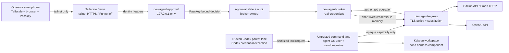
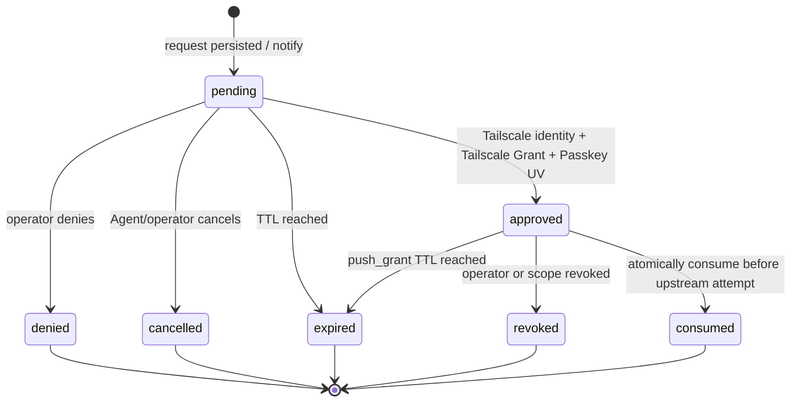

# Kakesu開発用Agentハーネス 設計案

> **状態: 外部開発基盤の提案（Kakesu本体には未採用）**
>
> この文書が定義する`Development Agent Harness`は、さくらのVPS上でKakesuを開発するための
> ホスト側の開発基盤である。KakesuのPlane、ランタイム、Schema、配布物、製品依存、外部公開契約には
> 含めない。サービス名と配置先にも`kakesu-*`を使わず、Kakesuは保護対象の作業領域の一つとしてだけ扱う。
> 将来Kakesu本体へ採用する場合は、本提案をそのまま昇格させず、別の製品変更Taskでスコープ、責任者、
> Schema/E2E、依存、運用責任を再審査する。

## 1. 結論

日常のAgent処理は専用OSユーザーと隔離ネットワークで動かし、実認証情報を持たせない。Agentには用途を限定した
短命の`Opaque capability`だけを渡し、ホスト側の認証情報ブローカーと外向き通信プロキシが、許可されたリクエストに限って
GitHubまたはOpenAIの実認証情報へ置換する。

Gitの読み取り操作はポリシーで自動許可できる。pushはスマートフォン上の非公開な承認UIから承認し、
「指定リポジトリへの次の`git-receive-pack`一回」に束縛した短命の`push grant`を発行する。許可は
Agentインスタンス/UID、workspace、完全一致 リポジトリ、一回消費、失効へ束縛し、上流試行開始前に原子的に消費する。
承認UIへの到達はTailscale Serveと
`Tailscale Grant`、個別の承認成立は毎回のPasskeyユーザー検証で保護する。Tailscale Funnelは使わない。

Git read、GitHub REST、OpenAI APIに対して、プロキシはプロバイダー プロトコルの意味を再実装しない。Unixソケット接続元、ホスト、
Opaque ケイパビリティを検証して実認証情報へ置換した後は、HTTPフレーミング、hop-by-hop ヘッダー、秘密情報境界に必要な
最小処理だけを行う未解釈のストリームとして転送する。pushだけは完全一致 リポジトリと`git-receive-pack`を分類するが、
参照、SHA、manifestまたはGit本文を認可根拠にしない。

Codex自身の認証だけは実認証情報保持を例外的に許す。ただし、信頼する親実行領域とモデル生成コマンドの
実行領域をOS境界で分離し、認証情報ファイル、環境、プロセス、ソケット、ネットワークを後者から不可視にできる
ことを導入条件とする。使用するCodexの実行形態でこの分離を実証できなければ、この例外は有効化しない。

## 2. 名称、所有、非採用境界

| 項目 | 決定 |
|---|---|
| システム名 | `Development Agent Harness` |
| 目的 | Kakesuを含む開発workspaceでcoding Agentを安全に動かす |
| 所有者 | VPS/開発インフラのoperator |
| Kakesuとの関係 | Kakesuの外側にある開発環境。製品コンポーネントではない |
| サービス prefix | `dev-agent-*` |
| 設定 | `/etc/dev-agent-harness/` |
| 秘密 | owner-controlled ストアまたはブローカー専用ストア。Agentから不可視 |
| 永続状態 | `/var/lib/dev-agent-harness/` |
| workspace例 | `/srv/agent-workspaces/kakesu/` |
| 製品への採用 | 未決。別のproduct Taskと全ゲートが必要 |

本提案を採用しても、Kakesu リポジトリのランタイム/build設定、依存manifest、Plane メッセージ、責任者、
Task/Agent実行 状態、tabletop scenarioは変えない。開発基盤のavailabilityはKakesu製品のavailabilityや
互換性契約にも含めない。

## 3. 目標と非目標

### 3.1 目標

- Agentがオーナーの秘密やプロバイダーの実認証情報を読めない状態で`gh`、OpenAI API、Git fetch/pullを使える。
- Git pushを、人がVPSへSSH loginし続けずスマートフォンから非同期承認できる。
- 承認を「誰が接続したか」「本人が今確認したか」「どのリポジトリへの次のpush一回か」の三層へ分離する。
- prompt injection、悪意あるリポジトリ コード、依存スクリプトが直接Internetやホスト サービスへ逃げる経路を閉じる。
- 認証情報、承認、ネットワーク、監査の障害をfail-closedにする。
- 最小構成から段階導入し、実VPSでしか証明できない性質を文書レビューで代替しない。

### 3.2 非目標

- Agentがルート、`sudo`、Docker/LXD ソケット、オーナー セッション、他workspaceを操作すること。
- AgentへPAT、GitHub App private キー、OpenAI API キー、SSH private キーを渡すこと。
- Tailscaleだけを最終承認要素として使うこと。
- 公開InternetからApproval UIへ到達させること。
- 承認後に停止中の`git push` プロセスを自動再開すること。
- ホスト ルート/kernel、Tailscale 制御 plane、GitHub、OpenAI自体の侵害へ耐えること。
- 本設計TaskでVPSへinstall、tailnet変更、GitHub App作成、Passkey登録を行うこと。
- 承認されたリポジトリ内で、侵害されたAgentが表示されたブランチ/コミット/参照/SHAとは異なる内容を一回のpushで送ることを防ぐこと。

## 4. 脅威モデル

### 4.1 信頼しないもの

- モデル出力と、そこから起動されるシェル コマンド、build/テスト、hook、パッケージ スクリプト。
- cloneしたリポジトリ、issue/PR、Web検索、dependencyから入るprompt injection。
- Agentから見えるenvironment、workspace、stdout/stderr、ネットワーク 入力。
- Agent userが保持するOpaque ケイパビリティ。漏えいし得る前提でスコープと寿命を制限する。
- smartphoneへの通知内容。通知は配送 チャネルであってauthorization チャネルではない。

### 4.2 信頼するもの

- Ubuntu kernel、ルート管理のOS isolation、systemd、packet filter。
- オーナー/operatorと、オーナーが管理するTailscale 識別情報およびPasskey。
- 認証情報 ブローカー、外向き通信 プロキシ、Approval サービスの小さく監査可能な実装。
- プロバイダーのTLS endpointと、repoを限定したGitHub App installation。

### 4.3 守る資産

- Codex実認証情報、GitHub App private キー/installation トークン、OpenAI API キー。
- オーナー home、SSH agent/ソケット、Tailscale ローカル API/ソケット、承認 signing キー、監査 signing キー。
- 許可されていないリポジトリ、他workspace、ホスト サービス。
- リポジトリ単位の承認リクエスト、一回限りの`push grant`の一意性、監査記録の秘匿性と対応関係。

## 5. 全体構成



`Approval Service`と`Broker`はlocalhostまたは専用Unix ソケットでだけ接続する。Agent 名前空間からは
Approval UI、ブローカー管理ソケット、Tailscale LocalAPIへ経路を作らない。外向き通信 プロキシのAgent向け入口だけを
固定endpointとして公開し、そこでAgent 識別情報、セッション、workspace、ケイパビリティを再検証する。

## 6. 識別情報とプロセス境界

### 6.1 OS 主体

| 主体 | 用途 | 読めるもの | 禁止 |
|---|---|---|---|
| `owner` | 初期provisioning、認証情報更新、break-glass | オーナー管理設定と管理コマンド | 日常push承認の必須経路にはしない |
| `dev-agent-runtime` | trusted Codex 親を起動するsupervisor | 有効化時のみCodex auth入口 | workspace シェルの直接実行、プロバイダー 秘密情報のexport |
| `dev-agent` | モデル生成コマンド、Git、`gh`、テスト/build | 対象workspace、公開CA、Opaque ケイパビリティ | オーナー/ブローカー/ランタイム home、他workspace、`sudo`、privileged ソケット |
| `dev-agent-broker` | ブローカー/プロキシ/Approvalの秘密処理 | プロバイダー 秘密情報、承認 状態、監査 キー | workspace コードの実行、interactive login |

実装上のuser数は統合してもよいが、上表の到達不能性を維持できることが条件である。特に
`dev-agent-runtime`と`dev-agent`を同じUIDに統合する場合、マウント/PID 名前空間、`/proc`の可視性、
認証情報 ファイル、environment、inherited ファイル descriptor、Unix ソケットを含む実測で分離を証明できなければならない。
証明できない統合案は不採用とする。

### 6.2 Agent userの最低制約

- login シェル、SSH authorized キー、`sudo`、`su`、Docker/LXD/libvirt グループを与えない。
- workspace以外はreadも拒否するallowlist型ファイルシステム ビューを使う。
- `ptrace`、他UIDの`/proc/*/environ`、ホスト PID 名前空間、privileged デバイスを不可視にする。
- ホスト ネットワーク 名前空間を共有せず、直接Internet、LAN、tailnet、loopback ホスト サービスへの通信を拒否する。
- arbitrary Unix ソケットをマウントしない。SSH agent、Docker、Tailscale、systemd、ブローカー管理ソケットは渡さない。
- environment allowlistをlauncherで再構築し、オーナー/ランタイムのenvironmentを継承しない。
- `.git`書込みなど必要なworkspace権限はTask ポリシーで別途制御し、認証情報の可視性とは混同しない。

## 7. 認証情報モデル

### 7.1 オーナー管理の秘密情報ストア

実認証情報はオーナーがprovisionするが、Agent workspaceやリポジトリには置かない。ブローカー専用の
`0600` ファイル、kernel keyring、または外部秘密情報 マネージャーのいずれかを後続Taskで選ぶ。選択にかかわらず、
平文秘密情報をコマンド line、job-wide environment、ユニット状態、journal、監査 ログへ出してはならない。

ブローカーはプロバイダー トークンを必要時に生成・取得し記憶に短時間だけ保持する。GitHubはリポジトリを限定した
GitHub App installation 認証情報を第一候補とし、恒久PATを通常経路にしない。OpenAI API キーはブローカーの
プロバイダー 認証情報であり、Agentへは対応するケイパビリティ handleだけを渡す。

### 7.2 Opaque ケイパビリティ

Opaque ケイパビリティは実認証情報の暗号化コピーではなく、ブローカー 状態を参照するランダム handleである。

```text
capability_id
subject: agent_instance_id + uid
workspace_id
provider: github | openai
repository: owner/name | none
operations: explicit allowlist
destination_hosts: exact allowlist
issued_at / expires_at
max_uses or request budget
policy_version
revocation_epoch
```

handleが漏れても、ブローカー入口へ到達でき、同じAgent インスタンス/workspace/ポリシーを満たす場合にしか使えない。
プロキシはUnixソケットの接続元認証情報から得たUID/Agentインスタンスと、handleの`subject`、プロバイダー、workspace、リポジトリ、TTL、
使用 予算、失効状態を照合する。unknown、expired、revoked、subject不一致、ホスト/リポジトリ/操作不一致、
予算超過はすべて拒否する。handleの自己申告値やHTTP本文をこの照合の代わりにしない。

### 7.3 Codex自身の実認証情報例外

この例外はCodexのモデル通信だけに限定する。

- 認証情報をtrusted 親 laneだけへ注入し、ツール コマンドのenvironmentへ渡さない。
- file-backed loginを使う場合、そのパスをuntrusted コマンド laneのマウント ビューから除外する。
- environment注入が必要なsurfaceでは親起動時だけに限定し、子環境をallowlistから再構築する。
- `/proc`、コア dump、クラッシュ report、debug ログ、inherited FD、ローカル callback listenerからの回収を防ぐ。
- Codex 親のプロバイダー通信と、Agent コードが行うOpenAI API通信を別ネットワーク ポリシー・別認証情報として扱う。
- `danger-full-access`やサンドボックス 迂回と併用しない。認証情報へ到達可能なサンドボックス モードは不採用とする。
- 使用するCodex バージョン/surfaceごとにネガティブ テストを行い、不可視性を証明できなければ例外を無効化する。

Codex公式資料も、repository-controlled コードを動かす環境で認証情報をjob-wideに置くことを避けるよう案内し、
full-access環境では認証情報がexfiltration対象になると注意している。本設計はCodex内蔵サンドボックスだけを唯一の
境界とせず、外側のOS 識別情報/ネットワーク境界を必須にする。

## 8. 外向き通信とTLS

### 8.1 ネットワーク ポリシー

untrusted コマンド laneのdefault 経路は破棄し、次だけを許す。

1. 外向き通信 プロキシのAgent入口。
2. 必要なら時刻同期など、Agent プロセスから直接使えないhost-managed サービス。
3. localhost bindはAgent 名前空間内に閉じ、ホスト localhostとは分離する。

DNSを直接Internetへ出さない。プロキシが固定プロバイダー ホストを解決し、解決済み addressの変化、private/link-local
address、DNS failureをfail-closedに扱う。SNI/CONNECTの許可だけで認可せず、TLS終端後のHTTP Hostと
ケイパビリティのプロバイダー/宛先/リポジトリ境界を検証する。通常のGit read、GitHub REST、OpenAI APIでは
method、パス、クエリ、本文をプロバイダー固有の意味へ解釈しない。pushだけは完全一致 リポジトリと`git-receive-pack`を
最小分類する。

### 8.2 TLS 傍受

GitHub CLI、Git、OpenAI SDKなど、custom CAとHTTP プロキシを正しく扱うクライアントだけを初期support対象にする。
Agentには公開CA certificateだけを配り、CA private キーはプロキシ 記憶またはブローカー専用ストアから出さない。

certificate pinning、独自TLS stack、プロキシ非対応、未知のHTTP upgradeを使うクライアントは迂回を
許さずunsupportedとして拒否する。通常のHTTP本文は検査せずストリーム転送する。Codex 親 laneの公式endpoint通信は
この置換プロキシとは分離し、必要なら
Codex向けのCA設定を独立させる。

## 9. 最小プロバイダー フロー

### 9.1 共通の薄いプロキシ契約

外向き通信プロキシは認証情報を差し替える境界であり、GitHub、OpenAIまたはGit wire プロトコルの意味を再実装する
gatewayではない。各リクエストでUnixソケット接続元の識別情報、Agentインスタンス/UID、workspace、Opaque handleの`subject`、プロバイダー、
リポジトリ、TTL、使用 予算、失効状態、完全一致 宛先 ホストを検証し、合格した場合だけブローカーから得た実認証情報へ
置換する。実認証情報はAgent側へ返さず、リダイレクト先でも再利用しない。リダイレクトを扱う場合は、各hopを新しいリクエストとして
同じホスト/ケイパビリティ/リポジトリ境界で再検証できるものに限る。

通常のGit read、GitHub REST、OpenAI APIでは、クライアントのmethod、パス、クエリ、本文と、上流の状態、headers、本文を、
HTTPフレーミング、hop-by-hop ヘッダーの除去、プロキシ/実認証情報の秘匿に必要な最小処理を除いて変更せず、バッファリングせずに
backpressure付きストリームとして転送する。タイムアウト、同時接続数、リクエスト/レスポンス ヘッダーの個数と大きさ、接続単位の
リソース 予算は上限を持たせるが、プロバイダー JSON、endpoint意味、成功状態、`Content-Type`を判定せず、レスポンス全量を
メモリへ保持しない。監査はsecret-freeの転送方式結果とケイパビリティ判断だけを記録する。

### 9.2 `gh` CLI / GitHub API

Agent環境の`GH_TOKEN`には`cap_...`形式のOpaque ケイパビリティを設定する。`gh`が`api.github.com`へ送る
Authorization ヘッダーをプロキシが検出し、Unixソケット接続元、GitHub プロバイダー ケイパビリティ、許可ホストとリポジトリ境界を検証してから、
ブローカーが発行した短命GitHub App installation トークンへ置換する。method/パス/クエリ/本文はそのまま上流へストリーム転送し、
GitHub RESTの`/repos/{owner}/{repo}` parserやendpoint allowlistをプロキシに持たせない。

GitHubで実際に実行できる操作と対象リポジトリは、リポジトリと権限を限定したGitHub App installationを上流の
安全境界とする。プロキシはGitHubのAPI意味やGraphQL本文を解釈して補強しようとせず、ケイパビリティとinstallationの範囲外を
REST経由で広げない。push 許可はGitHub RESTの認可には使用できない。

### 9.3 Agent コード / OpenAI API

Agent コードへは`OPENAI_API_KEY=cap_...`を渡し、プロキシがOpenAI プロバイダー ケイパビリティと`api.openai.com`の完全一致 ホストを
検証した場合だけ実API キーへ置換する。リクエスト/レスポンスは共通の薄いプロキシ契約でストリーム転送する。モデル、JSON フィールド、
`store`、`stream`、endpoint、レスポンス JSON/`Content-Type`/状態をプロキシで検査しない。利用量またはcostの上限が必要な場合は、
本文解析ではなくケイパビリティのリクエスト 予算と上流プロバイダー/project側のhard 上限で強制する。

このケイパビリティはCodex自身のauthには使わず、Codex実認証情報例外とも共有しない。

### 9.4 Git fetch/pull

リモートは`https://github.com/owner/repo.git`へ固定する。custom 認証情報 helperは`get`に対して、
username `x-access-token`とOpaque ケイパビリティをpasswordとして返す。`store`は何も保存せず、`erase`はブローカーの
セッション ケイパビリティだけを失効させる。実認証情報をGit config、リモート URL、認証情報 cacheへ書かない。

プロキシはGit read ケイパビリティ、完全一致 GitHub ホスト、リポジトリ境界を照合して短命installation トークンへ置換する。
`git-upload-pack`のリクエスト本文やレスポンス `Content-Type`を意味検査せず、Git wire/pkt-lineを解析しない。Git クライアントとGitHubの
間を共通の薄いプロキシ契約でストリーム転送する。

### 9.5 Git push

`git-receive-pack`はread ケイパビリティやGitHub REST ケイパビリティで通さない。pushには後述のリポジトリ単位の承認済み
`push grant`が必要である。プロキシは完全一致 GitHub ホスト、完全一致 リポジトリ、`git-receive-pack`を最小分類し、許可を
上流接続・リクエスト 本文送信その他の上流 試行開始前に原子的に消費する。その後のSmart HTTP リクエスト/レスポンスは
ストリーム転送し、参照、old/新規 SHA、force/delete、Git wire/pkt-lineまたは本文を解析・照合しない。

## 10. 非同期push承認

次の三つは別の概念であり、相互に代用してはならない。

| 固定用語 | 意味 | 単独でpushを認可するか |
|---|---|---|
| `Tailscale Grant` | operator端末から承認UIまでのネットワーク到達ポリシー | しない |
| `Passkey challenge` | リポジトリ単位のリクエストと判断へ束縛したWebAuthnの本人確認 | しない |
| `push grant` | 完全一致 リポジトリへの次の`git-receive-pack`一回について、上流試行前に原子的に消費する短命の認可 | する |

`Tailscale Grant`と`Passkey challenge`の両方を満たしても、同じagent インスタンス/UID、workspace、完全一致 リポジトリへ
束縛された未使用・未失効・TTL内の`push grant`がなければpushを拒否する。GitHub App installationは書き込み権限と
リポジトリを限定し、この許可が許す一回のpushでも別リポジトリへ到達できない上流安全境界にする。

### 10.1 リポジトリ単位のリクエストと許可

承認リクエスト/判断/許可の安全契約は次に限定する。

- 許可は発行対象のAgentインスタンスとUnixソケット接続元UID、workspace、正規化済みの完全一致 `owner/repository`、短いTTL、
  未使用状態、失効状態へ束縛する。
- 許可が認可する操作は、そのリポジトリへの次の`git-receive-pack`一回だけである。Git read、GitHub REST、OpenAI、
  別リポジトリ、別Agentインスタンス/UID、別workspaceへ転用できない。
- 消費は上流接続、リクエスト 本文送信その他の上流 試行が始まる前に永続状態上で原子的に行う。
  上流の成功、失敗、タイムアウト、切断、結果不明にかかわらず再利用しない。再試行には新しいリクエストと承認が必要である。
- operatorまたは失効処理は未使用許可を失効できる。Agent/workspace/プロバイダー 認証情報の失効とポリシー/revocation世代の
  変更も既存許可を無効にする。
- ブランチ、コミット、参照、old/新規 SHA、force/deleteその他の予定内容はUIの参考情報にはできるが、リクエスト/判断/許可の
  認可条件ではない。`approvalmanifest`、manifest ダイジェストまたはGit本文との一致は要求しない。

この簡素化では、侵害されたAgentが、operatorへ参考表示された内容と異なるブランチ/参照/コミット/SHA、force/deleteを
同じリポジトリへの承認済み一回で送る残余リスクを明示的に受容する。リポジトリ限定GitHub App書き込み権限、主体と
workspaceの束縛、短TTL、失効、試行前の一回消費が被害範囲を限定する。一方、リポジトリ越境、主体越境、
workspace越境、再使用、期限後使用、GitHub RESTへの転用は受容せずfail-closedに拒否する。

### 10.2 状態機械



`pending`作成時のコマンドは`APPROVAL_REQUIRED <request_id>`を返して終了する。プロセス、PTY、SSH セッション、
open HTTP リクエストを承認待ちの間保持しない。operatorが後で承認してもpushを自動開始せず、Agentまたは人が
状態を確認して明示的に`git push`を再実行する。

再実行時、プロキシはUnixソケット接続元から得たAgentインスタンス/UID、workspace、完全一致 リポジトリ、`git-receive-pack`、TTL、使用、
失効状態を再照合し、合格した許可をtransactionally `consumed`へ移してから上流試行を始める。消費後のクラッシュや
上流結果不明でも許可を戻さない。必要ならリポジトリをreadで確認し、新しいリクエストを作る。

## 11. スマートフォン承認

### 11.1 接続入口

- Approval backendは`127.0.0.1`だけでlistenする。
- `tailscale serve`がtailnet DNS名のHTTPSをbackendへプロキシする。
- Funnelを明示的にoffにし、public Internet向けlistenerを作らない。
- tailnet ポリシーは新規構成で推奨される`Tailscale Grant`を使い、operator 識別情報/デバイスだけにTCP 443を許可する。
- backendはTailscale Serveが付与した識別情報 ヘッダーを使うが、localhost外からヘッダーを受け取らない。
- tagged デバイスではuser 識別情報 ヘッダーが得られない場合があるため、日常承認はoperator user 識別情報から行う。
- Agent 名前空間からtailnet 経路、Serve URL、backend loopbackへ到達させない。

### 11.2 承認成立条件

次のすべてを満たしたときだけ`approved`へ遷移する。

| 条件 | 役割 |
|---|---|
| Tailscale デバイスがtailnetへ参加済み | 接続元デバイスを管理対象へ限定 |
| `Tailscale Grant`がoperatorからApproval サービスへの接続を許可 | ネットワーク reachabilityを最小化 |
| Serve 識別情報がbackend allowlistのoperatorと一致 | 接続userを識別 |
| Passkey 主張のRP ID、origin、`Passkey challenge`、UVが一致 | その場の本人操作を確認 |
| `Passkey challenge`が未使用かつリクエスト ID、リポジトリ単位の判断、期限へ束縛 | phishing、再実行、別リクエスト承認を抑止 |

Tailscale 識別情報だけ、browser セッションだけ、通知actionだけ、Passkeyのpresenceだけでは不足である。
Passkeyは`userVerification: required`相当を要求し、承認/拒否はGETやCSRF可能なformで実行しない。

### 11.3 UIと通知

承認画面の主認可文言は「このリポジトリへの次のpush一回を許可する」とし、対象リポジトリ、Agent/workspace、
許可期限を近接表示する。ブランチ、コミット要約、参照、old/新規 SHA、force/deleteを表示する場合は、すべて「参考情報であり、
実際にpushされる内容を認可上は拘束しない」と明記し、主文言や承認buttonが内容一致を保証するように見せない。
承認/拒否のPasskey 許可確認はリポジトリ単位のリクエストと判断に結び付け、reference情報やmanifest ダイジェストへ結び付けない。

通知はリクエスト ID、リポジトリ、期限切れ、private Serve URLへの導線だけを含め、認証情報や完全な機密diffを
載せない。通知へのreply、push button、URLを開くだけの操作には承認権限を与えない。通知失敗はリクエストを
`pending`のままにし、自動承認やpush継続をしない。

## 12. fail-closed表

| failure | 処理 |
|---|---|
| unknown/expired/revoked ケイパビリティ | リクエスト拒否、認証情報を取得しない |
| Unixソケット接続元/Agentインスタンス/UID/workspace不一致 | リクエスト拒否、認証情報を取得しない |
| ホスト/プロバイダー/リポジトリ/操作不一致 | リクエスト拒否、セキュリティ イベントを秘密情報なしで記録 |
| プロキシ/ブローカー停止 | コマンド失敗。直接 Internetへfallbackしない |
| TLS検査不能、pinning、未知プロトコル | unsupportedとして拒否 |
| Approval/Serve/Tailscale停止 | リクエストは`pending`/expired。pushしない |
| 識別情報 ヘッダー欠落/不一致 | UI/APIを拒否 |
| Passkey UV/`Passkey challenge`/origin不一致 | 判断を記録せず拒否 |
| リクエスト 期限切れ | 終端 `expired`。再承認は新リクエスト |
| `push grant`のリポジトリ/`subject`/workspace不一致、REST転用 | 許可を消費せず拒否 |
| `push grant`の二重使用/競合 | 試行前の原子的消費に成功した一件以外を拒否 |
| 消費後の上流失敗/タイムアウト/クラッシュ/結果不明 | 許可を再利用せず、新しいリクエストと承認を要求 |
| 許可 失効又はTTL 期限切れ | pushを拒否し、再承認は新しいリクエストとする |
| 監査永続化不能 | side effect前なら拒否。結果不明なら許可はconsumedのまま隔離して照合 |
| ポリシー/revocation世代変化 | 既存ケイパビリティ/`push grant`を無効化 |

## 13. 監査、失効、復旧

### 13.1 監査

append-only イベントにはリクエスト/`push grant` ID、Agentインスタンス/UID、workspace、リポジトリ、actorのTailscale login、
Passkey 認証情報の非可逆ID、判断、許可の発行/失効/試行前消費、ポリシーバージョン、時刻、上流結果区分を記録する。
通常プロキシ経路ではプロバイダー、宛先 ホスト、リポジトリ スコープ、ケイパビリティ判断、転送結果区分を記録する。プロバイダー トークン、
Opaque ケイパビリティ値、Authorization ヘッダー、Passkey 主張、リクエスト/レスポンス本文、ブランチ/参照/SHAや機密内容は記録しない。

stdout/stderr、systemd journal、reverse プロキシ アクセス ログにもヘッダー/本文を出さない。閲覧権限はオーナー/ブローカーへ限定し、
Agentが監査ログを読んだり消したりできないようにする。

### 13.2 失効

- phone紛失: Tailscale デバイスをdisable/removeし、該当Passkeyを失効し、全`pending` リクエストと未使用`push grant`を取消す。
- Agent侵害疑い: Agentインスタンスとworkspace ケイパビリティを失効し、ネットワーク 名前空間を停止する。
- プロバイダー漏えい疑い: GitHub App キー/installation アクセスとOpenAI キーをローテーション/失効し、revocation世代を進める。
- ポリシー変更: 旧ポリシーバージョンのケイパビリティ/`push grant`を無効化する。

### 13.3 復旧とbreak-glass

復旧は「停止、外部トークン失効、状態スナップショット、リモート read 照合、再認証、再発行」の順に行う。
break-glassはサービス停止と認証情報失効を優先し、承認 迂回や万能トークン発行には使わない。

日常承認にSSH loginは不要とする。ただし初期provisioning、OS update、サービス復旧、認証情報 rotationなどの
管理作業にはオーナーの管理経路が別途必要である。この管理経路は承認 UIと共有せず、後続運用設計で
hardware-backed SSH キー等を検討する。

## 14. 最小構成と段階導入

### 14.1 削除する旧契約と実装

次の機構は安全境界として維持せず、後続の単一縦断実装Taskで互換wrapperや休眠実装を残さず削除する。

- `approvalmanifest`とそのcanonicalization/ダイジェスト、old/新規 SHA、参照一覧、force/delete、リモート old SHAの取得・保存・照合。
- Git wire/pkt-lineのリクエスト本文解析、push本文と承認内容のbyte-level照合、プロトコル negotiationの意味検査。
- strict OpenAI リクエスト検査。JSON フィールド、モデル、`store`、`stream`、upload、endpointのプロバイダー意味をプロキシ ポリシーに複製する処理。
- GitHub RESTの`/repos/{owner}/{repo}` endpoint parser、個別endpoint allowlist、GraphQL/本文からリポジトリを抽出する処理。
- `git-upload-pack`リクエスト本文とレスポンス `Content-Type`の意味検査。
- 上流 レスポンスのJSON検証、`2xx`限定、`Content-Type`検査、レスポンス全量バッファ、固定1 MiB レスポンス上限。
- `Policy`→`Transaction`→`Exchange`→`Forwarder`で同じ認可やプロバイダー意味を重ねて評価する責務と不要な抽象層。

削除後の経路は、Unixソケット接続元/ケイパビリティ/ホスト/リポジトリを一度評価し、認証情報を差し替え、最小フレーミングでストリーム転送する。
プロバイダー意味検査を将来用に残したり再導入したりしない。実VPS E2Eで反復して観測された具体的不具合がある場合だけ、
別Taskでその不具合に対する最小の転送方式対策を判断する。

### 14.2 移行フェーズ

| フェーズ | 成果 | push | live検証 |
|---:|---|---|---|
| 0 | TASK-0070の旧manifest契約を廃止済みとし、TASK-0071〜0073の実装履歴を保持したまま移行対象を固定 | 旧契約を新規実装しない | 文書・滞留差分だけを確認 |
| 1 | 一つの製品Taskで旧意味検査/重複層を削除し、薄いプロキシ、リポジトリ単位リクエスト/判断/許可、正確なUIを一つの縦断実装にする | リポジトリへの一回限りのpushのみ | 実VPSでGit pull、GitHub REST、OpenAI API、承認後pushを縦断確認 |
| 2 | deny-all外向き通信、Unixソケット接続元/OS隔離、認証情報/CA/ホスト/ケイパビリティ/リソース/監査境界を回帰確認して運用可能にする | フェーズ1がPASSした場合だけ継続 | 越境、失効、再使用、restart/ロールバック/クリーンアップのlive ネガティブ ケース |
| 3 | Codex実認証情報例外 | 条件付き | コマンド laneから5経路の認証情報探索を拒否 |

フェーズ1は削除、薄いread/API プロキシ、リポジトリへの一回限りのpushを別Taskへ分割しない。実VPSで安全なロールバック/クリーンアップを
含む縦断確認ができなければblockedとし、mockや文書レビューのPASSでlive権限を開かない。あるフェーズのlive テストが
失敗した場合、それ以降の権限を開かない。

## 15. 検証表

| ID | 観測 | 文書で確認 | 隔離フィクスチャ | live VPS必須 |
|---|---|:---:|:---:|:---:|
| V-01 | Kakesu本体外の名称・依存・採用再審査 | yes | no | no |
| V-02 | 識別情報/ファイルシステム/environment/プロセス/ソケット/ネットワークの拒否設計 | yes | partial | yes |
| V-03 | `gh`/OpenAI/Git readの薄いストリーム転送と、Unixソケット接続元/ホスト/ケイパビリティ/認証情報/リソース境界 | yes | partial | yes |
| V-04 | 実認証情報がAgentから取得不能 | no | partial | yes |
| V-05 | 完全一致 リポジトリの次の`git-receive-pack`一回と、試行前の原子的消費/失効/TTL | yes | partial | yes |
| V-06 | リポジトリ/主体/workspace越境、REST転用、並行/再使用/期限後の拒否と消費後失敗 | yes | partial | yes |
| V-07 | Serve localhost、tailnet外拒否、Funnel off | yes | no | yes |
| V-08 | `Tailscale Grant`/識別情報/Passkey UVのAND条件と再実行拒否 | yes | partial | yes |
| V-09 | phone loss、トークン失効、outage、restart、ロールバック | yes | no | yes |
| V-10 | Codex親の実認証情報がツール コマンドへ非継承 | yes | partial | バージョン固定後yes |
| V-11 | 同一リポジトリ内のreference情報と異なるpushを残余リスクとして受容し、UIが保証を誤表示しない | yes | partial | yes |
| V-12 | 削除inventoryに旧意味検査、全量バッファ/1 MiB、重複評価層が残らない | yes | partial | yes |

本設計Taskで合否を出すのは「文書で確認」列だけである。live列は実装後の承認済み隔離環境で
`live-e2e`として実施し、未実施を静的レビューやmockのPASSで置き換えない。

## 16. 後続Taskの順序

最優先の次製品Taskは、TASK-0071〜0073で導入した旧manifest/ダイジェスト束縛とプロバイダー意味検査を削除し、リポジトリ単位の
リクエスト/判断/許可、正確な承認UI、薄い認証差し替えプロキシへ移行して、さくらのVPS上でGit pull、GitHub REST、
OpenAI API、承認後pushを一続きに確認する単一縦断実装とする。削除だけ、プロキシだけ、承認だけ、live E2Eだけへ
分割せず、ロールバックとクリーンアップも同じTaskの受け入れに含める。

そのTaskがlive E2Eを満たした後にだけ、次を順に扱う。

1. OS isolation、deny-all外向き通信、認証情報/CAローテーション、監査、失効、restart/ロールバックの運用hardening。
2. 対象Codex バージョン/surfaceを固定したauth例外の可否検証。
3. 実測で反復する具体的不具合が残った場合だけ、プロバイダー意味を再実装しない最小の転送方式対策。

TASK-0070の契約は廃止済みであり、TASK-0071〜0073のTASK/PLAN/HANDOVER/REVIEW/QA/Wiki receiptは実装履歴として
遡及変更しない。将来の認可根拠は本設計と、次製品Taskで確定するリポジトリ単位の実装・live E2Eである。

各Taskはこの文書を製品仕様として扱わず、同一リポジトリ内でKakesu本体から分離した
`tools/dev-agent-harness/`だけで実施する。Kakesu本体のGo workspace、build、ランタイム、配布物からは参照しない。

## 17. 実装配置と配布契約

実装ソースはKakesuと同じGitリポジトリの`tools/dev-agent-harness/`へ置く。別リポジトリには分けない。
このディレクトリは独立したGoモジュール、`configure`、`Makefile`、テスト、配布物生成を所有する。

利用者向けbuild/install契約は次で固定する。

```sh
cd tools/dev-agent-harness
./configure --prefix=/usr/local --sysconfdir=/etc --localstatedir=/var --runstatedir=/run
make
make check
sudo make install
```

- 実装言語はGoとし、ブローカー、外向き通信プロキシ、Approvalサービス、ランチャー、Git認証情報ヘルパー、
  初期設定ツールを別バイナリにする。
- リリースtarballは生成済み`configure`を含み、利用者へ`Autoconf`を要求しない。Git checkoutで`configure`を
  再生成する開発者だけ`Autoconf`を使う。
- `DESTDIR`、`make install-strip`、`make uninstall`、`make dist`、`make distcheck`を提供する。
- `make install`はバイナリ、設定例、systemdユニット、sysusers/tmpfiles定義だけを配置する。OSユーザー作成、
  実設定や秘密の生成、tailnet/GitHub/OpenAI変更、サービスのenable/startは行わない。
- `make uninstall`は配布した不変ファイルだけを削除し、設定、秘密、監査ログ、永続状態、OSユーザーを残す。
- 単独配布物の名前は`dev-agent-harness-VERSION.tar.gz`とし、Kakesu本体の配布物へ混ぜない。

## 18. 未決の実装判断

- 秘密情報 ストアにファイル、kernel keyring、外部マネージャーのどれを使うか。
- TLS終端とbackpressure付きストリーム転送に使うプロキシ library、およびタイムアウト/concurrency/ヘッダー上限の具体値。
- Tailscale app capabilities ヘッダーを識別情報/`Tailscale Grant`の補助へ使うか。
- Passkey library、RP ID、認証情報 復旧 ポリシー、複数operator対応。
- notification プロバイダー。いずれを選んでもnotificationへ責任者は与えない。
- Codex 親/ツール executorを別UIDで動かせるintegration、または同等のOS isolation方式。

プロバイダー parserの対応範囲、承認 manifest形式、参照/SHA照合方式、レスポンス バッファ上限は未決事項ではなく削除済みの
選択肢である。未決事項は安全要件を緩める余地ではない。実装候補が境界を満たさない場合、その機能を無効のままにする。

## 19. 将来Kakesu本体へ採用する場合

採用判断はこの文書の状態変更では行わない。別の製品変更Taskで少なくとも次を再審査する。

- どのPlaneがリクエスト、判断、責任者、監査を所有するか。
- Plane間メッセージ、Schema、versioning、persistence、復旧、エラーの製品契約。
- Tailscale、Passkey、GitHub App、プロキシ関連libraryを製品依存にする妥当性。
- multi-user/tenant、support ライフサイクル、upgrade/ロールバック、telemetry/privacy。
- tabletop E2E、実OS/authのlive-e2e、既存Kakesu ワークフローとの整合。
- 外部ハーネスとの移行と、二重の責任者 起点を作らない切替方法。

そのTaskがmergeされるまでは、Kakesu本体は本ハーネスの存在、availability、状態、承認結果に依存しない。

## 20. 公式参照と設計判断

| Ref | 公式資料 | 本設計で使う事実・判断 |
|---|---|---|
| REF-1 | [Tailscale Serve](https://tailscale.com/docs/features/tailscale-serve) | Serveはtailnet内サービスをHTTPSで共有し識別情報 ヘッダーを付加できる。backendはlocalhost待受とし、公開用Funnelを使わない。 |
| REF-2 | [Tailscale Grants](https://tailscale.com/docs/features/access-control/grants)、[Grants syntax](https://tailscale.com/docs/reference/syntax/grants) | 新規ポリシーはdeny-by-defaultの`Tailscale Grant`でoperator→Approval サービスだけを許可する。`push grant`とは別物である。 |
| REF-3 | [Git credentials](https://git-scm.com/docs/gitcredentials) | custom helperの`get/store/erase`契約を使い、AgentへOpaque ケイパビリティだけを返す。Git本文の認可解析は行わない。 |
| REF-4 | [Authenticating as a GitHub App installation](https://docs.github.com/en/apps/creating-github-apps/authenticating-with-a-github-app/authenticating-as-a-github-app-installation) | リポジトリ/権限を限定したinstallation認証情報をAPIとHTTPS Gitの上流安全境界に使う。 |
| REF-5 | [OpenAI: Agent approvals & セキュリティ](https://learn.chatgpt.com/docs/agent-approvals-security) | コマンド ネットワークとサンドボックスは別層で制御し、full アクセスで認証情報を露出させない。低層外向き通信制御も併用する。 |
| REF-6 | [OpenAI: Environment variables](https://learn.chatgpt.com/docs/config-file/environment-variables#authentication-and-network) | Codex auth/CA設定はtrusted 親 laneに限定し、repository-controlled コードへjob-wide 秘密情報を渡さない。 |
| REF-7 | [W3C Web Authentication Level 3](https://www.w3.org/TR/webauthn-3/) | リポジトリ単位のリクエスト/判断へ結び付けた`Passkey challenge`、expected origin/RP ID、user verificationを承認成立条件にする。`Passkey challenge`単独ではpushを認可しない。 |

外部仕様とクライアント挙動は変わり得る。各実装Taskはバージョンを固定し、上記資料と実クライアントの挙動を再確認してから
live権限を開く。
