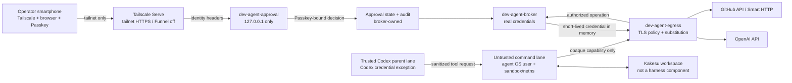
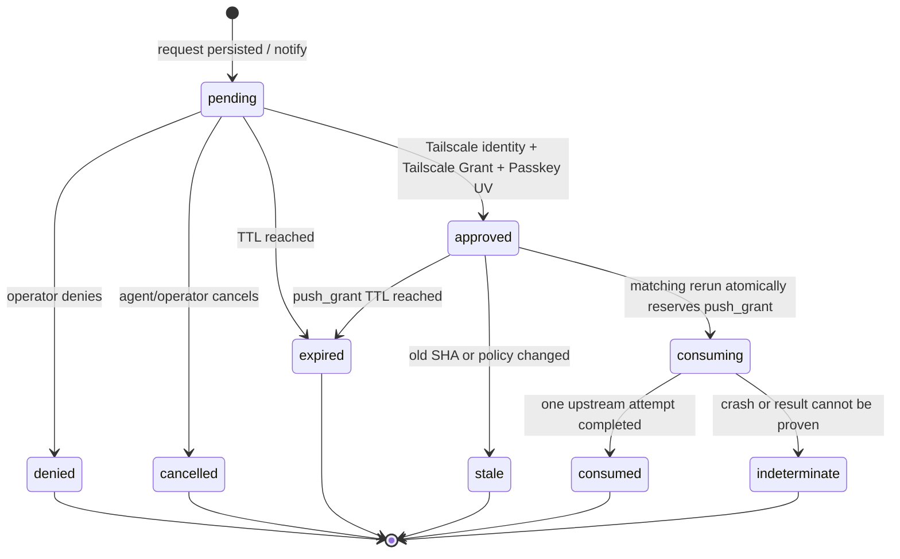

# Kakesu開発用Agentハーネス 設計案

> **状態: 外部開発基盤の提案（Kakesu本体には未採用）**
>
> この文書が定義する`Development Agent Harness`は、さくらのVPS上でKakesuを開発するための
> ホスト側の開発基盤である。KakesuのPlane、ランタイム、Schema、配布物、製品依存、外部公開契約には
> 含めない。サービス名と配置先にも`kakesu-*`を使わず、Kakesuは保護対象の作業領域の一つとしてだけ扱う。
> 将来Kakesu本体へ採用する場合は、本提案をそのまま昇格させず、別の製品変更Taskでスコープ、責任者、
> Schema/E2E、依存、運用責任を再審査する。

## 1. 結論

日常のAgent処理は専用OSユーザーと隔離ネットワークで動かし、実認証情報を持たせない。Agentには用途を限定した
短命の`Opaque capability`だけを渡し、ホスト側の認証情報ブローカーと外向き通信プロキシが、許可されたリクエストに限って
GitHubまたはOpenAIの実認証情報へ置換する。

Gitの読み取り操作はポリシーで自動許可できる。pushはスマートフォン上の非公開な承認UIから承認し、
承認対象の参照更新へ完全に束縛した`push grant`を発行する。承認UIへの到達はTailscale Serveと
`Tailscale Grant`、個別の承認成立は毎回のPasskeyユーザー検証で保護する。Tailscale Funnelは使わない。

Codex自身の認証だけは実認証情報保持を例外的に許す。ただし、信頼する親実行領域とモデル生成コマンドの
実行領域をOS境界で分離し、認証情報ファイル、環境、プロセス、ソケット、ネットワークを後者から不可視にできる
ことを導入条件とする。使用するCodexの実行形態でこの分離を実証できなければ、この例外は有効化しない。

## 2. 名称、所有、非採用境界

| 項目 | 決定 |
|---|---|
| システム名 | `Development Agent Harness` |
| 目的 | Kakesuを含む開発workspaceでcoding Agentを安全に動かす |
| 所有者 | VPS/開発インフラのoperator |
| Kakesuとの関係 | Kakesuの外側にある開発環境。製品コンポーネントではない |
| サービス prefix | `dev-agent-*` |
| 設定 | `/etc/dev-agent-harness/` |
| 秘密 | owner-controlled ストアまたはブローカー専用ストア。Agentから不可視 |
| 永続状態 | `/var/lib/dev-agent-harness/` |
| workspace例 | `/srv/agent-workspaces/kakesu/` |
| 製品への採用 | 未決。別のproduct Taskと全ゲートが必要 |

本提案を採用しても、Kakesu リポジトリのランタイム/build設定、依存manifest、Plane メッセージ、責任者、
Task/Agent実行 状態、tabletop scenarioは変えない。開発基盤のavailabilityはKakesu製品のavailabilityや
互換性契約にも含めない。

## 3. 目標と非目標

### 3.1 目標

- Agentがオーナーの秘密やプロバイダーの実認証情報を読めない状態で`gh`、OpenAI API、Git fetch/pullを使える。
- Git pushを、人がVPSへSSH loginし続けずスマートフォンから非同期承認できる。
- 承認を「誰が接続したか」「本人が今確認したか」「何を許したか」の三層へ分離する。
- prompt injection、悪意あるリポジトリ コード、依存スクリプトが直接Internetやホスト サービスへ逃げる経路を閉じる。
- 認証情報、承認、ネットワーク、監査の障害をfail-closedにする。
- 最小構成から段階導入し、実VPSでしか証明できない性質を文書レビューで代替しない。

### 3.2 非目標

- Agentがルート、`sudo`、Docker/LXD ソケット、オーナー セッション、他workspaceを操作すること。
- AgentへPAT、GitHub App private キー、OpenAI API キー、SSH private キーを渡すこと。
- Tailscaleだけを最終承認要素として使うこと。
- 公開InternetからApproval UIへ到達させること。
- 承認後に停止中の`git push` プロセスを自動再開すること。
- ホスト ルート/kernel、Tailscale 制御 plane、GitHub、OpenAI自体の侵害へ耐えること。
- 本設計TaskでVPSへinstall、tailnet変更、GitHub App作成、Passkey登録を行うこと。

## 4. 脅威モデル

### 4.1 信頼しないもの

- モデル出力と、そこから起動されるシェル コマンド、build/テスト、hook、パッケージ スクリプト。
- cloneしたリポジトリ、issue/PR、Web検索、dependencyから入るprompt injection。
- Agentから見えるenvironment、workspace、stdout/stderr、ネットワーク 入力。
- Agent userが保持するOpaque ケイパビリティ。漏えいし得る前提でスコープと寿命を制限する。
- smartphoneへの通知内容。通知は配送 チャネルであってauthorization チャネルではない。

### 4.2 信頼するもの

- Ubuntu kernel、ルート管理のOS isolation、systemd、packet filter。
- オーナー/operatorと、オーナーが管理するTailscale 識別情報およびPasskey。
- 認証情報 ブローカー、外向き通信 プロキシ、Approval サービスの小さく監査可能な実装。
- プロバイダーのTLS endpointと、repoを限定したGitHub App installation。

### 4.3 守る資産

- Codex実認証情報、GitHub App private キー/installation トークン、OpenAI API キー。
- オーナー home、SSH agent/ソケット、Tailscale ローカル API/ソケット、承認 signing キー、監査 signing キー。
- 許可されていないリポジトリ/参照、他workspace、ホスト サービス。
- 承認リクエストの完全性、一回限りの`push grant`の一意性、監査記録の秘匿性と対応関係。

## 5. 全体構成



`Approval Service`と`Broker`はlocalhostまたは専用Unix ソケットでだけ接続する。Agent 名前空間からは
Approval UI、ブローカー管理ソケット、Tailscale LocalAPIへ経路を作らない。外向き通信 プロキシのAgent向け入口だけを
固定endpointとして公開し、そこでAgent 識別情報、セッション、workspace、ケイパビリティを再検証する。

## 6. 識別情報とプロセス境界

### 6.1 OS 主体

| 主体 | 用途 | 読めるもの | 禁止 |
|---|---|---|---|
| `owner` | 初期provisioning、認証情報更新、break-glass | オーナー管理設定と管理コマンド | 日常push承認の必須経路にはしない |
| `dev-agent-runtime` | trusted Codex 親を起動するsupervisor | 有効化時のみCodex auth入口 | workspace シェルの直接実行、プロバイダー 秘密情報のexport |
| `dev-agent` | モデル生成コマンド、Git、`gh`、テスト/build | 対象workspace、公開CA、Opaque ケイパビリティ | オーナー/ブローカー/ランタイム home、他workspace、`sudo`、privileged ソケット |
| `dev-agent-broker` | ブローカー/プロキシ/Approvalの秘密処理 | プロバイダー 秘密情報、承認 状態、監査 キー | workspace コードの実行、interactive login |

実装上のuser数は統合してもよいが、上表の到達不能性を維持できることが条件である。特に
`dev-agent-runtime`と`dev-agent`を同じUIDに統合する場合、マウント/PID 名前空間、`/proc`の可視性、
認証情報 ファイル、environment、inherited ファイル descriptor、Unix ソケットを含む実測で分離を証明できなければならない。
証明できない統合案は不採用とする。

### 6.2 Agent userの最低制約

- login シェル、SSH authorized キー、`sudo`、`su`、Docker/LXD/libvirt グループを与えない。
- workspace以外はreadも拒否するallowlist型ファイルシステム ビューを使う。
- `ptrace`、他UIDの`/proc/*/environ`、ホスト PID 名前空間、privileged デバイスを不可視にする。
- ホスト ネットワーク 名前空間を共有せず、直接Internet、LAN、tailnet、loopback ホスト サービスへの通信を拒否する。
- arbitrary Unix ソケットをマウントしない。SSH agent、Docker、Tailscale、systemd、ブローカー管理ソケットは渡さない。
- environment allowlistをlauncherで再構築し、オーナー/ランタイムのenvironmentを継承しない。
- `.git`書込みなど必要なworkspace権限はTask ポリシーで別途制御し、認証情報の可視性とは混同しない。

## 7. 認証情報モデル

### 7.1 オーナー管理の秘密情報ストア

実認証情報はオーナーがprovisionするが、Agent workspaceやリポジトリには置かない。ブローカー専用の
`0600` ファイル、kernel keyring、または外部秘密情報 マネージャーのいずれかを後続Taskで選ぶ。選択にかかわらず、
平文秘密情報をコマンド line、job-wide environment、unit 状態、journal、監査 ログへ出してはならない。

ブローカーはプロバイダー トークンを必要時に生成・取得し記憶に短時間だけ保持する。GitHubはリポジトリを限定した
GitHub App installation 認証情報を第一候補とし、恒久PATを通常経路にしない。OpenAI API キーはブローカーの
プロバイダー 認証情報であり、Agentへは対応するケイパビリティ handleだけを渡す。

### 7.2 Opaque ケイパビリティ

Opaque ケイパビリティは実認証情報の暗号化コピーではなく、ブローカー 状態を参照するランダム handleである。

```text
capability_id
subject: agent_instance_id + uid
workspace_id
provider: github | openai
repository: owner/name | none
operations: explicit allowlist
destination_hosts: exact allowlist
issued_at / expires_at
max_uses or request budget
policy_version
revocation_epoch
```

handleが漏れても、ブローカー入口へ到達でき、同じAgent インスタンス/workspace/ポリシーを満たす場合にしか使えない。
unknown、expired、revoked、subject不一致、ホスト/repo/操作不一致、予算超過はすべて拒否する。

### 7.3 Codex自身の実認証情報例外

この例外はCodexのモデル通信だけに限定する。

- 認証情報をtrusted 親 laneだけへ注入し、ツール コマンドのenvironmentへ渡さない。
- file-backed loginを使う場合、そのパスをuntrusted コマンド laneのマウント ビューから除外する。
- environment注入が必要なsurfaceでは親起動時だけに限定し、子環境をallowlistから再構築する。
- `/proc`、コア dump、クラッシュ report、debug ログ、inherited FD、ローカル callback listenerからの回収を防ぐ。
- Codex 親のプロバイダー通信と、Agent コードが行うOpenAI API通信を別ネットワーク ポリシー・別認証情報として扱う。
- `danger-full-access`やサンドボックス 迂回と併用しない。認証情報へ到達可能なサンドボックス モードは不採用とする。
- 使用するCodex バージョン/surfaceごとにネガティブ テストを行い、不可視性を証明できなければ例外を無効化する。

Codex公式資料も、repository-controlled コードを動かす環境で認証情報をjob-wideに置くことを避けるよう案内し、
full-access環境では認証情報がexfiltration対象になると注意している。本設計はCodex内蔵サンドボックスだけを唯一の
境界とせず、外側のOS 識別情報/ネットワーク境界を必須にする。

## 8. 外向き通信とTLS

### 8.1 ネットワーク ポリシー

untrusted コマンド laneのdefault 経路は破棄し、次だけを許す。

1. 外向き通信 プロキシのAgent入口。
2. 必要なら時刻同期など、Agent プロセスから直接使えないhost-managed サービス。
3. localhost bindはAgent 名前空間内に閉じ、ホスト localhostとは分離する。

DNSを直接Internetへ出さない。プロキシが固定プロバイダー ホストを解決し、解決済み addressの変化、private/link-local
address、DNS failureをfail-closedに扱う。SNI/CONNECTの許可だけで認可せず、TLS終端後のHTTP ホスト、method、
パス、プロトコル 操作も検証する。

### 8.2 TLS 傍受

GitHub CLI、Git、OpenAI SDKなど、custom CAとHTTP プロキシを正しく扱うクライアントだけを初期support対象にする。
Agentには公開CA certificateだけを配り、CA private キーはプロキシ 記憶またはブローカー専用ストアから出さない。

certificate pinning、独自TLS stack、プロキシ非対応、未知のHTTP upgrade、検査不能な本文を使うクライアントは迂回を
許さずunsupportedとして拒否する。Codex 親 laneの公式endpoint通信はこの置換プロキシとは分離し、必要なら
Codex向けのCA設定を独立させる。

## 9. 最小プロバイダー フロー

### 9.1 `gh` CLI / GitHub API

Agent環境の`GH_TOKEN`には`cap_...`形式のOpaque ケイパビリティを設定する。`gh`が`api.github.com`へ送る
Authorization ヘッダーをプロキシが検出し、ケイパビリティ スコープ、HTTP method、API パス、リポジトリを検証してから、
ブローカーが発行した短命GitHub App installation トークンへ置換する。

リポジトリをURL/本文から一意に決められないendpoint、GraphQL クエリを安全に解析できないリクエスト、許可外の
organization/user リソースは拒否する。初期版の`gh` supportは実際に必要なREST endpointのallowlistから始める。

### 9.2 Agent コード / OpenAI API

Agent コードへは`OPENAI_API_KEY=cap_...`を渡し、プロキシが`api.openai.com`の許可endpointでだけ実API キーへ
置換する。モデル、project、リクエスト サイズ、比率、cost 予算、streaming、ファイル upload等のポリシーをブローカー側で
制限する。未知のホスト、admin endpoint、検査不能なupload、予算超過は拒否する。

このケイパビリティはCodex自身のauthには使わず、Codex実認証情報例外とも共有しない。

### 9.3 Git fetch/pull

リモートは`https://github.com/owner/repo.git`へ固定する。custom 認証情報 helperは`get`に対して、
username `x-access-token`とOpaque ケイパビリティをpasswordとして返す。`store`は何も保存せず、`erase`はブローカーの
セッション ケイパビリティだけを失効させる。実認証情報をGit config、リモート URL、認証情報 cacheへ書かない。

プロキシはGit Smart HTTPの`git-upload-pack`だけをread 操作として許可し、リポジトリ スコープを照合してから
短命installation トークンへ置換する。リダイレクトは同一の許可ホスト/リポジトリへ安全に検証できる場合だけ許す。

### 9.4 Git push

`git-receive-pack`はread ケイパビリティで通さない。pushには後述の承認済み`push grant`が必要であり、プロキシはSmart HTTP
ペイロードの参照 コマンドを解析して`push grant`とbyte-levelに対応付ける。プロトコル バージョンやケイパビリティ negotiationを
安全に解析できない形式は拒否する。

## 10. 非同期push承認

次の三つは別の概念であり、相互に代用してはならない。

| 固定用語 | 意味 | 単独でpushを認可するか |
|---|---|---|
| `Tailscale Grant` | operator端末から承認UIまでのネットワーク到達ポリシー | しない |
| `Passkey challenge` | リクエスト ダイジェストと判断へ束縛したWebAuthnの本人確認 | しない |
| `push grant` | 認証情報ブローカーが承認済み参照更新だけに発行し、原子的に消費する一回限りの認可 | する |

`Tailscale Grant`と`Passkey challenge`の両方を満たしても、manifestへ完全一致する未使用の`push grant`がなければ
pushを拒否する。

### 10.1 リクエストmanifest

承認対象は最低限、次へ束縛する。

```text
request_id
agent_instance_id / workspace_id
repository
remote_url
ref_updates[]:
  ref_name
  expected_old_sha
  new_sha
  force
  delete
policy_version / revocation_epoch
created_at / expires_at
request_digest
```

`new_sha`だけを承認してはいけない。リポジトリ、参照、リモートの現在値、force/deleteを含むmanifest全体を
canonicalizeしてダイジェスト化し、`Passkey challenge`と`push grant`へ同じダイジェストを結び付ける。

### 10.2 状態機械



`pending`作成時のコマンドは`APPROVAL_REQUIRED <request_id>`を返して終了する。プロセス、PTY、SSH セッション、
open HTTP リクエストを承認待ちの間保持しない。operatorが後で承認してもpushを自動開始せず、Agentまたは人が
状態を確認して明示的に`git push`を再実行する。

再実行時、プロキシはリモートのold SHA、送信される全参照 コマンド、force/delete、ポリシーバージョン、期限切れを再照合し、
一致した`push grant`をtransactionally `consuming`へ移す。`push grant`は上流への一回の試行にしか使えない。
上流結果が不明なクラッシュは`indeterminate`とし、リモートをreadで照合して新しいリクエストを作る。
同じ`push grant`を安全そうに見えても再利用しない。

## 11. スマートフォン承認

### 11.1 接続入口

- Approval backendは`127.0.0.1`だけでlistenする。
- `tailscale serve`がtailnet DNS名のHTTPSをbackendへプロキシする。
- Funnelを明示的にoffにし、public Internet向けlistenerを作らない。
- tailnet ポリシーは新規構成で推奨される`Tailscale Grant`を使い、operator 識別情報/デバイスだけにTCP 443を許可する。
- backendはTailscale Serveが付与した識別情報 ヘッダーを使うが、localhost外からヘッダーを受け取らない。
- tagged デバイスではuser 識別情報 ヘッダーが得られない場合があるため、日常承認はoperator user 識別情報から行う。
- Agent 名前空間からtailnet 経路、Serve URL、backend loopbackへ到達させない。

### 11.2 承認成立条件

次のすべてを満たしたときだけ`approved`へ遷移する。

| 条件 | 役割 |
|---|---|
| Tailscale デバイスがtailnetへ参加済み | 接続元デバイスを管理対象へ限定 |
| `Tailscale Grant`がoperatorからApproval サービスへの接続を許可 | ネットワーク reachabilityを最小化 |
| Serve 識別情報がbackend allowlistのoperatorと一致 | 接続userを識別 |
| Passkey 主張のRP ID、origin、`Passkey challenge`、UVが一致 | その場の本人操作を確認 |
| `Passkey challenge`が未使用かつリクエスト ダイジェスト/判断/期限切れへ束縛 | phishing、再実行、別リクエスト承認を抑止 |

Tailscale 識別情報だけ、browser セッションだけ、通知actionだけ、Passkeyのpresenceだけでは不足である。
Passkeyは`userVerification: required`相当を要求し、承認/拒否はGETやCSRF可能なformで実行しない。

### 11.3 UIと通知

承認画面にはリポジトリ、参照ごとのold/新規 SHA短縮値、コミット 要約、force/delete、リクエスト 期限切れ、ポリシーバージョンを
表示する。表示用要約ではなく正規 manifest ダイジェストが署名対象であることを明示する。

通知はリクエスト ID、リポジトリ、期限切れ、private Serve URLへの導線だけを含め、認証情報や完全な機密diffを
載せない。通知へのreply、push button、URLを開くだけの操作には承認権限を与えない。通知失敗はリクエストを
`pending`のままにし、自動承認やpush継続をしない。

## 12. fail-closed表

| failure | 処理 |
|---|---|
| unknown/expired/revoked ケイパビリティ | リクエスト拒否、認証情報を取得しない |
| ホスト/リポジトリ/操作不一致 | リクエスト拒否、セキュリティ イベントを秘密情報なしで記録 |
| プロキシ/ブローカー停止 | コマンド失敗。直接 Internetへfallbackしない |
| TLS検査不能、pinning、未知プロトコル | unsupportedとして拒否 |
| Approval/Serve/Tailscale停止 | リクエストは`pending`/expired。pushしない |
| 識別情報 ヘッダー欠落/不一致 | UI/APIを拒否 |
| Passkey UV/`Passkey challenge`/origin不一致 | 判断を記録せず拒否 |
| リクエスト 期限切れ | 終端 `expired`。再承認は新リクエスト |
| リモート old SHA変化 | `stale`。新manifestを作る |
| `push grant`の二重使用/競合 | 最初の原子的 予約以外を拒否 |
| consuming中のクラッシュ | `indeterminate`。`push grant`再利用禁止 |
| 監査永続化不能 | side effect前なら拒否。結果不明なら隔離して照合 |
| ポリシー/revocation epoch変化 | 既存ケイパビリティ/`push grant`を無効化 |

## 13. 監査、失効、復旧

### 13.1 監査

append-only イベントにはリクエスト/`push grant` ID、manifest ダイジェスト、actorのTailscale login、Passkey 認証情報の非可逆ID、
判断、状態 transition、ポリシーバージョン、時刻、上流結果区分を記録する。プロバイダー トークン、Opaque ケイパビリティ
値、Authorization ヘッダー、Passkey 主張、リクエスト本文の機密内容は記録しない。

stdout/stderr、systemd journal、reverse プロキシ アクセス ログにもヘッダー/本文を出さない。閲覧権限はオーナー/ブローカーへ限定し、
Agentが監査ログを読んだり消したりできないようにする。

### 13.2 失効

- phone紛失: Tailscale デバイスをdisable/removeし、該当Passkeyを失効し、全`pending`/approved リクエストを取消す。
- Agent侵害疑い: agent インスタンスとworkspace ケイパビリティを失効し、ネットワーク 名前空間を停止する。
- プロバイダー漏えい疑い: GitHub App キー/installation アクセスとOpenAI キーをrotate/失効し、revocation epochを進める。
- ポリシー変更: 旧ポリシーバージョンのケイパビリティ/`push grant`を無効化する。

### 13.3 復旧とbreak-glass

復旧は「停止、外部トークン失効、状態スナップショット、リモート read 照合、再認証、再発行」の順に行う。
break-glassはサービス停止と認証情報失効を優先し、承認 迂回や万能トークン発行には使わない。

日常承認にSSH loginは不要とする。ただし初期provisioning、OS update、サービス復旧、認証情報 rotationなどの
管理作業にはオーナーの管理経路が別途必要である。この管理経路は承認 UIと共有せず、後続運用設計で
hardware-backed SSH キー等を検討する。

## 14. 最小構成と段階導入

| フェーズ | 成果 | push | live検証 |
|---:|---|---|---|
| 0 | `dev-agent` user、workspace、deny-all 外向き通信、監査の骨格 | 禁止 | OS/ファイルシステム/ネットワーク ネガティブ テスト |
| 1 | 外向き通信 プロキシ + Opaque ケイパビリティ、GitHub read、`gh`限定REST、OpenAI API | 禁止 | プロバイダー 許可/拒否、認証情報非露出 |
| 2 | GitHub AppとGit Smart HTTP read、custom 認証情報 helper | 禁止 | clone/fetch/pull、リダイレクト、repo逸脱 |
| 3 | Approval サービス、永続状態、Tailscale Serve/`Tailscale Grant`、Passkey | dry-runのみ | tailnet外拒否、Funnel off、UV/再実行 |
| 4 | 完全一致する一回限りの`push grant` | 許可 | 古い、force/delete、競合、クラッシュ/TOCTOU |
| 5 | Codex実認証情報例外 | 条件付き | コマンド laneから5経路の認証情報探索を拒否 |

フェーズ 0〜2で安全なread開発環境を先に成立させ、pushとCodex例外を後から独立に有効化する。あるフェーズの
live テストが失敗した場合、それ以降の権限を開かない。

## 15. 検証表

| ID | 観測 | 文書で確認 | 隔離フィクスチャ | live VPS必須 |
|---|---|:---:|:---:|:---:|
| V-01 | Kakesu本体外の名称・依存・採用再審査 | yes | no | no |
| V-02 | 識別情報/ファイルシステム/environment/プロセス/ソケット/ネットワークの拒否設計 | yes | partial | yes |
| V-03 | `gh`/OpenAI/Git readのケイパビリティ スコープと置換 | yes | partial | yes |
| V-04 | 実認証情報がAgentから取得不能 | no | partial | yes |
| V-05 | push manifest、状態 machine、`push grant`の原子的な一回限りの消費 | yes | partial | yes |
| V-06 | リモート変化、並行使用、クラッシュ、indeterminate処理 | yes | partial | yes |
| V-07 | Serve localhost、tailnet外拒否、Funnel off | yes | no | yes |
| V-08 | `Tailscale Grant`/識別情報/Passkey UVのAND条件と再実行拒否 | yes | partial | yes |
| V-09 | phone loss、トークン失効、outage、restart、ロールバック | yes | no | yes |
| V-10 | Codex親の実認証情報がツール コマンドへ非継承 | yes | partial | バージョン固定後yes |

本設計Taskで合否を出すのは「文書で確認」列だけである。live列は実装後の承認済み隔離環境で
`live-e2e`として実施し、未実施を静的レビューやmockのPASSで置き換えない。

## 16. 後続Taskの分割

1. Ubuntu 識別情報、systemd unit、マウント/PID/ネットワーク 名前空間、deny-all 外向き通信の実装とネガティブ テスト。
2. ブローカー/外向き通信 プロキシ、ケイパビリティ スキーマ、CA ライフサイクル、監査/秘匿化の実装。
3. GitHub App、`gh`限定REST、OpenAI API、Git Smart HTTP readと認証情報 helperの実装。
4. Approval 状態 ストア、Tailscale Serve/`Tailscale Grant`、Passkey、通知の実装。
5. push manifest parser、`push grant`の原子的な一回限りの消費、クラッシュ/照合の実装。
6. 対象Codex バージョン/surfaceを固定したauth例外の可否検証。
7. さくらのVPSの隔離環境でのlive E2E、ロールバック、運用runbook。

各Taskはこの文書を製品仕様として扱わず、外部開発基盤リポジトリまたは明示的に分離したディレクトリで実施する。
Kakesu リポジトリへ実装を置く必要が生じた時点で、製品変更か開発toolingかを再分類する。

## 17. 未決の実装判断

- ブローカー、プロキシ、Approval サービスの実装言語と、単一プロセス/分離プロセスの選択。
- 秘密情報 ストアにファイル、kernel keyring、外部マネージャーのどれを使うか。
- TLS プロキシ libraryとGit Smart HTTP/GraphQL parserの対応範囲。
- Tailscale app capabilities ヘッダーを識別情報/`Tailscale Grant`の補助へ使うか。
- Passkey library、RP ID、認証情報 復旧 ポリシー、複数operator対応。
- notification プロバイダー。いずれを選んでもnotificationへ責任者は与えない。
- Codex 親/ツール executorを別UIDで動かせるintegration、または同等のOS isolation方式。

未決事項は安全要件を緩める余地ではない。実装候補が境界を満たさない場合、その機能を無効のままにする。

## 18. 将来Kakesu本体へ採用する場合

採用判断はこの文書の状態変更では行わない。別の製品変更Taskで少なくとも次を再審査する。

- どのPlaneがリクエスト、判断、責任者、監査を所有するか。
- Plane間メッセージ、Schema、versioning、persistence、復旧、エラーの製品契約。
- Tailscale、Passkey、GitHub App、プロキシ関連libraryを製品依存にする妥当性。
- multi-user/tenant、support ライフサイクル、upgrade/ロールバック、telemetry/privacy。
- tabletop E2E、実OS/authのlive-e2e、既存Kakesu ワークフローとの整合。
- 外部ハーネスとの移行と、二重の責任者 起点を作らない切替方法。

そのTaskがmergeされるまでは、Kakesu本体は本ハーネスの存在、availability、状態、承認結果に依存しない。

## 19. 公式参照と設計判断

| Ref | 公式資料 | 本設計で使う事実・判断 |
|---|---|---|
| REF-1 | [Tailscale Serve](https://tailscale.com/docs/features/tailscale-serve) | Serveはtailnet内サービスをHTTPSで共有し識別情報 ヘッダーを付加できる。backendはlocalhost待受とし、公開用Funnelを使わない。 |
| REF-2 | [Tailscale Grants](https://tailscale.com/docs/features/access-control/grants)、[Grants syntax](https://tailscale.com/docs/reference/syntax/grants) | 新規ポリシーはdeny-by-defaultの`Tailscale Grant`でoperator→Approval サービスだけを許可する。`push grant`とは別物である。 |
| REF-3 | [Git credentials](https://git-scm.com/docs/gitcredentials) | custom helperの`get/store/erase`契約を使い、AgentへOpaque ケイパビリティだけを返す。 |
| REF-4 | [Authenticating as a GitHub App installation](https://docs.github.com/en/apps/creating-github-apps/authenticating-with-a-github-app/authenticating-as-a-github-app-installation) | リポジトリ/permissionを限定したinstallation 認証情報をAPIとHTTPS Gitに使う。 |
| REF-5 | [OpenAI: Agent approvals & セキュリティ](https://learn.chatgpt.com/docs/agent-approvals-security) | コマンド ネットワークとサンドボックスは別層で制御し、full アクセスで認証情報を露出させない。低層外向き通信制御も併用する。 |
| REF-6 | [OpenAI: Environment variables](https://learn.chatgpt.com/docs/config-file/environment-variables#authentication-and-network) | Codex auth/CA設定はtrusted 親 laneに限定し、repository-controlled コードへjob-wide 秘密情報を渡さない。 |
| REF-7 | [W3C Web Authentication Level 3](https://www.w3.org/TR/webauthn-3/) | リクエスト ダイジェストへ結び付けた`Passkey challenge`、expected origin/RP ID、user verificationを承認成立条件にする。`Passkey challenge`単独ではpushを認可しない。 |

外部仕様とクライアント挙動は変わり得る。各実装Taskはバージョンを固定し、上記資料と実クライアントの挙動を再確認してから
live権限を開く。
