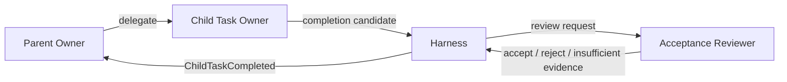

# Task Ownership

Taskの実行責任、完了確認、状態遷移を分離するための構造である。

## 登場主体

### Task Owner

Objectiveを達成し、Acceptanceを解釈し、必要ならSubtaskを生成する。作業が完成したと判断した時点でCompletion Candidateを提出する。([Owner責任Episode](episode://design/task-owner-unit))

### Acceptance Reviewer

Ownerと別Runで、提出されたOutcomeとEvidenceが元のAcceptanceを満たすかだけを軽量確認する。新しい要件や詳細コードレビューを追加しない。([Completion Review導入Episode](episode://design/completion-review))

### Parent Owner

子Taskを生成し、子のOutcomeを親Taskへ統合する。直接の子Taskをキャンセルできるが、子Taskを直接completedにしない。([子Task取消Episode](episode://design/child-cancellation))

### Harness

Owner排他、Task状態、Mailbox、Continuation、Workspace、Reviewer起動を管理し、状態遷移を確定する。

## 関係

## 構造上の制約

- 一TaskにOwnerは一人。
- OwnerとReviewerを同一Runにしない。
- Parent Ownerは直接の子だけをcancelできる。
- ReviewerはTaskの実行へ参加しない。
- HarnessはAcceptanceの意味判断を自分では行わない。

## 関連

- [Task](../concepts/task.md)
- [Task Completion](../scripts/task-completion.md)
