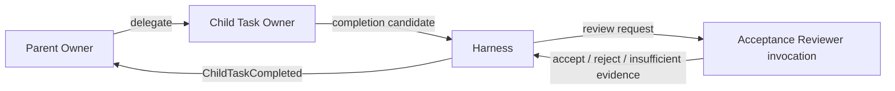

# Task 所有権

Taskの実行責任、完了確認、状態遷移を分離するための構造である。

## 登場主体

### Taskオーナー

目的を達成し、受け入れ条件を解釈し、必要ならSubtaskを生成する。作業が完成したと判断した時点で完了案を提出する。([オーナー責任エピソード](episode://design/task-owner-unit))

### 受け入れ条件レビュアー

オーナーAgent 実行から分離した一時API セッションで、提出された結果と証跡が元の受け入れ条件を満たすかだけを軽量確認する。ハーネス管理のAgent実行には登録せず、新しい要件や詳細コードレビューを追加しない。([完了レビュー導入エピソード](episode://design/completion-review))

### 親 オーナー

子Taskを生成し、子の結果を親Taskへ統合する。直接の子Taskをキャンセルできるが、子Taskを直接`completed`にしない。([子Task取消エピソード](episode://design/child-cancellation))

### ハーネス

オーナー排他、Task状態、メールボックス、継続情報、Workspace、レビュアー起動を管理し、状態遷移を確定する。

## 関係

## 構造上の制約

- 一Taskにオーナーは一人。
- オーナーAgent 実行とレビュアーの一時API セッションを分離する。
- 親 オーナーは直接の子だけをキャンセルできる。
- レビュアーはTaskの実行へ参加しない。
- ハーネスは受け入れ条件の意味判断を自分では行わない。

## 関連

- [Task](../concepts/task.md)
- [Task 完了](../scripts/task-completion.md)
